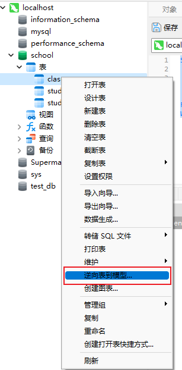
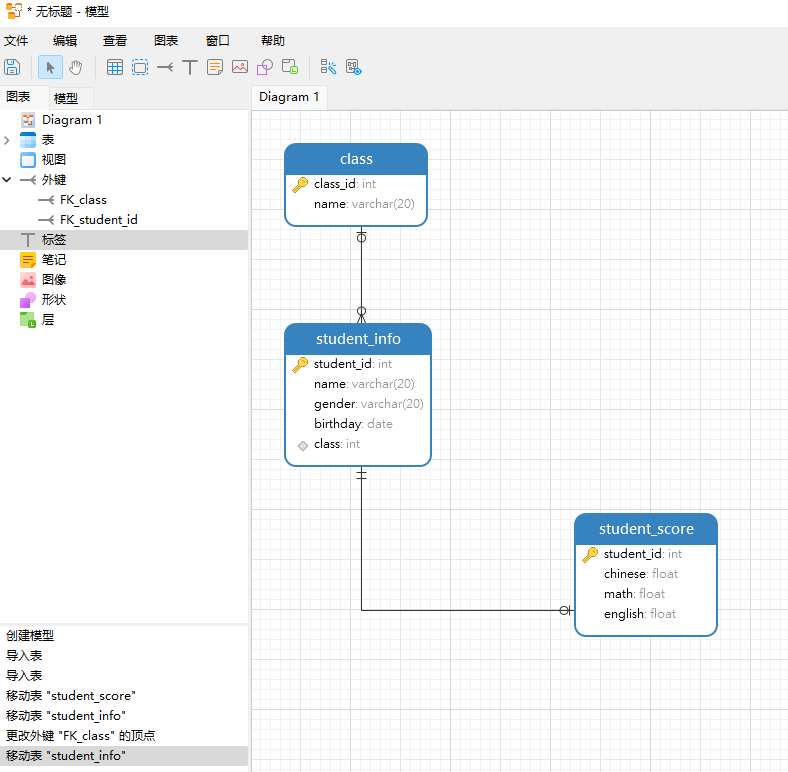
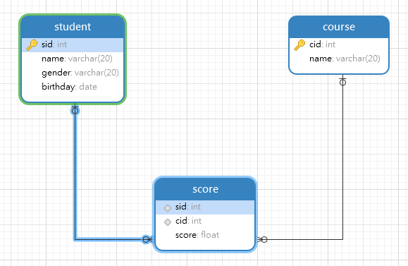

# 多表操作

在 MySQL 中，可以使用多种方式对多个表进行操作。例如，可以使用 `UNION``、INTERSECT` 和 `EXCEPT` 等集合操作来组合多个查询块的结果。此外，还可以使用连接来从多个表中检索数据。

## 多表关系

在 MySQL 中，多表关系指的是多个表之间的关联。这些关联可以是一对一、一对多或多对多的关系。

|关系|介绍|
|-|-|
|一对一（1:1）关系|在两个表之间，每个表中的一行与另一个表中的一行相关联。例如，假设有一个员工表和一个员工详细信息表，每个员工都有一个详细信息记录，那么这两个表之间就存在一对一关系。|
|一对多（1:M）关系|在两个表之间，一个表中的一行与另一个表中的多行相关联。例如，假设有一个作者表和一个书籍表，每个作者都可以写多本书，那么这两个表之间就存在一对多关系。|
|多对多（M:M）关系|在两个表之间，一个表中的多行与另一个表中的多行相关联。例如，假设有一个学生表和一个课程表，每个学生都可以选修多门课程，每门课程也可以有多个学生选修，那么这两个表之间就存在多对多关系。由于关系数据库不允许直接在两个表之间实现多对多关系，因此处理这种关系可能是一项令人生畏的任务。当您需要在关系数据库中建立两个或更多表之间的多对多关系时，最简单的方法是使用连接表。|

## 外键约束

MySQL 外键约束是表的一个特殊字段，经常与主键约束一起使用。外键约束用于帮助保持多个表之间相关数据的一致性。外键关系涉及一个父表，其中保存初始列值，以及一个子表，其中的列值引用父列值。外键约束在子表上定义。

对于两个具有关联关系的表而言，相关联字段中主键所在的表就是主表（父表），外键所在的表就是从表（子表）。外键**用来建立主表与从表的关联关系**，为了两个表的数据建立连接，约束两个表中的一致性和完整性。

**定义外键时，需要遵守的规则：**

- 主表必须已经存在与数据库中，或者是当前正在创建的表。
- 必须主表定义主键。
- 主键不能包含空值，但允许在外键出现空值。也就是说，只要外键的每个非空值出现在指定的主键中，这个外键的内容就是正确的。
- 在主表的表名后面指定列名或列名的组合，这个列名或列名组合必须是主表的主键或候选键。
- 外键中列的数目必须和主表的主键列的数目相同。
- 外键中列的数据类型和主表主键中对应列的数据类型相同。

### 创建外键约束

创建外键约束可以在创建表时指定外键约束，也可以在创建表后增加外键约束。

#### 在创建表时设置外键约束

在`CREATE TABLE`语句中，通过 `FOREIGN KEY` 关键字来指定外键，具体语法格式如下：

```sql
[ CONSTRAINT <外键名> ] FOREIGN KEY ( <字段名 1> [, <字段名 2> ,…] ) REFERENCES <主表名> ( <主键 1> [ <主键 2> ,…] )
```

- [ CONSTRAINT <外键名> ] 是可选的，如果不指定外键名称，系统将自动生成一个名称。

**参考示例：**

创建一个名为班级表的表格，做为主表：

```sql
CREATE DATABASE IF NOT EXISTS school; -- 创建数据库
USE school; -- 进入库中
CREATE TABLE IF NOT EXISTS class( -- 创建班级表
    class_id INT PRIMARY KEY, -- 班级号
    name VARCHAR(20) -- 班级名
);
```

然后创建学生信息表，作为从表，其中班级作为外键约束和主表保持关联：

```sql
USE school; -- 进入库中
CREATE TABLE IF NOT EXISTS student_info( -- 创建学生信息表
    student_id INT PRIMARY KEY, -- 学号
    name VARCHAR(20), -- 名字
    gender VARCHAR(20), -- 性别
    birthday DATE, -- 出生日期
    class INT, -- 班级
    CONSTRAINT FK_class FOREIGN KEY (class) REFERENCES class (class_id) -- 设置外键约束
);
```

#### 为表添加外键约束

外键约束也可以在修改表时添加，但是添加外键约束的前提是从表中的数据必须与主表中主键的数据类型一致。

```sql
ALTER TABLE <从表名> ADD [ CONSTRAINT <外键名> ] FOREIGN KEY ( <字段名 1> [, <字段名 2> ,…] ) REFERENCES <主表名> ( <主键 1> [ <主键 2> ,…] )
```

**参考示例：**

再创建一个学生成绩表作为学生信息表的从表：

```sql
USE school; -- 进入库中
CREATE TABLE IF NOT EXISTS student_score( -- 创建学生成绩表
    student_id INT PRIMARY KEY,  -- 学号
    chinese FLOAT, -- 语文
    math FLOAT, -- 数学
    english FLOAT, -- 英语
);
```

创建完从表后，再添加外键约束，其中学号作为外键约束和主表进行关联：

```sql
ALTER TABLE student_score ADD CONSTRAINT FK_student_id FOREIGN KEY (student_id) REFERENCES student_info (student_id);
```

这个方法并不推荐，在设计表时就考虑外键的设置，这样可以避免数据不一致的问题。

#### 查看表的关联

可以通过查询数据库中的外键约束来查看主表和从表之间的关联。可以使用 `SELECT` 语句来查询 `INFORMATION_SCHEMA` 数据库中的 `KEY_COLUMN_USAGE` 表，该表包含了外键约束的信息。例如，可以使用以下语句来查询主表和从表之间的关联：

```sql
SELECT 
    TABLE_NAME AS '从表', 
    COLUMN_NAME AS '外键列', 
    REFERENCED_TABLE_NAME AS '主表', 
    REFERENCED_COLUMN_NAME AS '主键列' 
FROM INFORMATION_SCHEMA.KEY_COLUMN_USAGE 
WHERE REFERENCED_TABLE_NAME = 'class';
```

```sql
+--------------+-----------+--------+-----------+
| 从表         | 外键列    | 主表   | 主键列    |
+--------------+-----------+--------+-----------+
| student_info | class     | class  | class_id  |
+--------------+-----------+--------+-----------+
```

```sql
SELECT 
    TABLE_NAME AS '从表', 
    COLUMN_NAME AS '外键列', 
    REFERENCED_TABLE_NAME AS '主表', 
    REFERENCED_COLUMN_NAME AS '主键列' 
FROM INFORMATION_SCHEMA.KEY_COLUMN_USAGE 
WHERE REFERENCED_TABLE_NAME = 'student_info';
```

```sql
+---------------+------------+--------------+------------+
| 从表          | 外键列     | 主表         | 主键列     |
+---------------+------------+--------------+------------+
| student_score | student_id | student_info | student_id |
+---------------+------------+--------------+------------+
```

除此之外，使用图形化管理工具（例如 Navicat Premium）来查看主表和从表之间的关联。

在 Navicat Premium 中，可以使用“逆向表到模型”功能来查看表之间的关联。这个功能可以将您的数据库表逆向生成一个数据模型，您可以在模型中查看表之间的关联关系。

要使用这个功能，需要右键单击表名，然后选择“逆向表到模型”。接下来，可以按照向导的提示操作，最终会生成一个数据模型。在数据模型中，可以清楚地看到表之间的关联关系。这个功能非常方便，尤其是当需要查看多个表之间的复杂关联关系时。

*注意，添加的顺序，应先添加主表，然后添加从表。*





### 外键约束操作

#### 添加数据

1. 添加主表数据

    注意，在添加数据时必须先给主表添加数据。

    ```sql
    USE school;
    INSERT INTO class VALUES('0101','一年级一班');
    INSERT INTO class VALUES('0102','一年级二班');
    INSERT INTO class VALUES('0201','二年级一班');
    INSERT INTO class VALUES('0301','三年级一班');
    INSERT INTO class VALUES('0401','四年级一班');
    ```

2. 添加从表数据

    注意，给从表添加数据时，外键列的值必须依赖主表的主键列，外键列不能随便写。

    ```sql
    USE school;
    INSERT INTO student_info VALUES('1001','张三','男','2008-08-08','0101');
    INSERT INTO student_info VALUES('1002','李四','男','2008-02-14','0102');
    INSERT INTO student_info VALUES('1003','王五','男','2007-12-23','0201');
    INSERT INTO student_info VALUES('1004','赵六','男','2006-03-19','0301');
    ```

    这时，如果插入一个不存在的班级号，则会报错，因为从表受到了主表的约束。

    ```sql
    INSERT INTO student_info VALUES('1005','赵六','男','2006-03-19','0302');
    ```

    ```sql
    1452 - Cannot add or update a child row: a foreign key constraint fails (`school`.`student_info`, CONSTRAINT `FK_class` FOREIGN KEY (`class`) REFERENCES `class` (`class_id`))
    ```

#### 删除数据

注意，当主表的数据被从表依赖时，是不能删除的：

```sql
DELETE FROM class WHERE class_id = 0101;
```

```sql
1451 - Cannot delete or update a parent row: a foreign key constraint fails (`school`.`student_info`, CONSTRAINT `FK_class` FOREIGN KEY (`class`) REFERENCES `class` (`class_id`))
```

*错误提示为：无法删除或更新父行：外键约束失败。意味着试图删除或更新一个在其他表中被引用的行，而这个操作会违反外键约束。*

如果主表的数据没有被从表依赖则可以删除：

```sql
DELETE FROM class WHERE class_id = 0401;
```

#### 删除外键约束

当一个表中不需要外键约束时，就需要从表中将其删除。外键一旦删除，就会解除主表和从表的关联关系。

**基本语法：**

```sql
ALTER TABLE <表名> DROP FOREIGN KEY <外键约束名>;
```

**参考示例：**

删除学生成绩表和学生信息表的关联：

```sql
ALTER TABLE student_score DROP FOREIGN KEY student_id;
```

### 多对多关系

在多对多关系中，A 表的一行对应 B 的多行，B 表的一行对应 A 表的多少，就需要新增一个中间表，来建立多对多的关系。

例如，有三个表，分别为学生信息表、课程表和成绩表。一个学生可以学习多个课程，而一个课程也可以被多个学生学习。这样就需要用到多表关系，其中学生信息表和课程表都作为主表，成绩表作为从表。

|学号|名字|
|-|-|
|0001|张三|
|0003|李四|
|0001|王五|

|课程号|课程|
|-|-|
|01|语文|
|02|数学|
|03|英语|

|学号|课程号|成绩|
|-|-|-|
|0001|01|99|
|0001|02|29|
|0001|03|47|
|0002|01|80|
|0002|02|58|
|0002|03|98|
|0003|01|23|
|0003|02|53|
|0003|03|95|

成绩表中的学号和课程号就为外键，分别关联学校表和课程表。

#### 创建多对多的表

1. 创建一个学生表

    ```sql
    CREATE TABLE IF NOT EXISTS student(
        sid INT PRIMARY KEY AUTO_INCREMENT, -- 学号
        name VARCHAR(20), -- 名字
        gender VARCHAR(20), -- 性别
        birthday DATE -- 出生日期
    );
    ```

2. 创建课程表

    ```sql
    CREATE TABLE IF NOT EXISTS course(
        cid INT PRIMARY KEY AUTO_INCREMENT, -- 课程号
        name VARCHAR(20) -- 课程名
    );
    ```

3. 创建成绩表，设置外键

    ```sql
    CREATE TABLE IF NOT EXISTS score(
    sid INT,
    cid INT,
    score FLOAT,
    CONSTRAINT FK_student FOREIGN KEY (sid) REFERENCES student (sid), -- 设置学生表的外键约束
    CONSTRAINT FK_course FOREIGN KEY (cid) REFERENCES course (cid) -- 设置课程表的外键约束
    );
    ```



#### 为各个表格添加数据

1. 向学生表添加数据

    ```sql
    INSERT INTO student VALUES('0001','张三','男','2008-10-01');
    INSERT INTO student VALUES('0002','李四','女','2008-12-31');
    INSERT INTO student VALUES('0003','王五','男','2008-05-01');
    ```

2. 向课程表添加数据

    ```sql
    INSERT INTO course VALUES('01','语文');
    INSERT INTO course VALUES('02','数学');
    INSERT INTO course VALUES('03','英语');
    ```

3. 向成绩表添加数据

    ```sql
    INSERT INTO score VALUES('0001','01','99'),('0001','02','29'),('0001','03','47');
    INSERT INTO score VALUES('0002','01','80'),('0002','02','58'),('0002','03','98');
    INSERT INTO score VALUES('0003','01','23'),('0003','02','53'),('0003','03','95');
    ```

## 多表查询

多表查询就是同时查询两个或两个以上的表，因为有的时候用户在查看数据的时候，需要显示的数据来自多张表。

多表查询有以下分类：

- 交叉连接查询（产生笛卡尔积）。
- 内连接查询。
- 外连接查询。
- 子查询。
- 表自关联。

**数据准备：**

外键约束对多表查询并没有影响，这里不设置外键约束了，方便后面查询。

1. 创建部门表

    ```sql
    CREATE TABLE IF NOT EXISTS dept(
        d_id INT PRIMARY KEY, -- 部门号
        name VARCHAR(20) -- 部门名
    );
    ```

2. 创建员工表

    ```sql
    CREATE TABLE IF NOT EXISTS emp(
        e_id INT PRIMARY KEY, -- 员工编号
        name VARCHAR(20), -- 员工名字
        age INT,
        d_id INT -- 所属部门
    );
    ```

3. 为部门表添加数据

    ```sql
    INSERT INTO dept VALUES('01','研发部');
    INSERT INTO dept VALUES('02','销售部');
    INSERT INTO dept VALUES('03','人事部');
    INSERT INTO dept VALUES('04','财务部');
    ```

4. 为员工表添加数据

    ```sql
    INSERT INTO emp VALUES('1001','张三','24','01');
    INSERT INTO emp VALUES('1002','李四','26','01');
    INSERT INTO emp VALUES('1003','王五','31','01');
    INSERT INTO emp VALUES('1004','赵六','40','01');

    INSERT INTO emp VALUES('1005','小红','21','02');
    INSERT INTO emp VALUES('1006','小蓝','61','02');
    INSERT INTO emp VALUES('1007','小绿','42','02');

    INSERT INTO emp VALUES('1008','谢云流','88','03');
    INSERT INTO emp VALUES('1009','李忘生','86','03');

    INSERT INTO emp VALUES('1010','沈剑心','18','05');
    ```

注意，部门表和员工表是没有做关联的，所以部门字段是可以插入`05`的。

### 交叉连接查询

交叉连接（CROSS JOIN）也称为“笛卡尔连接”。它用于从两个或多个连接表中返回记录集的笛卡尔积，即将左表的每一行与右表的每一行合并。当连接的表之间没有关系时，会省略掉 WHERE 子句，这时返回结果就是两个表的笛卡尔积，返回结果数量就是两个表的数据行相乘。

- 假如 A 表有 m 行数据，B 行有 n 行数据，则返回 m*n 行数据。
- 笛卡尔积会产生很多冗余的数据，后期的其他查询可以在该集合的举出上进行条件筛选。

**基本语法：**

```sql
SELECT <字段列表> FROM <表 1>,<表 2>……;
```

或者

```sql
SELECT <字段列表> FROM <表 1> CROSS JOIN <表 2>……;
```

两种语法的返回结果是相同的，但是使用 CROSS JOIN 关键字更加清晰明确。

**参考示例：**

```sql
SELECT * FROM dept CROSS JOIN emp;
```

```sql
+------+-----------+------+-----------+------+------+
| d_id | name      | e_id | name      | age  | d_id |
+------+-----------+------+-----------+------+------+
|    4 | 财务部    | 1001 | 张三      |   24 |    1 |
|    3 | 人事部    | 1001 | 张三      |   24 |    1 |
|    2 | 销售部    | 1001 | 张三      |   24 |    1 |
|    1 | 研发部    | 1001 | 张三      |   24 |    1 |
|    4 | 财务部    | 1002 | 李四      |   26 |    1 |
…………
|    1 | 研发部    | 1010 | 沈剑心    |   18 |    5 |
+------+-----------+------+-----------+------+------+
40 rows in set (0.00 sec)
```

交叉查询会返回两个表中每一行数据的任意组合，因此结果集中的数据量会很大。如果想要查询特定的数据，可以使用其他类型的连接查询，例如内连接（INNER JOIN），它只返回两个表中匹配的数据。

### 内连接查询

内连接查询（INNER JOIN）是一种多表查询方式，它通过 `INNER JOIN` 关键字来连接多张表，并使用 `ON` 设置连接条件。内连接查询的结果只包含两张表中同时符合某种条件的数据记录。

**基本语法：**

```sql
SELECT <字段列表> FROM <表 1>,<表 2>,…… WHERE <条件>;
```

或者

```sql
SELECT <字段列表>  FROM <表 1> INNER JOIN <表 2> INNER JOIN …… ON <条件>;
```

两种语法的返回结果是相同的，但是使用 INNER JOIN 关键字更加清晰明确。

**参考示例：**

1. 查询每个部门所属的员工：

    ```sql
    SELECT * FROM dept INNER JOIN emp ON dept.d_id = emp.d_id;
    ```

    ```sql
    +------+-----------+------+-----------+------+------+
    | d_id | name      | e_id | name      | age  | d_id |
    +------+-----------+------+-----------+------+------+
    |    1 | 研发部    | 1001 | 张三      |   24 |    1 |
    |    1 | 研发部    | 1002 | 李四      |   26 |    1 |
    |    1 | 研发部    | 1003 | 王五      |   31 |    1 |
    |    1 | 研发部    | 1004 | 赵六      |   40 |    1 |
    |    2 | 销售部    | 1005 | 小红      |   21 |    2 |
    |    2 | 销售部    | 1006 | 小蓝      |   61 |    2 |
    |    2 | 销售部    | 1007 | 小绿      |   42 |    2 |
    |    3 | 人事部    | 1008 | 谢云流    |   88 |    3 |
    |    3 | 人事部    | 1009 | 李忘生    |   86 |    3 |
    +------+-----------+------+-----------+------+------+
    ```

    在多表查询中，如果两张表中有相同名称的列，那么在查询语句中需要指定表名来避免歧义。但是，如果两张表中没有相同名称的列，那么在查询语句中可以直接指定列名而不需要指定表名。

2. 查询研发部的所属员工

    ```sql
    SELECT
        * 
    FROM
        dept
        INNER JOIN emp ON dept.d_id = emp.d_id 
    WHERE
        dept.d_id = 1;
    ```

    ```sql
    +------+-----------+------+--------+------+------+
    | d_id | name      | e_id | name   | age  | d_id |
    +------+-----------+------+--------+------+------+
    |    1 | 研发部    | 1001 | 张三   |   24 |    1 |
    |    1 | 研发部    | 1002 | 李四   |   26 |    1 |
    |    1 | 研发部    | 1003 | 王五   |   31 |    1 |
    |    1 | 研发部    | 1004 | 赵六   |   40 |    1 |
    +------+-----------+------+--------+------+------+
    ```

3. 查询研发部和销售部的所属员工

    ```sql
    SELECT
        * 
    FROM
        dept
        INNER JOIN emp ON dept.d_id = emp.d_id 
    WHERE
        dept.d_id IN ( 1, 2 );
    ```

    ```sql
    +------+-----------+------+--------+------+------+
    | d_id | name      | e_id | name   | age  | d_id |
    +------+-----------+------+--------+------+------+
    |    1 | 研发部    | 1001 | 张三   |   24 |    1 |
    |    1 | 研发部    | 1002 | 李四   |   26 |    1 |
    |    1 | 研发部    | 1003 | 王五   |   31 |    1 |
    |    1 | 研发部    | 1004 | 赵六   |   40 |    1 |
    |    2 | 销售部    | 1005 | 小红   |   21 |    2 |
    |    2 | 销售部    | 1006 | 小蓝   |   61 |    2 |
    |    2 | 销售部    | 1007 | 小绿   |   42 |    2 |
    +------+-----------+------+--------+------+------+
    ```

4. 查询每个部门的员工数，并升序排序

    ```sql
    SELECT
        dept.NAME,
        count( 1 ) 
    FROM
        dept
        INNER JOIN emp ON dept.d_id = emp.d_id 
    GROUP BY
        dept.d_id 
    ORDER BY
        dept.d_id DESC;
    ```

    ```sql
    +-----------+------------+
    | NAME      | count( 1 ) |
    +-----------+------------+
    | 人事部    |          2 |
    | 销售部    |          3 |
    | 研发部    |          4 |
    +-----------+------------+
    ```

5. 查询人数大于等于 3 的部门，并按照人数降序排序

    ```sql
    SELECT
        dept.NAME,
        count( 1 ) AS 部门人数
    FROM
        dept
        INNER JOIN emp ON dept.d_id = emp.d_id 
    GROUP BY
        dept.d_id 
    HAVING
        count( 1 ) >= 3 
    ORDER BY
        dept.d_id DESC;
    ```

    ```sql
    +-----------+--------------+
    | NAME      | 部门人数     |
    +-----------+--------------+
    | 销售部    |            3 |
    | 研发部    |            4 |
    +-----------+--------------+
    ```

### 外连接查询

外连接查询是一种多表查询方式，它包括左外连接（LEFT JOIN）和右外连接（RIGHT JOIN）两种类型。

- 左外连接（LEFT JOIN）的结果集包括左表的所有记录和右表中满足连接条件的记录，结果集中那些不符合连接条件的来源于右表的列值为 null。
- 右外连接（RIGHT JOIN）是左外连接的反向连接。右外连接的结果集包括右表的所有记录和左表中满足连接条件的记录，结果集中那些不符合连接条件的来源于左表的列值为 null。

*注意，ORACLE 里面还有一种外连接：全连接（FULL JOIN）。可是是 MySQL 并不支持，但可以通过 UNION 查询左外连接+UNION+右外连接实现全连接。*

*全连接（FULL JOIN）是左外连接和右外连接的结合。它返回左表和右表中的所有记录，如果左表和右表中有匹配的记录，则返回匹配的记录，否则返回 null 值。*

**基本语法：**

```sql
-- 左外连接
SELECT <字段列表>  FROM <表 1> LEFT JOIN <表 2> ON <条件>;
```

```sql
-- 右外连接
SELECT <字段列表>  FROM <表 1> RIGHT JOIN <表 2> ON <条件>;
```

```sql
-- 全连接
SELECT <字段列表>  FROM <表 1> LEFT JOIN <表 2> ON <条件> UNION SELECT <字段列表>  FROM <表 1> RIGHT JOIN <表 2> ON <条件>;
```

参考示例：

1. 查询哪些部门有员工，哪些部门没有员工

    左外连接，就是用左边的分别匹配右边的每一条。

    ```sql
    SELECT * FROM dept LEFT JOIN emp ON dept.d_id = emp.d_id;
    ```

    ```sql
    +------+-----------+------+-----------+------+------+
    | d_id | name      | e_id | name      | age  | d_id |
    +------+-----------+------+-----------+------+------+
    |    1 | 研发部    | 1004 | 赵六      |   40 |    1 |
    |    1 | 研发部    | 1003 | 王五      |   31 |    1 |
    |    1 | 研发部    | 1002 | 李四      |   26 |    1 |
    |    1 | 研发部    | 1001 | 张三      |   24 |    1 |
    |    2 | 销售部    | 1007 | 小绿      |   42 |    2 |
    |    2 | 销售部    | 1006 | 小蓝      |   61 |    2 |
    |    2 | 销售部    | 1005 | 小红      |   21 |    2 |
    |    3 | 人事部    | 1009 | 李忘生    |   86 |    3 |
    |    3 | 人事部    | 1008 | 谢云流    |   88 |    3 |
    |    4 | 财务部    | NULL | NULL      | NULL | NULL |
    +------+-----------+------+-----------+------+------+
    ```

2. 查询哪些员工有对应的部门，哪些没有

    右外连接。

    ```sql
    SELECT * FROM dept RIGHT JOIN emp ON dept.d_id = emp.d_id;
    ```

    ```sql
    +------+-----------+------+-----------+------+------+
    | d_id | name      | e_id | name      | age  | d_id |
    +------+-----------+------+-----------+------+------+
    |    1 | 研发部    | 1001 | 张三      |   24 |    1 |
    |    1 | 研发部    | 1002 | 李四      |   26 |    1 |
    |    1 | 研发部    | 1003 | 王五      |   31 |    1 |
    |    1 | 研发部    | 1004 | 赵六      |   40 |    1 |
    |    2 | 销售部    | 1005 | 小红      |   21 |    2 |
    |    2 | 销售部    | 1006 | 小蓝      |   61 |    2 |
    |    2 | 销售部    | 1007 | 小绿      |   42 |    2 |
    |    3 | 人事部    | 1008 | 谢云流    |   88 |    3 |
    |    3 | 人事部    | 1009 | 李忘生    |   86 |    3 |
    | NULL | NULL      | 1010 | 沈剑心    |   18 |    5 |
    +------+-----------+------+-----------+------+------+
    ```

3. 实现全连接

    ```sql
    SELECT * FROM dept LEFT JOIN emp ON dept.d_id = emp.d_id
    UNION
    SELECT * FROM dept RIGHT JOIN emp ON dept.d_id = emp.d_id;
    ```

    ```sql
    +------+-----------+------+-----------+------+------+
    | d_id | name      | e_id | name      | age  | d_id |
    +------+-----------+------+-----------+------+------+
    |    1 | 研发部    | 1004 | 赵六      |   40 |    1 |
    |    1 | 研发部    | 1003 | 王五      |   31 |    1 |
    |    1 | 研发部    | 1002 | 李四      |   26 |    1 |
    |    1 | 研发部    | 1001 | 张三      |   24 |    1 |
    |    2 | 销售部    | 1007 | 小绿      |   42 |    2 |
    |    2 | 销售部    | 1006 | 小蓝      |   61 |    2 |
    |    2 | 销售部    | 1005 | 小红      |   21 |    2 |
    |    3 | 人事部    | 1009 | 李忘生    |   86 |    3 |
    |    3 | 人事部    | 1008 | 谢云流    |   88 |    3 |
    |    4 | 财务部    | NULL | NULL      | NULL | NULL |
    | NULL | NULL      | 1010 | 沈剑心    |   18 |    5 |
    +------+-----------+------+-----------+------+------+
    ```

    当使用 UNION 时，会把结果集中重复的记录删掉，而使用 UNION ALL，会把所有的记录返回，且效率高于 UNION。

    ```sql
    SELECT * FROM dept LEFT JOIN emp ON dept.d_id = emp.d_id
    UNION ALL
    SELECT * FROM dept RIGHT JOIN emp ON dept.d_id = emp.d_id;
    ```

    ```sql
    +------+-----------+------+-----------+------+------+
    | d_id | name      | e_id | name      | age  | d_id |
    +------+-----------+------+-----------+------+------+
    |    1 | 研发部    | 1004 | 赵六      |   40 |    1 |
    |    1 | 研发部    | 1003 | 王五      |   31 |    1 |
    |    1 | 研发部    | 1002 | 李四      |   26 |    1 |
    |    1 | 研发部    | 1001 | 张三      |   24 |    1 |
    |    2 | 销售部    | 1007 | 小绿      |   42 |    2 |
    |    2 | 销售部    | 1006 | 小蓝      |   61 |    2 |
    |    2 | 销售部    | 1005 | 小红      |   21 |    2 |
    |    3 | 人事部    | 1009 | 李忘生    |   86 |    3 |
    |    3 | 人事部    | 1008 | 谢云流    |   88 |    3 |
    |    4 | 财务部    | NULL | NULL      | NULL | NULL |
    |    1 | 研发部    | 1001 | 张三      |   24 |    1 |
    |    1 | 研发部    | 1002 | 李四      |   26 |    1 |
    |    1 | 研发部    | 1003 | 王五      |   31 |    1 |
    |    1 | 研发部    | 1004 | 赵六      |   40 |    1 |
    |    2 | 销售部    | 1005 | 小红      |   21 |    2 |
    |    2 | 销售部    | 1006 | 小蓝      |   61 |    2 |
    |    2 | 销售部    | 1007 | 小绿      |   42 |    2 |
    |    3 | 人事部    | 1008 | 谢云流    |   88 |    3 |
    |    3 | 人事部    | 1009 | 李忘生    |   86 |    3 |
    | NULL | NULL      | 1010 | 沈剑心    |   18 |    5 |
    +------+-----------+------+-----------+------+------+
    ```

### 子查询

子查询是指在一个 SELECT 语句中嵌套另一个 SELECT 语句。它是嵌套在另一个查询（如 SELECT，INSERT，UPDATE 或 DELETE）中的查询。子查询可以嵌套若干个不同功能的小查询，从而一起完成复杂查询的一种编写方式，通俗来说就是 SELECT 嵌套的查询。

子查询可以返回的数据类型一共有四种：

- 单行单列：返回的是一个具体列的内容，可以理解为一个单值数据。
- 单行多列：返回一行数据中多个列的内容。
- 多行单列：返回多行记录之中同一列的内容，相当于给出一个操作范围。
- 多行多列：查询返回的结果是一张临时表。

例如，如果想查询公司年龄最号员工，可以先查询员工信息表最高年龄：

```sql
SELECT MAX(age) FROM emp;
```

```sql
+----------+
| max(age) |
+----------+
|       88 |
+----------+
```

然后再让员工信息表中年龄和最高年龄进行对比，如果年龄相等，那就是年龄最高的员工：

```sql
SELECT * FROM emp WHERE age = '88';
```

```sql
+------+-----------+------+------+
| e_id | name      | age  | d_id |
+------+-----------+------+------+
| 1008 | 谢云流    |   88 |    3 |
+------+-----------+------+------+
```

虽然可以查询出研发部和销售部员工的信息，但是需要两条语句。这时候就可以使用子查询，将上面的两条语句变成一条：

```sql
SELECT * FROM emp WHERE age = (SELECT MAX(age) FROM emp);
```

```sql
+------+-----------+------+------+
| e_id | name      | age  | d_id |
+------+-----------+------+------+
| 1008 | 谢云流    |   88 |    3 |
+------+-----------+------+------+
```

也就是直接两第一个查询放入条件中，如果再结合内连接查询就可以获得该员工的所有信息：

```sql
SELECT
    * 
FROM
    dept
    INNER JOIN emp ON dept.d_id = emp.d_id 
WHERE age = ( SELECT MAX( age ) FROM emp );
```

```sql
+------+-----------+------+-----------+------+------+
| d_id | name      | e_id | name      | age  | d_id |
+------+-----------+------+-----------+------+------+
|    3 | 人事部    | 1008 | 谢云流    |   88 |    3 |
+------+-----------+------+-----------+------+------+
```

**参考示例：**

1. 查询研发部和销售部员工的所有信息

    可以使用内连接查询，然后设置条件进行过滤

    ```sql
    SELECT
        * 
    FROM
        dept
        INNER JOIN emp ON dept.d_id = emp.d_id 
    WHERE
        dept.name IN ( '研发部', '销售部' );
    ```

    除此之外，还可以直接使用子查询，先再部门表中查询出研发部和销售部的部门号，然后再员工表中进行匹配。

    ```sql
    SELECT * FROM emp WHERE d_id IN (SELECT d_id FROM dept WHERE NAME IN ( '研发部', '销售部' ));
    ```

    ```sql
    +------+--------+------+------+
    | e_id | name   | age  | d_id |
    +------+--------+------+------+
    | 1001 | 张三   |   24 |    1 |
    | 1002 | 李四   |   26 |    1 |
    | 1003 | 王五   |   31 |    1 |
    | 1004 | 赵六   |   40 |    1 |
    | 1005 | 小红   |   21 |    2 |
    | 1006 | 小蓝   |   61 |    2 |
    | 1007 | 小绿   |   42 |    2 |
    +------+--------+------+------+
    ```

2. 查询研发部 30 岁以下员工的所有信息

    内连接查询

    ```sql
    SELECT * FROM dept INNER JOIN emp ON dept.d_id = emp.d_id WHERE age < 30 AND dept.d_id = 1;
    ```

    ```sql
    +------+-----------+------+--------+------+------+
    | d_id | name      | e_id | name   | age  | d_id |
    +------+-----------+------+--------+------+------+
    |    1 | 研发部    | 1001 | 张三   |   24 |    1 |
    |    1 | 研发部    | 1002 | 李四   |   26 |    1 |
    +------+-----------+------+--------+------+------+
    ```

    子查询

    ```sql
    SELECT * FROM emp WHERE age < 30 AND d_id = (SELECT d_id FROM dept WHERE NAME = '研发部');
    ```

    ```sql
    +------+--------+------+------+
    | e_id | name   | age  | d_id |
    +------+--------+------+------+
    | 1001 | 张三   |   24 |    1 |
    | 1002 | 李四   |   26 |    1 |
    +------+--------+------+------+
    ```

### 子查询关键字

在子查询中，有一些常用的逻辑换剪子，这些关键字可以提供更丰富的查询功能，主要关键字：

- `ALL` 关键字
- `ANY` 关键字
- `SOME` 关键字
- `IN` 关键字
- `EXISTS` 关键字

---

ALL 关键字用于比较一个值和子查询返回的多个值，可以与比较运算符（如=, <, >, <=, >=, <>）结合使用。

ALL 表示指定列中的值必须要大于子查询集的每一个值，即必须要大于子查询集的最大值；如果是小于号即小于资产下集的最小值，同理可以推出其他的比较运算符的情况。

**参考示例：**

1. 查询年龄大于销售部中所有年龄的员工信息

    ```sql
    SELECT * FROM emp WHERE age > ALL (SELECT age FROM emp WHERE d_id = 2);
    ```

    ```sql
    +------+-----------+------+------+
    | e_id | name      | age  | d_id |
    +------+-----------+------+------+
    | 1008 | 谢云流    |   88 |    3 |
    | 1009 | 李忘生    |   86 |    3 |
    +------+-----------+------+------+
    ```

    其中 `SELECT age FROM emp WHERE d_id = 2` 就是查询销售部的年龄：

    ```sql
    SELECT age FROM emp WHERE d_id = 2;
    ```

    ```sql
    +------+
    | age  |
    +------+
    |   21 |
    |   61 |
    |   42 |
    +------+
    ```

2. 查询一个不属于任何一个部门的员工信息

    ```sql
    SELECT * FROM emp WHERE d_id <> ALL ( SELECT d_id FROM dept );
    ```

    ```sql
    +------+-----------+------+------+
    | e_id | name      | age  | d_id |
    +------+-----------+------+------+
    | 1010 | 沈剑心    |   18 |    5 |
    +------+-----------+------+------+
    ```

    如果员工表中的部门号不等于部门表中的部门号，则说明该员工不属于任何部门。

---

ANY 和 SOME 关键字在 SQL 中是等价的，它们用于比较一个值和子查询返回的多个值。ANY 和 SOME 也可以与比较运算符（如=, <, >, <=, >=, <>）结合使用。

ANY 和 SOME 关键字与 ALL 关键字的区别在于，ANY 和 SOME 只要求满足子查询返回的多个值中的任意一个，而 ALL 要求满足子查询返回的所有值。

**参考示例：**

查询年龄大于销售部中任意一个年龄的员工信息

```sql
SELECT * FROM emp WHERE age > ANY (SELECT age FROM emp WHERE d_id = 2) AND d_id != 2;
```

```sql
+------+-----------+------+------+
| e_id | name      | age  | d_id |
+------+-----------+------+------+
| 1001 | 张三      |   24 |    1 |
| 1002 | 李四      |   26 |    1 |
| 1003 | 王五      |   31 |    1 |
| 1004 | 赵六      |   40 |    1 |
| 1008 | 谢云流    |   88 |    3 |
| 1009 | 李忘生    |   86 |    3 |
+------+-----------+------+------+
```

---

IN 关键字用于判断一个值是否在一组值中。这组值可以是一个静态列表，也可以是一个子查询返回的结果集。在 IN 关键字前边加上 NOT 可以将条件反过来。

**参考示例：**

查询研发部和销售部的员工信息

```sql
SELECT * FROM emp WHERE d_id IN (SELECT d_id FROM dept WHERE name IN ('研发部','销售部'));
```

```sql
+------+--------+------+------+
| e_id | name   | age  | d_id |
+------+--------+------+------+
| 1001 | 张三   |   24 |    1 |
| 1002 | 李四   |   26 |    1 |
| 1003 | 王五   |   31 |    1 |
| 1004 | 赵六   |   40 |    1 |
| 1005 | 小红   |   21 |    2 |
| 1006 | 小蓝   |   61 |    2 |
| 1007 | 小绿   |   42 |    2 |
+------+--------+------+------+
```

---

EXISTS 关键字用于判断子查询是否返回至少一行数据。它通常用于相关子查询中，即子查询中引用了外部查询的字段。

注意，当 EXISTS 关键字判断为真时，外部查询将返回所有数据，而不考虑子查询的条件。EXISTS 关键字只用于判断子查询是否返回至少一行数据，而不关心子查询返回的具体数据。

EXISTS 关键字比 IN 关键字的运算效率高，因此在实际开发中，特别时大数据量时，推荐使用 EXISTS 关键字。

**参考示例：**

1. 查询所有部门是否有大于 60 岁的员工，有则输出

    ```sql
    SELECT * FROM emp WHERE EXISTS (SELECT * FROM emp WHERE age > 60);
    ```

    ```sql
    +------+-----------+------+------+
    | e_id | name      | age  | d_id |
    +------+-----------+------+------+
    | 1001 | 张三      |   24 |    1 |
    | 1002 | 李四      |   26 |    1 |
    | 1003 | 王五      |   31 |    1 |
    | 1004 | 赵六      |   40 |    1 |
    | 1005 | 小红      |   21 |    2 |
    | 1006 | 小蓝      |   61 |    2 |
    | 1007 | 小绿      |   42 |    2 |
    | 1008 | 谢云流    |   88 |    3 |
    | 1009 | 李忘生    |   86 |    3 |
    | 1010 | 沈剑心    |   18 |    5 |
    +------+-----------+------+------+
    ```

    子查询 `SELECT * FROM emp WHERE age > 60` 返回了至少一行数据，因此 EXISTS 表达式的值为真。这意味着外部查询 `SELECT * FROM emp WHERE EXISTS (SELECT * FROM emp WHERE age > 60)` 将返回**所有员工**，而不仅仅是年龄大于 60 岁的员工。

    ```sql
    SELECT * FROM emp AS 外表 WHERE EXISTS (SELECT * FROM emp WHERE 外表。age > 60);
    ```

    ```sql
    +------+-----------+------+------+
    | e_id | name      | age  | d_id |
    +------+-----------+------+------+
    | 1006 | 小蓝      |   61 |    2 |
    | 1008 | 谢云流    |   88 |    3 |
    | 1009 | 李忘生    |   86 |    3 |
    +------+-----------+------+------+
    ```

    然而在这个查询语句中，外部查询 `SELECT * FROM emp AS 外表` 使用了别名 `外表` 来表示 emp 表。这意味着在查询语句的其余部分，可以使用 `外表` 来引用 emp 表中的字段。

    在子查询中，使用了条件 `外表。age > 60`，它引用了外部查询的 age 字段。由于**子查询中引用了外部查询的字段，因此对于每个员工，都会执行一次子查询**，以检查该员工的年龄是否大于 60 岁。如果子查询返回至少一行数据，则说明该员工的年龄大于 60 岁，因此 EXISTS 表达式的值为真，外部查询将返回该员工的信息。

    对于第一个员工，子查询将检查其年龄是否大于 60 岁。由于 24 小于 60，因此子查询不会返回任何数据，所以 EXISTS 表达式的值为假，外部查询不会返回该员工的信息。对于第二个员工，同理。直到于第六个员工，子查询将检查其年龄是否大于 60 岁。由于 61 大于 60，因此子查询会返回至少一行数据，所以 EXISTS 表达式的值为真，外部查询将返回该员工的信息。

    别名的作用是能够在子查询中引用外部查询的字段。在这个例子中，它允许在子查询的条件中使用 `外表。age > 60` 来引用外部查询的 age 字段。

    因此，提供的查询语句最终将返回年龄大于 60 岁的所有员工。

2. 查询有所属部门的员工信息

    ```sql
    SELECT * FROM emp WHERE EXISTS (SELECT d_id FROM dept WHERE dept.d_id = emp.d_id);
    ```

    ```sql
    +------+-----------+------+------+
    | e_id | name      | age  | d_id |
    +------+-----------+------+------+
    | 1001 | 张三      |   24 |    1 |
    | 1002 | 李四      |   26 |    1 |
    | 1003 | 王五      |   31 |    1 |
    | 1004 | 赵六      |   40 |    1 |
    | 1005 | 小红      |   21 |    2 |
    | 1006 | 小蓝      |   61 |    2 |
    | 1007 | 小绿      |   42 |    2 |
    | 1008 | 谢云流    |   88 |    3 |
    | 1009 | 李忘生    |   86 |    3 |
    +------+-----------+------+------+
    ```

3. 查询至少有一个年龄小于 30 岁的员工的所有部门

    ```sql
    SELECT * FROM dept WHERE EXISTS ( SELECT * FROM emp WHERE emp.d_id = dept.d_id AND age < 30 );
    ```

    ```sql
    +------+-----------+S
    | d_id | name      |
    +------+-----------+
    |    1 | 研发部    |
    |    2 | 销售部    |
    +------+-----------+
    ```

    在这个例子中，子查询中的条件 `emp.d_id = dept.d_id` 用于将子查询与外部查询相关联。它指定了子查询只返回与当前部门相关的员工。

    由于子查询中引用了外部查询的 dept.d_id 字段，因此对于每个部门，都会执行一次子查询，以检查该部门是否有年龄小于 30 岁的员工。如果子查询返回至少一行数据，则说明该部门有至少一个年龄小于 30 岁的员工，因此 EXISTS 表达式的值为真，外部查询将返回该部门的信息。

    如果不加条件 `emp.d_id = dept.d_id`，则子查询将返回所有年龄小于 30 岁的员工，而不考虑它们所属的部门。这意味着只要 S 公司中有至少一个年龄小于 30 岁的员工，那么 EXISTS 表达式的值就为真，外部查询将返回所有部门。

---

### 自关联查询

自连接查询是指使用表的**别名**实现表与其自身连接的查询方法。它是一种特殊的关联查询，数据的来源是同一个表，这样的表内的多个字段要存有关系。我们要使用表别名来虚拟出两个表

MySQL 有时在信息查询时需要进行对表自身进行关联查询，即一张表自己和自己关联，一张表当成多张表来用。注意自关联时表必须给表取别名。

**参考示例：**

再新创建一个名为`三国`的表，并建立自关联约束：

```sql
CREATE TABLE IF NOT EXISTS sanguo(
    user_id INT PRIMARY KEY,
    name VARCHAR(20),
    manager_id INT,
    CONSTRAINT FK_manager FOREIGN KEY (manager_id) REFERENCES sanguo (user_id)
);
```

`sanguo` 表中的 `manager_id` 字段是一个外键，它引用了 `sanguo` 表中的 `user_id` 字段。这意味着这个表的外键约束引用的是它自己。

这种情况通常出现在具有层次结构的数据中，例如组织结构或家谱。在这种情况下，表中的每一行都可以表示一个实体（例如员工或家庭成员），而外键列（例如 `manager_id`）则用于表示实体之间的关系（例如经理-下属关系或父母-子女关系）。

然后再插入数据：

```sql
INSERT INTO sanguo VALUES(1,'刘协',NULL);
INSERT INTO sanguo VALUES(2,'刘备',1);
INSERT INTO sanguo VALUES(3,'张飞',2);
INSERT INTO sanguo VALUES(4,'关羽',2);

INSERT INTO sanguo VALUES(5,'曹操',1);
INSERT INTO sanguo VALUES(6,'许褚',5);
INSERT INTO sanguo VALUES(7,'典韦',5);

INSERT INTO sanguo VALUES(8,'孙权',1);
INSERT INTO sanguo VALUES(9,'周瑜',8);
INSERT INTO sanguo VALUES(10,'鲁肃',8);

INSERT INTO sanguo VALUES(11,'吕布',NULL);
INSERT INTO sanguo VALUES(12,'陈宫',11);
INSERT INTO sanguo VALUES(13,'张辽',11);
```

然后再通过自关联（内连接）查询，查询每一个武将的上级信息：

```sql
SELECT
    a.NAME AS 武将,
    b.NAME AS 上级 
FROM
    sanguo a
    JOIN sanguo b ON a.manager_id = b.user_id;
```

```sql
+--------+--------+
| 武将   | 上级   |
+--------+--------+
| 刘备   | 刘协   |
| 张飞   | 刘备   |
| 关羽   | 刘备   |
| 曹操   | 刘协   |
| 许褚   | 曹操   |
| 典韦   | 曹操   |
| 孙权   | 刘协   |
| 周瑜   | 孙权   |
| 鲁肃   | 孙权   |
| 陈宫   | 吕布   |
| 张辽   | 吕布   |
+--------+--------+
```

这里只显示有 `manager_id`的上级，如果想显示所有武将的上级则可以使用左连接查询：

```sql
SELECT
    a.NAME AS 武将,
    b.NAME AS 上级 
FROM
    sanguo a
    LEFT JOIN sanguo b ON a.manager_id = b.user_id;
```

```sql
+--------+--------+
| 武将   | 上级   |
+--------+--------+
| 刘协   | NULL   |
| 刘备   | 刘协   |
| 张飞   | 刘备   |
| 关羽   | 刘备   |
| 曹操   | 刘协   |
| 许褚   | 曹操   |
| 典韦   | 曹操   |
| 孙权   | 刘协   |
| 周瑜   | 孙权   |
| 鲁肃   | 孙权   |
| 吕布   | NULL   |
| 陈宫   | 吕布   |
| 张辽   | 吕布   |
+--------+--------+
```

查询所有武将的上级和上上级：

```sql
SELECT
    a.NAME AS 武将,
    b.NAME AS 上级,
    c.NAME AS 上上级
FROM
    sanguo a
    LEFT JOIN sanguo b ON a.manager_id = b.user_id
    LEFT JOIN sanguo c ON b.manager_id = c.user_id;
```

```sql
+--------+--------+-----------+
| 武将   | 上级   | 上上级    |
+--------+--------+-----------+
| 刘协   | NULL   | NULL      |
| 刘备   | 刘协   | NULL      |
| 张飞   | 刘备   | 刘协      |
| 关羽   | 刘备   | 刘协      |
| 曹操   | 刘协   | NULL      |
| 许褚   | 曹操   | 刘协      |
| 典韦   | 曹操   | 刘协      |
| 孙权   | 刘协   | NULL      |
| 周瑜   | 孙权   | 刘协      |
| 鲁肃   | 孙权   | 刘协      |
| 吕布   | NULL   | NULL      |
| 陈宫   | 吕布   | NULL      |
| 张辽   | 吕布   | NULL      |
+--------+--------+-----------+
```

## 多表查询案例

### 数据库准备

1. 创建库

    ```sql
    CREATE DATABASE select_test;
    ```

    ```sql
    USE select_test;
    ```

2. 创建部门表，插入数据

    ```sql
    CREATE TABLE dept(
        d_id INT PRIMARY KEY, -- 部门编号
        d_name VARCHAR(20), -- 部门名称
        d_address VARCHAR(20) -- 部门地址
    );
    ```

    ```sql
    INSERT INTO dept VALUES(1,'总经办','北京');
    INSERT INTO dept VALUES(2,'行政部','上海');
    INSERT INTO dept VALUES(3,'技术部','广州');
    INSERT INTO dept VALUES(4,'销售部','深圳');
    ```

3. 创建员工表，插入数据

    ```sql
    CREATE TABLE emp(
        e_id INT PRIMARY KEY, -- 员工编号
        e_name VARCHAR(20), -- 员工姓名
        job VARCHAR(20), -- 工作岗位
        hiredate DATE, -- 入职时间
        salary DECIMAL, -- 工资
        bonus DECIMAL, -- 奖金
        superior_id INT, -- 直属领导编号
        d_id INT, -- 部门编号
        CONSTRAINT fk_d_id FOREIGN KEY emp(d_uid) REFERENCES dept(d_id) -- 对应 dept 表的外键
    );
    ```

    ```sql
    INSERT INTO emp VALUES(1001,'张三','董事长','2010-01-01','10','0',NULL,1);
    INSERT INTO emp VALUES(1002,'李四','总经理','2012-04-23','30000','40000',1001,1);
    INSERT INTO emp VALUES(1003,'王五','总经理秘书','2012-04-23','20000','10000',1002,1);

    INSERT INTO emp VALUES(1004,'小王','行政总监','2015-05-12','10000','200',1001,2);
    INSERT INTO emp VALUES(1005,'小张','人事专员','2022-01-02','5000','100',1004,2);
    INSERT INTO emp VALUES(1006,'小李','行政专员','2021-06-28','5000','100',1004,2);

    INSERT INTO emp VALUES(1007,'Tom','技术总监','2014-04-23','10000','29841',1001,3);
    INSERT INTO emp VALUES(1008,'Ann','UI设计','2022-11-20','8000','5310',1007,3);
    INSERT INTO emp VALUES(1009,'Zane','JAVA开发','2020-12-31','10000','4211',1007,3);

    INSERT INTO emp VALUES(1010,'猪猪侠','销售总监','2020-04-04','10000','19234',1001,4);
    INSERT INTO emp VALUES(1011,'喜羊羊','电话销售','2021-07-15','2000','9831',1010,4);
    INSERT INTO emp VALUES(1012,'大耳朵图图','电话销售','2015-08-09','2000','1123',1010,4);
    ```

4. 创建工资等级表，并插入数据

    ```sql
    CREATE TABLE salgrade(
        grade INT, -- 工资等级
        losal DECIMAL, -- 最低红字
        hisal DECIMAL -- 最高工资
    );
    ```

    ```sql
    INSERT INTO salgrade VALUES(1,0,5000);
    INSERT INTO salgrade VALUES(2,5001,8000);
    INSERT INTO salgrade VALUES(3,8001,10000);
    INSERT INTO salgrade VALUES(4,10001,20000);
    INSERT INTO salgrade VALUES(5,20001,30000);
    INSERT INTO salgrade VALUES(6,30001,99999);
    ```

### 查询练习

1. 返回员工的姓名和所属部门

    ```sql
    SELECT
        dept.d_name AS 部门,
        emp.e_name AS 姓名 
    FROM
        dept
        INNER JOIN emp ON dept.d_id = emp.d_id;
    ```

    ```sql
    +-----------+-----------------+
    | 部门      | 姓名            |
    +-----------+-----------------+
    | 总经办    | 张三            |
    | 总经办    | 李四            |
    | 总经办    | 王五            |
    | 行政部    | 小王            |
    | 行政部    | 小张            |
    | 行政部    | 小李            |
    | 技术部    | Tom             |
    | 技术部    | Ann             |
    | 技术部    | Zane            |
    | 销售部    | 猪猪侠          |
    | 销售部    | 喜羊羊          |
    | 销售部    | 大耳朵图图      |
    +-----------+-----------------+
    ```

2. 返回岗位为电话销售的员工姓名和所属岗位

    ```sql
    SELECT
        emp.job AS 岗位,
        emp.e_name AS 姓名 
    FROM
        dept
        INNER JOIN emp ON dept.d_id = emp.d_id 
    WHERE
        JOB = '电话销售';
    ```

    ```sql
    +--------------+-----------------+
    | 岗位         | 姓名            |
    +--------------+-----------------+
    | 电话销售     | 喜羊羊          |
    | 电话销售     | 大耳朵图图      |
    +--------------+-----------------+
    ```

3. 返回技术部所有员工名字和岗位

    ```sql
    SELECT
        emp.job AS 岗位,
        emp.e_name AS 姓名 
    FROM
        dept
        INNER JOIN emp ON dept.d_id = emp.d_id 
    WHERE
        dept.d_name = '技术部';
    ```

    ```sql
    +--------------+--------+
    | 岗位         | 姓名   |
    +--------------+--------+
    | 技术总监     | Tom    |
    | UI设计       | Ann    |
    | JAVA开发     | Zane   |
    +--------------+--------+
    ```

4. 返回工资水平多于 Ann 的员工信息

    ```sql
    SELECT
        * 
    FROM
        dept
        INNER JOIN emp ON dept.d_id = emp.d_id 
    WHERE
        salary > ( SELECT salary FROM emp WHERE e_name = "Ann" );
    ```

    ```sql
    +------+-----------+-----------+------+-----------+-----------------+------------+--------+-------+-------------+------+
    | d_id | d_name    | d_address | e_id | e_name    | job             | hiredate   | salary | bonus | superior_id | d_id |
    +------+-----------+-----------+------+-----------+-----------------+------------+--------+-------+-------------+------+
    |    1 | 总经办    | 北京      | 1002 | 李四      | 总经理          | 2012-04-23 |  30000 | 40000 |        1001 |    1 |
    |    1 | 总经办    | 北京      | 1003 | 王五      | 总经理秘书      | 2012-04-23 |  20000 | 10000 |        1002 |    1 |
    |    2 | 行政部    | 上海      | 1004 | 小王      | 行政总监        | 2015-05-12 |  10000 |   200 |        1001 |    2 |
    |    3 | 技术部    | 广州      | 1007 | Tom       | 技术总监        | 2014-04-23 |  10000 | 29841 |        1001 |    3 |
    |    3 | 技术部    | 广州      | 1009 | Zane      | JAVA开发        | 2020-12-31 |  10000 |  4211 |        1007 |    3 |
    |    4 | 销售部    | 深圳      | 1010 | 猪猪侠    | 销售总监        | 2020-04-04 |  10000 | 19234 |        1001 |    4 |
    +------+-----------+-----------+------+-----------+-----------------+------------+--------+-------+-------------+------+
    ```

5. 返回员工姓名以及所属领导姓名和领导的岗位

    ```sql
    SELECT
        a.e_name AS 姓名,
        b.e_name AS 领导,
        b.job AS 领导岗位 
    FROM
        emp AS a
        INNER JOIN emp AS b ON a.superior_id = b.e_id;
    ```

6. 返回员工的入职日期晚于其领导入职日期的员工姓名以及领导的姓名

    ```sql
    SELECT
        a.e_name,
        a.hiredate,
        b.e_name,
        b.hiredate
    FROM
        emp a
        INNER JOIN emp b ON a.superior_id = b.e_id 
    WHERE
        a.hiredate < b.hiredate;
    ```

    ```sql
    +-----------------+------------+-----------+------------+
    | e_name          | hiredate   | e_name    | hiredate   |
    +-----------------+------------+-----------+------------+
    | 大耳朵图图      | 2015-08-09 | 猪猪侠    | 2020-04-04 |
    +-----------------+------------+-----------+------------+
    ```

7. 返回工资多于平均工资的员工姓名和工资

    ```sql
    SELECT
        e_name,
        salary 
    FROM
        emp 
    WHERE
        salary > ( SELECT avg( salary ) FROM emp );
    ```

    ```sql
    +-----------+--------+
    | e_name    | salary |
    +-----------+--------+
    | 李四      |  30000 |
    | 王五      |  20000 |
    | 小王      |  10000 |
    | Tom       |  10000 |
    | Zane      |  10000 |
    | 猪猪侠    |  10000 |
    +-----------+--------+
    ```

8. 返回每个部门工资最低的员工信息

    ```sql
    SELECT
        dept.d_name,
        emp.job,
        emp.e_name,
        emp.salary 
    FROM
        emp
        INNER JOIN dept ON emp.d_id = dept.d_id 
    WHERE
        ( emp.d_id, emp.salary ) IN ( SELECT emp.d_id, min( emp.salary ) FROM emp GROUP BY emp.d_id );
    ```

    ```sql
    +-----------+--------------+-----------------+--------+
    | d_name    | job          | e_name          | salary |
    +-----------+--------------+-----------------+--------+
    | 总经办    | 董事长       | 张三            |     10 |
    | 行政部    | 人事专员     | 小张            |   5000 |
    | 行政部    | 行政专员     | 小李            |   5000 |
    | 技术部    | UI设计       | Ann             |   8000 |
    | 销售部    | 电话销售     | 喜羊羊          |   2000 |
    | 销售部    | 电话销售     | 大耳朵图图      |   2000 |
    +-----------+--------------+-----------------+--------+
    ```

9. 返回工资高于技术部所有员工工资的员工信息

    ```sql
    SELECT
        * 
    FROM
        emp 
    WHERE
        salary > ALL ( SELECT salary FROM emp WHERE d_id = 2 );
    ```

    ```sql
    +------+--------+-----------------+------------+--------+-------+-------------+------+
    | e_id | e_name | job             | hiredate   | salary | bonus | superior_id | d_id |
    +------+--------+-----------------+------------+--------+-------+-------------+------+
    | 1002 | 李四   | 总经理          | 2012-04-23 |  30000 | 40000 |        1001 |    1 |
    | 1003 | 王五   | 总经理秘书      | 2012-04-23 |  20000 | 10000 |        1002 |    1 |
    +------+--------+-----------------+------------+--------+-------+-------------+------+
    ```

10. 返回岗位的最低工资，排除董事长和总经理以及各个总监

    ```sql
    SELECT
        job,
        MIN( salary ) 
    FROM
        emp 
    WHERE
        job NOT IN ( '董事长', '总经理' ) AND job NOT LIKE '%总监' 
    GROUP BY job;
    ```

    ```sql
    +-----------------+---------------+
    | job             | MIN( salary ) |
    +-----------------+---------------+
    | 总经理秘书      |         20000 |
    | 人事专员        |          5000 |
    | 行政专员        |          5000 |
    | UI设计          |          8000 |
    | JAVA开发        |         10000 |
    | 电话销售        |          2000 |
    +-----------------+---------------+
    ```

11. 计算出员工的年薪，并且以年薪降序排序

    ```sql
    SELECT e_name,salary * 12 AS 年薪 
    FROM emp 
    ORDER BY 年薪 DESC;
    ```

    ```sql
    +-----------------+--------+
    | e_name          | 年薪   |
    +-----------------+--------+
    | 李四            | 360000 |
    | 王五            | 240000 |
    | 小王            | 120000 |
    | Tom             | 120000 |
    | Zane            | 120000 |
    | 猪猪侠          | 120000 |
    | Ann             |  96000 |
    | 小张            |  60000 |
    | 小李            |  60000 |
    | 喜羊羊          |  24000 |
    | 大耳朵图图      |  24000 |
    | 张三            |    120 |
    +-----------------+--------+
    ```

12. 返回工资处于第四级别的员工信息

    ```sql
    SELECT emp.* 
    FROM emp
    INNER JOIN salgrade ON salary BETWEEN losal AND hisal 
    WHERE grade = 4;
    ```

    或者使用子查询

    ```sql
    SELECT * 
    FROM emp
    WHERE salary BETWEEN ( SELECT losal FROM salgrade WHERE grade = 4 ) AND ( SELECT hisal FROM salgrade WHERE grade = 4 );
    ```

    ```sql
    +------+--------+-----------------+------------+--------+-------+-------------+------+
    | e_id | e_name | job             | hiredate   | salary | bonus | superior_id | d_id |
    +------+--------+-----------------+------------+--------+-------+-------------+------+
    | 1003 | 王五   | 总经理秘书      | 2012-04-23 |  20000 | 10000 |        1002 |    1 |
    +------+--------+-----------------+------------+--------+-------+-------------+------+
    ```

13. 返回工资级别为2等级的员工名字和部门所在地

    ```sql
    SELECT emp.e_name,dept.d_address
    FROM emp,
    INNER JOIN dept ON dept.d_id = emp.d_id
    INNER JOIN salgrade ON emp.salary BETWEEN salgrade.losal AND salgrade.hisal WHERE salgrade.grade = 2;
    ```

    或者

    ```sql
    SELECT emp.e_name,dept.d_address
    FROM emp,dept,salgrade
    WHERE dept.d_id = emp.d_id AND emp.salary BETWEEN salgrade.losal AND salgrade.hisal AND salgrade.grade = 2;
    ```

    ```sql
    +--------+-----------+
    | e_name | d_address |
    +--------+-----------+
    | Ann    | 广州      |
    +--------+-----------+
    ```