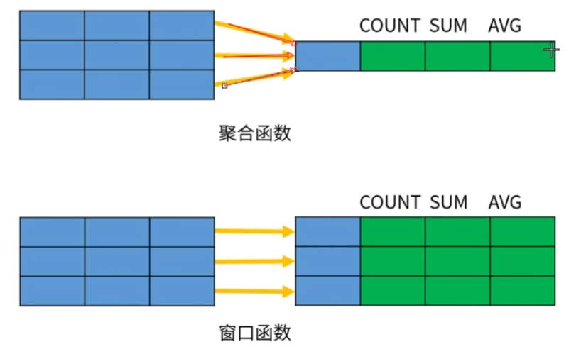

# MySQL 的函数

MySQL 数据库提供了丰富的函数，可以帮助用户更加方便地处理表中的数据，使 MySQL 数据库的功能更加强大。这些函数包括：

- 聚合函数。
- 数值型函数。
- 字符串函数。
- 日期及时间函数
- 控制流函数。
- 窗口函数。

*函数可以理解为别人封装好的模块代码。*

## 聚合函数

聚合函数包括 `COUNT`、`MIN`、`MAX`、`SUM` 和 `AVG` 等，用于对查询结果进行统计和计算。

|聚合函数|作用|
|-|-|
|`COUNT()`|统计指定列不为 NULL 的记录行数。|
|`AVG()`|计算指定列的平均值，如果指定类型不是数据类型，那么计算结果为 0。|
|`SUM()`|计算指定列的数值和，如果指定类型不是数据类型，那么计算结果为 0。|
|`MAX()`|计算指定列的最大值，如果指定类型不是数据类型，那么使用字符串排序运算。|
|`MIN()`|计算指定列的最小值，如果指定类型不是数据类型，那么使用字符串排序运算。|

- 括号中的值 `( )` 可以替换为任何常量或列名，结果都是一样的。

这些聚合函数通常与`GROUP BY`子句一起使用，以对数据进行分组并对每组数据进行计算。

*聚合函数在 **MySQL 基本操作-DQL** 中聚合查询中介绍过，这里不再重复。这里了解另一个聚合函数 `GROUP_CONCAT()`*

`GROUP_CONCAT()` 函数首先根据 GROUP BY 指定的列进行分组，并且用分隔符，将同一分组的值连接起来，返回一个字符串结果。

**函数语法：**

```sql
GROUP_CONCAT([DISTINCT] <expression> [ORDER BY <expression>] [SEPARATOR '<sep>'])
```

|选项|含义|
|-|-|
|`DISTINCT`|子句用于在连接分组之前消除组中的重复值。|
|`expression`|表达式，它指定了要连接的列。可以使用任何有效的表达式作为 `GROUP_CONCAT()` 函数的参数。例如，可以使用列名、常量、函数或计算表达式。|
|`ORDER BY`|子句允许您在连接之前按升序或降序排序值。默认情况下，它按升序排序值。如果要按降序对值进行排序，则需要明确指定 `DESC` 选项。|
|`SEPARATOR '<sep>'`|指定在组中的值之间插入的文字值。如果不指定分隔符，则 `GROUP_CONCAT` 函数使用逗号 `,` ，作为默认分隔符。|

**参考示例：**

1. 创建表，插入数据

    ```sql
    CREATE TABLE IF NOT EXISTS emp1(
        e_id INT PRIMARY KEY, -- 编号
        e_name VARCHAR(20), -- 姓名
        salary DECIMAL, -- 工资
        department VARCHAR(20) -- 部门
    );
    ```

    ```sql
    INSERT INTO emp1 VALUES(0001,'张三',5000,'财务部');
    INSERT INTO emp1 VALUES(0002,'李四',5500,'行政部');
    INSERT INTO emp1 VALUES(0003,'王五',11000,'财务部');
    INSERT INTO emp1 VALUES(0004,'喜羊羊',8000,'开发部');
    INSERT INTO emp1 VALUES(0005,'懒羊羊',3000,'销售部');
    INSERT INTO emp1 VALUES(0006,'牛爷爷',8000,'行政部');
    INSERT INTO emp1 VALUES(0007,'灰太狼',6500,'开发部');
    INSERT INTO emp1 VALUES(0008,'熊大',7300,'销售部');
    INSERT INTO emp1 VALUES(0009,'图图',5000,'财务部');
    INSERT INTO emp1 VALUES(0010,'熊二',5000,'销售部');
    ```

2. 将所有员工的名字合并成一行

    ```sql
    SELECT GROUP_CONCAT(e_name) FROM emp1;
    ```

    ```sql
    +-----------------------------------------------------------------------------------+
    | GROUP_CONCAT(e_name)                                                              |
    +-----------------------------------------------------------------------------------+
    | 张三，李四，王五，喜羊羊，懒羊羊，牛爷爷，灰太狼，熊大，图图，熊二                         |
    +-----------------------------------------------------------------------------------+
    ```

3. 指定分隔符合并

    ```sql
    SELECT GROUP_CONCAT(e_name SEPARATOR '|' )FROM emp1;
    ```

    ```sql
    +-----------------------------------------------------------------------------------+
    | GROUP_CONCAT(e_name SEPARATOR '|' )                                               |
    +-----------------------------------------------------------------------------------+
    | 张三|李四|王五|喜羊羊|懒羊羊|牛爷爷|灰太狼|熊大|图图|熊二                         |
    +-----------------------------------------------------------------------------------+
    ```

4. 按部门进行合并

    ```sql
    SELECT department,GROUP_CONCAT(e_name SEPARATOR '|' )FROM emp1 GROUP BY department;
    ```

    ```sql
    +------------+-------------------------------------+
    | department | GROUP_CONCAT(e_name SEPARATOR '|' ) |
    +------------+-------------------------------------+
    | 开发部     | 喜羊羊|灰太狼                       |
    | 行政部     | 李四|牛爷爷                         |
    | 财务部     | 张三|王五|图图                      |
    | 销售部     | 懒羊羊|熊大|熊二                    |
    +------------+-------------------------------------+
    ```

5. 按部门进行合并，并且按照薪资降序排序方式

    ```sql
    SELECT department,GROUP_CONCAT(e_name ORDER BY salary DESC SEPARATOR '|' )FROM emp1 GROUP BY department;
    ```

    ```sql
    +------------+----------------------------------------------------------+
    | department | GROUP_CONCAT(e_name ORDER BY salary DESC SEPARATOR '|' ) |
    +------------+----------------------------------------------------------+
    | 开发部     | 喜羊羊|灰太狼                                            |
    | 行政部     | 牛爷爷|李四                                              |
    | 财务部     | 王五|图图|张三                                           |
    | 销售部     | 熊大|熊二|懒羊羊                                         |
    +------------+----------------------------------------------------------+
    ```

## 数字函数

MySQL 中有很多数字函数，它们主要用于数字处理或数学计算。

|常见函数名|描述|
|-|-|
|`ABS(x)`|返回 x 的绝对值。|
|`CEIL(x)`|返回不小于 x 的最小整数，向上取整。|
|`FLOOR(x)`|返回不大于 x 的最大整数，向下取整。|
|`GREATEST(expr1,expr2,expr3,……)`|返回列表中的最大值。|
|`LEAST(expr1,expr2,expr3,……)`|返回列表中的最小值。|

**参考示例：**

```sql
SELECT ABS(-1);
-- 返回 '1'

SELECT CEIL(1.5);
-- 返回 '2'
SELECT CEIL(1.0);
-- 返回 '1'

SELECT FLOOR(1.5);
-- 返回 '1'
SELECT FLOOR(2.9);
-- 返回 '2'

SELECT GREATEST(1,2,3);
-- 返回 '3'

SELECT LEAST(1,2,3);
-- 返回 '1'
```

|常见函数名|描述|
|-|-|
|`MAX(expression)`|返回字段中的最大值。|
|`MIN(expression)`|返回字段中的最小值。|
|`MOD(x,y)`|返回 x 除以 y 的余数（取模）。|
|`PI()`|返回圆周率π，默认显示 6 位小数。|
|`POW(X,W)`|返回 x 的 y 次方。|

**参考示例：**

```sql
SELECT MAX(salary);
-- 返回字段 salary 中的最大值

SELECT MIN(salary);
-- 返回字段 salary 中的最小值

SELECT MOD(5,2);
-- 返回 '1'

SELECT PI();
-- 返回 '3.141593'

SELECT POW(2,3);
-- 返回 '8'
```

|常见函数名|描述|
|-|-|
|`RAND()`|返回一个介于 0 和 1 之间的随机浮点值。如果指定了种子值，则每次调用 RAND(N) 都会返回相同的序列。如果未指定种子值，则每次调用 RAND() 都会返回不同的值。|
|`ROUND(x)`|返回最接近于 x 的整数，即对 x 进行四舍五入。|
|`ROUND(x,y)`|返回最接近 x 的数，其值保留到小数点后面 y 位，若 y 为负值，则将保留到 x 到小数点左边 y 位。|
|`TRUNCATE(x,y)`|通过删除数字的小数部分将数字截断为指定的小数位数。|

**参考示例：**

```sql
SELECT RAND();
-- 返回 '0.9618685142713306'，注意这是在 0 和 1 之间随机生产的。

SELECT FLOOR(RAND() * 100);
-- 可以使用函数嵌套，返回的是 100 以内的整数。

SELECT ROUND(19.5);
-- 返回 '20'
SELECT ROUND(3.141593,3);
--返回 '3.142'
SELECT ROUND(1328.14,-3);
-- 返回 '1000'
SELECT ROUND(1528.14,-3);
-- 返回 '2000'

SELECT TRUNCATE(3.141593,3);
-- 返回 '3.141'
```

## 字符串函数

字符串函数是用来处理字符串的函数。它们可以对字符串进行各种操作，例如转换大小写、连接、查找和替换等。这些函数可以帮助你更方便地处理字符串数据。

|常见函数名|描述|
|-|-|
|`length(str)`|返回字符串的存储长度，注意返回的单位是字节。|
|`char_length(str)`|返回字符串的字符数。|
|`CONCAT(str1,str2……)`|将多个字符串参数首尾相连后返回，也就是字符串合并。|
|`CONCAT_WS(x,str1,str2……)`|将多个字符串参数以给定的 **分隔符 x** 首尾相连后返回。|
|`FIELD(str,str1,str2……)`|返回第一个字符串 str 在字符串列表 (str1,str2……) 中的位置。|

**参考示例：**

```sql
LENGTH('你好，数据库');
-- 返回 '18'

CHAR_LENGTH('你好，数据库');
-- 返回 '6'

SELECT CONCAT('Hello','MySQL')
-- 返回 'HelloMySQL'

SELECT CONCAT_WS(',','Hello','MySQL');
--返回 'Hello,MySQL'

SELECT FIELD('Hello','Hello','MySQL','Hello','world');
-- 返回 '1'

SELECT FIELD('world','Hello','MySQL','Hello','world');
-- 返回 '4'
```

|常见函数名|描述|
|-|-|
|`TRIM(str)`|用于删除字符串两端的空格或其他字符。默认情况下，它会删除字符串两端的空格，但也可以指定要删除的字符。|
|`LTRIM(str)`、`RTRIM(str)`|分别删除字符串开始处、结尾处的空格。|
|`MID(str,n,len)`|从字符串的 n 位置截取长度为 len 的子字符串，同 `SUBSTRING(str,n,len)`。函数中的 n 位置是从 1 开始算的。||
|`POSITION(str1 IN str)`|从字符串 str 中获取 str1 的开始位置。||
|`REPLACE(str,str1,str2)`|将字符串 str2 替代字符串 str 中的字符串 str1 ||
|`REVERSE(str)`|将字符串的顺序反过来。|

**参考示例：**

```sql
SELECT TRIM('   Hello,world   ');
-- 返回 'Hello,world'
SELECT TRIM(LEADING 'x' FROM 'xxxHelloxxx');
-- 返回 'Helloxxx'
SELECT TRIM(BOTH  'x' FROM 'xxxHello,worldxxx');
-- 返回 'Hello,world'
SELECT TRIM(TRAILING 'World' FROM 'Helloworld');
-- 返回 'Hello'

SELECT LTRIM('   Hello,world   ');
-- 返回 'Hello,world   '
SELECT LTRIM('   Hello,world   ');
-- 返回 '   Hello,world'

SELECT MID('Hello',2,3 );
-- 返回 'ell'

SELECT POSITION('o' IN 'Hello,world');
-- 返回 '5'

SELECT REPLACE('Hello,world','world','MySQL');
-- 返回 'Hello,MySQL'

SELECT REVERSE('Hello,world');
-- 返回 'dlrow,olleH'
```

|常见函数名|描述|
|-|-|
|`RIGHT(str,n)`|返回字符串的后 n 个字符。|
|`STRCMP(str1,str2)`|比较两个字符串，如果两个字符串相等，则返回 0；如果根据当前的排序顺序，第一个参数小于第二个参数，则返回-1，否则返回 1。MySQL 会按照字符的字典顺序进行比较。也就是说，它会逐个比较字符串中的字符，直到找到不同的字符为止。|
|`UPPER(str)`|将字符串中的所有字母转换为大写字母。等价于`UCASE(str)`。|
|`LOWER(str)`|将字符串中的所有字母转换为小写字母。等价于`LCASE(str)`。|

*可以使用 MySQL 的 ASCII() 函数来获取一个字符的 ASCII 码值。*

**参考示例：**

```sql
SELECT RIGHT('Hello',3);
-- 返回 'llo'

SELECT ASCII('H');
-- 返回 '72'

SELECT STRCMP('Hello','Hello');
-- 返回 '0'
SELECT STRCMP('Hello','world');
-- 返回 -'1'
SELECT STRCMP('Hello','123');
-- 返回 '1'

SELECT UPPER('Hello World!');
-- 返回 'HELLO WORLD!'
SELECT LOWER('Hello World!');
-- 返回 'hello world!'
```

## 日期及时间函数

|常见函数名|描述|
|-|-|
|`UNIX_TIMESTAMP()`|返回一个无符号整数类型的 UNIX 时间戳（1970-01-01 00:00:00’ GMT 之后的秒数）。|
|`UNIX_TIMESTAMP(date)`|将 `date` 这个日期时间字符串转换为一个 UNIX 时间戳。|
|`FROM_UNIXTIME(unix_timestamp[, format])`|将 UNIX 时间戳转换为日期时间格式。`unix_timestamp` 是要转换的 UNIX 时间戳，`format` 是可选的日期时间格式参数，默认为 `%Y-%m-%d %H:%i:%s`。|
|`CURDATE()`|返回当前日期。等价于`CURRENT_DATE()`。|
|`CURTIME()`|返回当前时间。等价于`CURRENT_TIME()`|
|`CURRENT_TIMESTAMP()`|返回当前日期和时间。|
|`DATE()`|从日期或日期时间表达式中提取日期部分|
|`DATEDIFF(date1,date2)`|计算两个日期之间的天数差。|

**参考示例：**

```sql
SELECT UNIX_TIMESTAMP();
-- 返回 '1672502400'
SELECT UNIX_TIMESTAMP('2012-12-12 12:12:12');
-- 返回 '1355285532'

SELECT FROM_UNIXTIME(1672502400);
-- 返回 '2023-01-01 00:00:00'

SELECT CURDATE();
-- 返回 '2023-05-01'

SELECT CURTIME();
-- 返回 '18:13:30'

SELECT CURRENT_TIMESTAMP();
-- 返回 '2023-01-01 18:15:30'

SELECT DATE('2022-10-30 16:13:49');
-- 返回 '2022-10-30'

SELECT DATEDIFF('2022-10-30', '2022-10-20');
-- 返回 '10'
```

|常见函数名|描述|
|-|-|
|`TIMEDIFF(time1,time2)`|计算两个时间之间的差值。|
|`DATE_FORMAT(date,format)`|按指定格式格式化日期。date 是要格式化的日期，format 是日期格式。|
|`STR_TO_DATE(string,format_mask)`|用于将日期时间字符串转换为日期。`string` 是要转换的日期时间字符串，`format_mask` 是日期时间格式。|
|`DATE_SUB(date,INTERVAL expr unit)`|用于从日期中减去指定的时间间隔。`date` 是要减去时间间隔的日期，`expr` 是时间间隔的数量，`unit` 是时间间隔的单位。|
|`DATE_ADD(date,INTERVAL expr unit)`|用于从日期中添加指定的时间间隔。|

*在 DATE_ADD() 和 DATE_SUB() 函数中，unit 参数可以有多种，例如：SECOND（秒）、MINUTE（分钟）、HOUR（小时）、DAY（天）、WEEK（周）、MONTH（月）、YEAR（年）……等等。*

**参考示例：**

```sql
SELECT TIMEDIFF('16:13:49', '08:00:00');
-- 返回 '08:13:49'

SELECT DATE_FORMAT('2022-10-30', '%W %M %Y');
-- 返回 'Sunday October 2022'

SELECT STR_TO_DATE('30,10,2022', '%d,%m,%Y');
-- 返回 '2022-10-30'

SELECT DATE_SUB('2022-10-30', INTERVAL 10 DAY);
-- 返回 '2022-10-20'

SELECT DATE_ADD('2022-10-30', INTERVAL 1 MONTH);
-- 返回 '2022-11-30'
```

|常见函数名|描述|
|-|-|
|`EXTRACT(type FROM d)`|从日期中提取指定类型的值。`type` 是要提取的值的类型，d 是要提取值的日期。|
|`LAST_DAY(d)`|返回指定日期所在月份的最后一天。d 是要计算的日期。|
|`makedate(year,dayofyear)`|用于根据年份和一年中的天数创建日期。year 是要创建日期的年份，dayofyear 是一年中的天数。|

**参考示例：**

```sql
SELECT EXTRACT(YEAR FROM '2022-10-30');
-- 返回 '2022'
SELECT EXTRACT(WEEK FROM '2022-10-30 12:12:12');
-- 返回 '44'
SELECT EXTRACT(HOUR FROM '2022-10-30 12:12:12');
-- 返回 '12'

SELECT LAST_DAY('2022-10-30');
-- 返回 2022-10-31

SELECT MAKEDATE(2022,123);
-- 返回 2022-05-03
```

|常见函数名|描述|
|-|-|
|`YEAR(date)`|用于从日期中提取年份。|
|`MONTH(date)`|用于从日期中提取月份。|
|`DAY(date)`|用于从日期中提取天数。|
|`HOUR(date)`|用于从日期中提取小时数。|
|`MINUTE(date)`|用于从日期中提取分钟数。|
|`SECOND(date)`|用于从日期中提取秒数。|
|`QUARTER(date)`|用于从日期中提取季度。返回值为 1（第一季度）到 4（第四季度）。|

**参考示例：**

```sql
SELECT YEAR('2022-10-30');
-- 返回 '2022'

SELECT MONTH('2022-10-30');
-- 返回 '10'

SELECT DAY('2022-10-30');
-- 返回 '30'

SELECT HOUR('16:13:49');
-- 返回 '16'

SELECT MINUTE('16:13:49');
-- 返回 '13'

SELECT SECOND('16:13:49');
-- 返回 '49'

SELECT QUARTER('2022-10-30');
-- 返回 '4'
```

|常见函数名|描述|
|-|-|
|`MONTHNAME(date)`|用于从日期中提取月份名称。|
|`DAYNAME(date)`|用于从日期中提取星期几的名称。|
|`DAYOFMONTH(date)`|用于从日期中提取月份中的天数。|
|`DAYOFWEEK(date)`|用于从日期中提取星期几。返回值为 1（星期天）到 7（星期六）。|
|`DAYOFYEAR(date)`|用于从日期中提取一年中的天数。|

**参考示例：**

```sql
SELECT MONTHNAME('2022-10-30');
-- 返回 'October'

SELECT DAYNAME('2022-10-30');
-- 返回 'Sunday'

SELECT DAYOFMONTH('2022-10-30');
-- 返回 '30'

SELECT DAYOFWEEK('2022-10-30');
-- 返回 '1'

SELECT DAYFYEAR('2022-10-30');
-- 返回 '303'
```

|常见函数名|描述|
|-|-|
|`WEEK(date[,mode])`|用于从日期中提取周数。date 是要提取周数的日期，mode 是可选的模式，用于指定一周的起始日和返回值的范围，默认使用的是 0|
|`WEEKDAY(date)`|用于从日期中提取星期几。返回值为 0（星期一）到 6（星期天）。|
|`WEEKOFYEAR(date)`|用于从日期中提取一年中的周数。它与 `WEEK(date,3)` 函数相同。|
|`YEARWEEK(date[,mode])`|用于从日期中提取年和周数。date 是要提取年和周数的日期，mode 是可选的模式，用于指定一周的起始日和返回值的范围。|
|`NOW`|返回当前日期和时间。等价于`CURRENT_TIMESTAMP()`。|

`WEEK(date[,mode])`和`YEARWEEK(date[,mode])`函数中的 mode 参数用于指定一周的起始日和返回值的范围：

- 0：周日为一周的第一天，范围为 0 到 53。
- 1：周一为一周的第一天，范围为 0 到 53。
- 2：周日为一周的第一天，范围为 1 到 53。
- 3：周一为一周的第一天，范围为 1 到 53。
- 4：周日为一周的第一天，范围为 0 到 53，与模式 0 相同。
- 5：周一为一周的第一天，范围为 0 到 53，与模式 1 相同。
- 6：周日为一周的第一天，范围为 1 到 53，与模式 2 相同。
- 7：周一为一周的第一天，范围为 1 到 53，与模式 3 相同。

```sql
SELECT WEEK('2022-10-30');
-- 返回 '44'
SELECT WEEK('2022-10-30',1);
-- 返回 '43'
SELECT WEEK('2022-10-30',2);
-- 返回 '44'

SELECT WEEKDAY('2022-10-30');
-- 返回 '6'

SELECT WEEKOFYEAR('2022-10-30');
-- 返回 '43'

SELECT YEARWEEK('2022-10-30');
-- 返回 '202243'

SELECT NOW();
-- 返回 '2023-01-01 23:02:05'
```

## 控制流函数

MySQL 中的控制流函数可以用来控制查询语句中的执行流程。这些函数包括 IF，IFNULL，NULLIF，CASE 和 COALESCE。它们可以用来根据特定条件执行不同的操作或返回不同的结果。

### IF 相关函数

|格式|描述|
|-|-|
|`IF(expr, value_if_true, value_if_false)`|如果条件表达式的结果为真（非零），则 IF 函数返回第二个参数的值；否则，它返回第三个参数的值。|
|`IFNULL(expr, value_if_null)`|如果表达式的值不为 NULL，则 IFNULL 函数返回表达式的值；否则，它返回替代值。|
|`NULLIF(expr1, expr2)`|如果这两个表达式的值相等，则 NULLIF 函数返回 NULL；否则，它返回第一个表达式的值。|

**参考示例：**

1. 创建表，插入数据

    ```sql
    CREATE TABLE employees (
        id INT AUTO_INCREMENT PRIMARY KEY,
        name VARCHAR(255),
        salary INT,
        bonus INT
    );

    INSERT INTO employees (name, salary, bonus)
    VALUES ('Alice', 3500, 500),
        ('Bob', 2500, NULL),
        ('Charlie', 4000, 0),
        ('Dave', 3000, 100);
    ```

2. IF 函数

   使用 IF 函数来检查每个员工的工资是否高于 3000，如果是，则返回“High”，否则返回“Low”

   ```sql
   SELECT name, salary, IF(salary > 3000, 'High', 'Low') as salary_level FROM employees;
   ```

   ```sql
   +---------+--------+--------------+
   | name    | salary | salary_level |
   +---------+--------+--------------+
   | Alice   |   3500 | High         |
   | Bob     |   2500 | Low          |
   | Charlie |   4000 | High         |
   | Dave    |   3000 | Low          |
   +---------+--------+--------------+
   ```

3. IFNULL 函数

    使用 IFNULL 函数来检查每个员工的奖金是否为 NULL，如果是，则返回 0，否则返回奖金的值。

    ```sql
    SELECT name, salary, IFNULL(bonus, 0) as bonus FROM employees;
    ```

    ```sql
    +---------+--------+-------+
    | name    | salary | bonus |
    +---------+--------+-------+
    | Alice   |   3500 |   500 |
    | Bob     |   2500 |     0 |
    | Charlie |   4000 |     0 |
    | Dave    |   3000 |   100 |
    +---------+--------+-------+
    ```

4. NULLIF 函数

    使用 NULLIF 函数来检查每个员工的奖金是否为 0，如果是，则返回 NULL，否则返回奖金的值。

    ```sql
    SELECT name, salary, NULLIF(bonus, 0) as bonus FROM employees;
    ```

    ```sql
    +---------+--------+-------+
    | name    | salary | bonus |
    +---------+--------+-------+
    | Alice   |   3500 |   500 |
    | Bob     |   2500 |  NULL |
    | Charlie |   4000 |  NULL |
    | Dave    |   3000 |   100 |
    +---------+--------+-------+
    ```

### CASE 函数

CASE 是 MySQL 中的一个控制流函数，它允许您根据多个条件执行不同的操作或返回不同的结果。它有两种语法形式：简单 CASE 语法和搜索 CASE 语法。

简单 CASE 语法的形式如下：

```sql
CASE case_value
    WHEN when_value1 THEN result1
    WHEN when_value2 THEN result2
    ...
    ELSE else_result
END
```

在这种形式中，`case_value` 是一个表达式，它的值会与每个 `when_value` 进行比较。如果 `case_value` 的值与某个 `when_value` 相等，则返回相应的 `result` 值。如果没有任何一个 `when_value` 与 `case_value` 的值相等，则返回 `else_result` 的值。

搜索 CASE 语法的形式如下：

```sql
CASE
    WHEN when_condition1 THEN result1
    WHEN when_condition2 THEN result2
    ...
    ELSE else_result
END
```

在这种形式中，每个 `when_condition` 都是一个条件表达式。如果某个 `when_condition` 的结果为真（非零），则返回相应的 `result` 值。并且不再检查后面的 `when_condition`。只有当所有的 `when_condition` 的结果不为真，则返回 `else_result` 的值。

**参考示例：**

1. 创建表，插入数据

    ```sql
    CREATE TABLE orders (
        id INT AUTO_INCREMENT PRIMARY KEY,
        customer_name VARCHAR(255),
        order_date DATE,
        order_total INT
    );

    INSERT INTO orders (customer_name, order_date, order_total)
    VALUES ('Alice', '2022-01-01', 100),
        ('Bob', '2022-02-14', 200),
        ('Charlie', '2022-03-01', 150),
        ('Dave', '2022-04-01', 250);
    ```

2. 简单 CASE 语法

    使用简单 CASE 语法来检查每个订单的月份，如果是 1 月，则返回“January”，否则，再检查月份是否为 2 月，如果是，则返回“February”，否则返回“Other”。

    ```sql
    SELECT
        customer_name,
        order_date,
        order_total,
    CASE
            MONTH ( order_date ) 
            WHEN 1 THEN
            'January' 
            WHEN 2 THEN
            'February' 
            WHEN 3 THEN
            'March' 
            WHEN 4 THEN
            'April' ELSE 'Other' 
        END AS order_month 
    FROM
        orders;
    ```

    ```sql
    +---------------+------------+-------------+-------------+
    | customer_name | order_date | order_total | order_month |
    +---------------+------------+-------------+-------------+
    | Alice         | 2022-01-01 |         100 | January     |
    | Bob           | 2022-02-14 |         200 | February    |
    | Charlie       | 2022-03-01 |         150 | March       |
    | Dave          | 2022-04-01 |         250 | April       |
    +---------------+------------+-------------+-------------+
    ```

3. 搜索 CASE 语法

    使用搜索 CASE 语法来检查每个订单的总金额是否小于 150，如果是，则返回“Small”，否则再检查总金额是否小于 200，如果是，则返回“Medium”，否则返回“Large”。

    ```sql
    SELECT
        customer_name,
        order_date,
        order_total,
    CASE
            WHEN order_total < 150 THEN
            'Small' 
            WHEN order_total < 200 THEN
            'Medium' ELSE 'Large' 
        END AS order_size 
    FROM
        orders;
    ```

    ```sql
    +---------------+------------+-------------+------------+
    | customer_name | order_date | order_total | order_size |
    +---------------+------------+-------------+------------+
    | Alice         | 2022-01-01 |         100 | Small      |
    | Bob           | 2022-02-14 |         200 | Large      |
    | Charlie       | 2022-03-01 |         150 | Medium     |
    | Dave          | 2022-04-01 |         250 | Large      |
    +---------------+------------+-------------+------------+
    ```

## 窗口函数

MySQL 从 8.0 版本开始支持窗口函数，窗口函数又被成为开窗函数，与 Oracle 窗口函数类似，属于 MySQL 的一大特点。

窗口函数和聚合函数都可以对数据进行分组和计算，窗口函数也可以对数据进行分组和计算，但它与聚合函数不同的是，它将**分组的结果置于每一条数据记录中**。窗口函数在行记录上计算某个字段时的结果时，可以将窗口范围内的数据输入到聚合函数中，并不改变行数。

窗口函数可以分为静态窗口函数和动态窗口函数。静态窗口函数的大小是固定的，而动态窗口函数的大小可以根据设置进行变化。



窗口函数可以按照功能划分为几类：

- 序号函数：可以用来对数据进行排序和生成序列号。
- 开窗聚合函数：开窗聚合函数是指将聚合函数与窗口函数结合使用的一类函数。聚合函数是一类特殊的函数，它可以对一组值进行计算并返回单个值。
- 分布函数：可以用来计算数据的分布情况。
- 前后函数：可以用来获取当前行之前或之后的行。
- 头尾函数：可以用来获取第一行或最后一行。
- 其他函数：可以用来返回窗口内排序后的第 n 个值，可以将窗口内的数据分成 n 个组，并返回每行所属组的编号。

**语法结构：**

```sql
windows_function (expr) OVER (
    PARTITION BY ...
    ORDER BY ...
    [ROWS | RANGE] frame_clause
)
```

- `windows_function (expr)` 表示窗口函数名和参数，有些函数不需要参数。
- `OVER` 子句用来定义窗口，包含了三个选项。
- `PARTITION BY` 子句用来将数据行拆分成多个分区（组），它的作用类似于 `GROUP BY` 分组。如果忽略了 `PARTITION BY` ，所有的数据作为一个组进行计算。
- `ORDER BY` 子句用来指定分区内的字段和排序顺序。
- `frame_clause` 用来在当前分区指定一个计算窗口，也就是一个与当前行相关的数据子集，可以使用 `ROWS` 或 `RANGE` 子句。

### 序号函数

序号函数是一类窗口函数，它可以用来对数据进行排序和生成序列号。MySQL 支持的序号函数包括 `ROW_NUMBER()`、`RANK()` 和 `DENSE_RANK()` 等：

- `ROW_NUMBER()` 函数用来为窗口内的每一行数据生成一个唯一的序列号。序列号从 1 开始，按照窗口内数据的顺序递增。
- `RANK()` 函数用来为窗口内的每一行数据生成一个排名。排名从 1 开始，按照窗口内数据的顺序递增。如果有多行数据具有相同的值，则它们会获得相同的排名。
- `DENSE_RANK()` 函数与 `RANK()` 函数类似，也用来为窗口内的每一行数据生成一个排名。不同的是，`DENSE_RANK()` 函数生成的排名是连续的，即使有多行数据具有相同的值。

**示例表格：**

创建一个示例表格，后续操作会使用：

```sql
CREATE TABLE IF NOT EXISTS emp1(
    e_id INT PRIMARY KEY, -- 编号
    e_name VARCHAR(20), -- 姓名
    salary DECIMAL, -- 工资
    department VARCHAR(20) -- 部门
);
```

```sql
INSERT INTO emp1 VALUES(0001,'张三',5000,'开发部');
INSERT INTO emp1 VALUES(0002,'李四',5000,'开发部');
INSERT INTO emp1 VALUES(0003,'王五',11000,'开发部');
INSERT INTO emp1 VALUES(0004,'喜羊羊',8000,'开发部');
INSERT INTO emp1 VALUES(0005,'懒羊羊',8000,'开发部');
INSERT INTO emp1 VALUES(0006,'猪猪侠',3000,'开发部');
INSERT INTO emp1 VALUES(0007,'牛爷爷',8000,'销售部');
INSERT INTO emp1 VALUES(0008,'灰太狼',8000,'销售部');
INSERT INTO emp1 VALUES(0009,'熊大',7300,'销售部');
INSERT INTO emp1 VALUES(0010,'图图',5000,'销售部');
INSERT INTO emp1 VALUES(0011,'熊二',5000,'销售部');
INSERT INTO emp1 VALUES(0012,'葫芦娃',3000,'销售部');
```

**参考示例：**

1. 对每个部门的员工按照薪资降序排序，并且给出排名

    ```sql
    SELECT
        e_name,
        salary,
        department,
        ROW_NUMBER() OVER ( PARTITION BY department ORDER BY salary DESC ) AS 工资排名 1,
        RANK() OVER ( PARTITION BY department ORDER BY salary DESC ) AS 工资排名 2,
        DENSE_RANK() OVER ( PARTITION BY department ORDER BY salary DESC ) AS 工资排名 3
    FROM
        emp1;
    ```

    ```sql
    +-----------+--------+------------+---------------+---------------+---------------+
    | e_name    | salary | department | 工资排名 1     | 工资排名 2     | 工资排名 3     |
    +-----------+--------+------------+---------------+---------------+---------------+
    | 王五      |  11000 | 开发部     |             1 |             1 |             1 |
    | 喜羊羊    |   8000 | 开发部     |             2 |             2 |             2 |
    | 懒羊羊    |   8000 | 开发部     |             3 |             2 |             2 |
    | 张三      |   5000 | 开发部     |             4 |             4 |             3 |
    | 李四      |   5000 | 开发部     |             5 |             4 |             3 |
    | 猪猪侠    |   3000 | 开发部     |             6 |             6 |             4 |
    | 牛爷爷    |   8000 | 销售部     |             1 |             1 |             1 |
    | 灰太狼    |   8000 | 销售部     |             2 |             1 |             1 |
    | 熊大      |   7300 | 销售部     |             3 |             3 |             2 |
    | 图图      |   5000 | 销售部     |             4 |             4 |             3 |
    | 熊二      |   5000 | 销售部     |             5 |             4 |             3 |
    | 葫芦娃    |   3000 | 销售部     |             6 |             6 |             4 |
    +-----------+--------+------------+---------------+---------------+---------------+
    ```

    可以看到在 `工资排名 1` 列展示了 `ROW_NUMBER()` 函数的结果。可以看到，每个部门内的员工都获得了一个唯一的序列号，序列号从 1 开始，按照薪水降序递增。

    `工资排名 2` 列展示了 `RANK()` 函数的结果。可以看到，每个部门内的员工都获得了一个排名，排名从 1 开始，按照薪水降序递增。如果有多个员工薪水相同，则它们获得相同的排名。

    `工资排名 3` 列展示了 `DENSE_RANK()` 函数的结果。可以看到，每个部门内的员工都获得了一个连续递增的排名，排名从 1 开始，按照薪水降序递增。如果有多个员工薪水相同，则它们获得相同的排名。

2. 返回每个部门工资薪资排名前三名的员工（使用 `ROW_NUMBER()` 序号函数）

    ```sql
    SELECT
        * 
    FROM
        ( SELECT e_name, salary, department, ROW_NUMBER() OVER ( PARTITION BY department ORDER BY salary DESC ) AS TOP3 FROM emp1 ) t 
    WHERE
        t.TOP3 <= 3;
    ```

    ```sql
    +-----------+--------+------------+------+
    | e_name    | salary | department | TOP3 |
    +-----------+--------+------------+------+
    | 王五      |  11000 | 开发部     |    1 |
    | 喜羊羊    |   8000 | 开发部     |    2 |
    | 懒羊羊    |   8000 | 开发部     |    3 |
    | 牛爷爷    |   8000 | 销售部     |    1 |
    | 灰太狼    |   8000 | 销售部     |    2 |
    | 熊大      |   7300 | 销售部     |    3 |
    +-----------+--------+------------+------+
    ```

3. 对所有员工进行全局排序（不分组）

    ```sql
    SELECT
        e_name,
        salary,
        department,
        ROW_NUMBER() OVER (ORDER BY salary DESC ) AS TOP3 
    FROM
        emp1;
    ```

    ```sql
    +-----------+--------+------------+------+
    | e_name    | salary | department | TOP3 |
    +-----------+--------+------------+------+
    | 王五      |  11000 | 开发部     |    1 |
    | 喜羊羊    |   8000 | 开发部     |    2 |
    | 懒羊羊    |   8000 | 开发部     |    3 |
    | 牛爷爷    |   8000 | 销售部     |    4 |
    | 灰太狼    |   8000 | 销售部     |    5 |
    | 熊大      |   7300 | 销售部     |    6 |
    | 张三      |   5000 | 开发部     |    7 |
    | 李四      |   5000 | 开发部     |    8 |
    | 图图      |   5000 | 销售部     |    9 |
    | 熊二      |   5000 | 销售部     |   10 |
    | 猪猪侠    |   3000 | 开发部     |   11 |
    | 葫芦娃    |   3000 | 销售部     |   12 |
    +-----------+--------+------------+------+
    ```

### 开窗聚合函数

开窗聚合函数是指将聚合函数与窗口函数结合使用的一类函数。聚合函数是一类特殊的函数，它可以对一组值进行计算并返回单个值，例如 `SUM()`、`AVG()`、`COUNT()`、`MAX()` 和 `MIN()` 等。当聚合函数作为窗口函数使用时，它会在每个窗口内执行聚合计算，并将结果置于每一条数据记录中。

**参考示例：**

还是使用 `emp1` 表中的数据进行操作。

1. 查询每个部门内员工的薪水累计和

    ```sql
    SELECT
        *,
        SUM( salary ) OVER ( PARTITION BY department ORDER BY salay ) AS sum 
    FROM
        emp1;
    ```

    ```sql
    +------+-----------+--------+------------+-------+
    | e_id | e_name    | salary | department | sum   |
    +------+-----------+--------+------------+-------+
    |    6 | 猪猪侠    |   3000 | 开发部     |  3000 |
    |    1 | 张三      |   5000 | 开发部     | 13000 |
    |    2 | 李四      |   5000 | 开发部     | 13000 |
    |    4 | 喜羊羊    |   8000 | 开发部     | 29000 |
    |    5 | 懒羊羊    |   8000 | 开发部     | 29000 |
    |    3 | 王五      |  11000 | 开发部     | 40000 |
    |   12 | 葫芦娃    |   3000 | 销售部     |  3000 |
    |   10 | 图图      |   5000 | 销售部     | 13000 |
    |   11 | 熊二      |   5000 | 销售部     | 13000 |
    |    9 | 熊大      |   7300 | 销售部     | 20300 |
    |    7 | 牛爷爷    |   8000 | 销售部     | 36300 |
    |    8 | 灰太狼    |   8000 | 销售部     | 36300 |
    +------+-----------+--------+------------+-------+
    ```

    使用了 `SUM()` 函数作为窗口函数来计算每个部门内员工的薪水累计和，每个部门内的员工都按照员工编号排序，薪水累计和从第一个员工开始累加，直到最后一个员工。

    如果没有 `ORDER BY` 排序语句的话，窗口函数会对整个窗口内的数据进行计算，而不是按照行进行累加。这就是为什么每个部门内的所有员工的薪水总和都是相同的原因。

    ```sql
    SELECT
        *,
        SUM( salary ) OVER ( PARTITION BY department ) AS sum 
    FROM
        emp1;
    ```

    ```sql
    +------+-----------+--------+------------+-------+
    | e_id | e_name    | salary | department | sum   |
    +------+-----------+--------+------------+-------+
    |    1 | 张三      |   5000 | 开发部     | 40000 |
    |    2 | 李四      |   5000 | 开发部     | 40000 |
    |    3 | 王五      |  11000 | 开发部     | 40000 |
    |    4 | 喜羊羊    |   8000 | 开发部     | 40000 |
    |    5 | 懒羊羊    |   8000 | 开发部     | 40000 |
    |    6 | 猪猪侠    |   3000 | 开发部     | 40000 |
    |    7 | 牛爷爷    |   8000 | 销售部     | 36300 |
    |    8 | 灰太狼    |   8000 | 销售部     | 36300 |
    |    9 | 熊大      |   7300 | 销售部     | 36300 |
    |   10 | 图图      |   5000 | 销售部     | 36300 |
    |   11 | 熊二      |   5000 | 销售部     | 36300 |
    |   12 | 葫芦娃    |   3000 | 销售部     | 36300 |
    +------+-----------+--------+------------+-------+
    ```

2. 查询每个部门的薪水累计和从当前行往前 3 行开始累加，直到当前行。

    ```sql
    SELECT
        *,
        SUM( salary ) OVER ( PARTITION BY department ORDER BY salary ROWS BETWEEN 3 PRECEDING AND CURRENT ROW ) AS sum 
    FROM
        emp1;
    ```

    ```sql
    +------+-----------+--------+------------+-------+
    | e_id | e_name    | salary | department | sum   |
    +------+-----------+--------+------------+-------+
    |    6 | 猪猪侠    |   3000 | 开发部     |  3000 |
    |    1 | 张三      |   5000 | 开发部     |  8000 |
    |    2 | 李四      |   5000 | 开发部     | 13000 |
    |    4 | 喜羊羊    |   8000 | 开发部     | 21000 |
    |    5 | 懒羊羊    |   8000 | 开发部     | 26000 |
    |    3 | 王五      |  11000 | 开发部     | 32000 |
    |   12 | 葫芦娃    |   3000 | 销售部     |  3000 |
    |   10 | 图图      |   5000 | 销售部     |  8000 |
    |   11 | 熊二      |   5000 | 销售部     | 13000 |
    |    9 | 熊大      |   7300 | 销售部     | 20300 |
    |    7 | 牛爷爷    |   8000 | 销售部     | 25300 |
    |    8 | 灰太狼    |   8000 | 销售部     | 28300 |
    +------+-----------+--------+------------+-------+
    ```

    `ROWS BETWEEN 3 PRECEDING AND CURRENT ROW` 是一个 `ROWS` 子句，它用来指定窗口的大小。这个子句表示窗口包括从当前行往前 3 行到当前行的所有数据。

    `3 PRECEDING` 表示窗口的起始位置是当前行往前 3 行。

    `CURRENT ROW` 表示窗口的结束位置是当前行。

    以王五为例，他所在的部门是开发部，他的工资是 11000。在结果集中，他前面有 5 个人，但是由于指定了只包括前三行，所以在计算他的累计总和时，只会包括他自己和他前面三个人的工资。因此，他的累计总和是 32000（8000 + 8000 + 5000 + 11000）。

3. 查询每个部门的薪水累计和从当前行往前 3 行开始累加，直到当前行的后 1 行。

    ```sql
    SELECT
        *,
        SUM( salary ) OVER ( PARTITION BY department ORDER BY salary ROWS BETWEEN 3 PRECEDING AND 1 FOLLOWING ) AS sum 
    FROM
        emp1;
    ```

    ```sql
    +------+-----------+--------+------------+-------+
    | e_id | e_name    | salary | department | sum   |
    +------+-----------+--------+------------+-------+
    |    6 | 猪猪侠    |   3000 | 开发部     |  8000 |
    |    1 | 张三      |   5000 | 开发部     | 13000 |
    |    2 | 李四      |   5000 | 开发部     | 21000 |
    |    4 | 喜羊羊    |   8000 | 开发部     | 29000 |
    |    5 | 懒羊羊    |   8000 | 开发部     | 37000 |
    |    3 | 王五      |  11000 | 开发部     | 32000 |
    |   12 | 葫芦娃    |   3000 | 销售部     |  8000 |
    |   10 | 图图      |   5000 | 销售部     | 13000 |
    |   11 | 熊二      |   5000 | 销售部     | 20300 |
    |    9 | 熊大      |   7300 | 销售部     | 28300 |
    |    7 | 牛爷爷    |   8000 | 销售部     | 33300 |
    |    8 | 灰太狼    |   8000 | 销售部     | 28300 |
    +------+-----------+--------+------------+-------+
    ```

    `ROWS BETWEEN 3 PRECEDING AND 1 FOLLOWING` 是一个 `ROWS` 子句，它用来指定窗口的大小。这个子句表示窗口包括从当前行往前 3 行到当前行往后 1 行的所有数据。

    `1 FOLLOWING` 表示计算窗口将包括当前行往后 1 行。

    以懒羊羊为例，他所在的部门是开发部，他的工资是 8000。在结果集中，由于指定了前三行和后一行，所以在计算他的累计总和时，只会包括他自己和他前面三个人以及他后面一个人的工资。因此，他的累计总和是 37000（5000 + 5000 + 8000 + 8000 + 11000）。

4. 查询每个部门的薪水累计和从当前行开始累加，直到最后 1 行。

    ```sql
    SELECT
        *,
        SUM( salary ) OVER ( PARTITION BY department ORDER BY salary ROWS BETWEEN CURRENT ROW AND UNBOUNDED FOLLOWING ) AS sum 
    FROM
        emp1;
    ```

    ```sql
    +------+-----------+--------+------------+-------+
    | e_id | e_name    | salary | department | sum   |
    +------+-----------+--------+------------+-------+
    |    6 | 猪猪侠    |   3000 | 开发部     | 40000 |
    |    1 | 张三      |   5000 | 开发部     | 37000 |
    |    2 | 李四      |   5000 | 开发部     | 32000 |
    |    4 | 喜羊羊    |   8000 | 开发部     | 27000 |
    |    5 | 懒羊羊    |   8000 | 开发部     | 19000 |
    |    3 | 王五      |  11000 | 开发部     | 11000 |
    |   12 | 葫芦娃    |   3000 | 销售部     | 36300 |
    |   10 | 图图      |   5000 | 销售部     | 33300 |
    |   11 | 熊二      |   5000 | 销售部     | 28300 |
    |    9 | 熊大      |   7300 | 销售部     | 23300 |
    |    7 | 牛爷爷    |   8000 | 销售部     | 16000 |
    |    8 | 灰太狼    |   8000 | 销售部     |  8000 |
    +------+-----------+--------+------------+-------+
    ```

    `ROWS BETWEEN CURRENT ROW AND UNBOUNDED FOLLOWING`  是一个用于指定计算窗口范围的子句。它表示对于每一行，计算窗口将包括当前行和之后的所有行。

    `BETWEEN CURRENT ROW` 表示计算窗口将从当前行开始。

    `UNBOUNDED FOLLOWING` 表示计算窗口将一直延伸到分区的最后一行。

    *示例中只使用了 `SUM()` 函数，可以任意更换为其他聚合函数。*

### 分布函数

分布函数是一类用来计算数据分布情况的函数。它们可以帮助我们了解数据的分布情况，比如数据的分位数、累积分布等。

在 MySQL 8.0 中，有两个常用的分布函数。

#### CUME_DIST() 函数

`CUME_DIST()` 计算了一个值在一组值中的累积分布，它返回的值在 0 到 1 之间，表示**小于等于**该值的数据所占的比例。

`CUME_DIST()` 计算方式：

```sql
(rank_total) / (total_rows)
```

在此公式中，rank_total 为小于或等于当前行 `RANK()` 值的行数，total_rows 为当前窗口的记录总行。

**参考示例：**

计算每个员工的工资在其所在部门中的累积分布：

```sql
SELECT
    *,
    RANK() OVER ( PARTITION BY department ORDER BY salary ) AS 'RANK 值',
    CUME_DIST() OVER ( PARTITION BY department ORDER BY salary ) AS '累积分布'
FROM
    emp1;
```

```sql
+------+-----------+--------+------------+---------+---------------------+
| e_id | e_name    | salary | department | RANK 值  | 累积分布          |
+------+-----------+--------+------------+---------+---------------------+
|    6 | 猪猪侠    |   3000 | 开发部     |       1 | 0.16666666666666666 |
|    1 | 张三      |   5000 | 开发部     |       2 |                 0.5 |
|    2 | 李四      |   5000 | 开发部     |       2 |                 0.5 |
|    4 | 喜羊羊    |   8000 | 开发部     |       4 |  0.8333333333333334 |
|    5 | 懒羊羊    |   8000 | 开发部     |       4 |  0.8333333333333334 |
|    3 | 王五      |  11000 | 开发部     |       6 |                   1 |
|   12 | 葫芦娃    |   3000 | 销售部     |       1 | 0.16666666666666666 |
|   10 | 图图      |   5000 | 销售部     |       2 |                 0.5 |
|   11 | 熊二      |   5000 | 销售部     |       2 |                 0.5 |
|    9 | 熊大      |   7300 | 销售部     |       4 |  0.6666666666666666 |
|    7 | 牛爷爷    |   8000 | 销售部     |       5 |                   1 |
|    8 | 灰太狼    |   8000 | 销售部     |       5 |                   1 |
+------+-----------+--------+------------+---------+---------------------+
```

在此示例中，工资按照升序排序，`RANK 值` 添加了功能以供参考。

对于每个员工，`CUME_DIST()` 函数都会计算出他们的工资在其所在部门中的累积百分比。

例如，对于猪猪侠，他的工资是开发部中最低的，小于等于 3000 的行数为 1，因此他的累积分布是 0.16（1/6）。而对于王五，他的工资是开发部中最高的，小于等于 11000 的行数为 6，因此他的累积分布是 1（6/6）。

#### PERCENT_RANK() 函数

`PERCENT_RANK()` 函数用于计算分区或结果集中行的百分位数。它返回一个从 0 到 1 的数字。

`PERCENT_RANK()` 的计算方式：

```sql
(rank - 1) / (total_rows - 1)
```

在此公式中，rank 为 `RANK()` 值，total_rows 为当前窗口的记录总行。

`PERCENT_RANK()` 对于分区或结果集中的第一行，函数始终返回零。重复的列值将接收相同的 `PERCENT_RANK()` 值。

**参考示例：**

计算每个员工的工资在其所在部门中的百分位数：

```sql  
SELECT
    *,
    RANK() OVER ( PARTITION BY department ORDER BY salary ) AS 'RANK 值',
    PERCENT_RANK() OVER ( PARTITION BY department ORDER BY salary ) AS '百分位数' 
FROM
    emp1;
```

```sql
+------+-----------+--------+------------+---------+--------------------+
| e_id | e_name    | salary | department | RANK 值  | 百分位数          |
+------+-----------+--------+------------+---------+--------------------+
|    6 | 猪猪侠    |   3000 | 开发部     |       1 |                  0 |
|    1 | 张三      |   5000 | 开发部     |       2 |                0.2 |
|    2 | 李四      |   5000 | 开发部     |       2 |                0.2 |
|    4 | 喜羊羊    |   8000 | 开发部     |       4 |                0.6 |
|    5 | 懒羊羊    |   8000 | 开发部     |       4 |                0.6 |
|    3 | 王五      |  11000 | 开发部     |       6 |                  1 |
|   12 | 葫芦娃    |   3000 | 销售部     |       1 |                  0 |
|   10 | 图图      |   5000 | 销售部     |       2 |                0.2 |
|   11 | 熊二      |   5000 | 销售部     |       2 |                0.2 |
|    9 | 熊大      |   7300 | 销售部     |       4 |                0.6 |
|    7 | 牛爷爷    |   8000 | 销售部     |       5 |                0.8 |
|    8 | 灰太狼    |   8000 | 销售部     |       5 |                0.8 |
+------+-----------+--------+------------+---------+--------------------+
```

这个查询使用了 `RANK()` 和 `PERCENT_RANK()` 窗口函数，它们都是按部门分区并按薪水排序。`RANK()` 函数为每个部门中的员工分配一个等级，其中薪水相同的员工将获得相同的等级。`PERCENT_RANK()` 函数计算每个部门中员工的百分位数。

例如，在开发部中，猪猪侠的薪水最低，所以他的 RANK 值 为 1，百分位数为 0`(1-1/6-1)`。这意味着在开发部中，0% 的员工的薪水比他低。也就是说，他的薪水最低。

张三和李四的薪水相同，所以他们的 RANK 值 都是 2，百分位数都是 0.2`(2-1/6-1)`。这意味着在开发部中，20% 的员工的薪水比他们低。也就是说，他们的薪水高于开发部中 20% 的员工。

喜羊羊和懒羊羊的薪水也相同，所以他们的 RANK 值 都是 4（因为张三和李四共享了第 2 名），百分位数都是 0.6`(4-1/6-1)`。这意味着在开发部中，60% 的员工的薪水比他们低。也就是说，他们的薪水高于开发部中 60% 的员工。

王五的薪水最高，所以他的 RANK 值 为 6（因为喜羊羊和懒羊羊共享了第 4 名），百分位数为 1`(6-1/6-1)`。这意味着在开发部中，100% 的员工的薪水比他低。也就是说，他的薪水最高。

### 前后函数

前后函数是一类窗口函数，用于访问结果集中当前行之前或之后的行。常见的前后函数包括 `LAG()`、`LEAD()`。

**示例表格：**

```sql
CREATE TABLE emp2 (
    e_name VARCHAR(255),
    department VARCHAR(255),
    month DATE,
    salary INT
);

INSERT INTO employee (e_name, department, month, salary)
VALUES
    ('张三', '开发部', '2022-01-01', 5000),
    ('张三', '开发部', '2022-02-01', 5500),
    ('张三', '开发部', '2022-03-01', 6100),
    ('张三', '开发部', '2022-04-01', 6200),
    ('张三', '开发部', '2022-05-01', 5800),

    ('李四', '开发部', '2022-01-01', 9000),
    ('李四', '开发部', '2022-02-01', 9500),
    ('李四', '开发部', '2022-03-01', 8100),
    ('李四', '开发部', '2022-04-01', 9400),
    ('李四', '开发部', '2022-05-01', 8500),

    ('王五', '销售部', '2022-01-01', 12000),
    ('王五', '销售部', '2022-02-01', 3000),
    ('王五', '销售部', '2022-03-01', 8600),
    ('王五', '销售部', '2022-04-01', 2300),
    ('王五', '销售部', '2022-05-01', 4100);
```

#### LAG()

`LAG()` 函数它返回结果集中当前行之前指定偏移量的行中指定列的值。如果没有指定偏移量，则默认为 1。如果指定的偏移量超出了结果集的范围，则返回 NULL。

**基本语法：**

```sql
LAG(<expression>[,offset[, default_value]]) OVER (
    PARTITION BY expr,...
    ORDER BY expr [ASC|DESC],...
) 
```

- `value_expression` 是必需的参数，它指定要返回的列。
- `offset` 是可选的参数，它指定偏移量，即当前行之前要返回的行数。如果没有指定偏移量，则默认为 1。
- `default` 是可选的参数，它指定当偏移量超出结果集范围时返回的值。如果没有指定默认值，则返回 NULL。

**参考示例：**

查询员工上个月和上两个月的薪水：

```sql
SELECT
    e_name,
    department,
    MONTH,
    salary,
    LAG( salary ) OVER ( PARTITION BY e_name ORDER BY MONTH ) AS '上一个月薪水',
    LAG( salary, 2, '未入职' ) OVER ( PARTITION BY e_name ORDER BY MONTH ) AS '上两个月薪水' 
FROM
    emp2;
```

```sql
+--------+------------+------------+--------+--------------------+--------------------+
| e_name | department | MONTH      | salary | 上一个月薪水       | 上两个月薪水       |
+--------+------------+------------+--------+--------------------+--------------------+
| 张三   | 开发部     | 2022-01-01 |   5000 |               NULL | 未入职             |
| 张三   | 开发部     | 2022-02-01 |   5500 |               5000 | 未入职             |
| 张三   | 开发部     | 2022-03-01 |   6100 |               5500 | 5000               |
| 张三   | 开发部     | 2022-04-01 |   6200 |               6100 | 5500               |
| 张三   | 开发部     | 2022-05-01 |   5800 |               6200 | 6100               |
| 李四   | 开发部     | 2022-01-01 |   9000 |               NULL | 未入职             |
| 李四   | 开发部     | 2022-02-01 |   9500 |               9000 | 未入职             |
| 李四   | 开发部     | 2022-03-01 |   8100 |               9500 | 9000               |
| 李四   | 开发部     | 2022-04-01 |   9400 |               8100 | 9500               |
| 李四   | 开发部     | 2022-05-01 |   8500 |               9400 | 8100               |
| 王五   | 销售部     | 2022-01-01 |  12000 |               NULL | 未入职             |
| 王五   | 销售部     | 2022-02-01 |   3000 |              12000 | 未入职             |
| 王五   | 销售部     | 2022-03-01 |   8600 |               3000 | 12000              |
| 王五   | 销售部     | 2022-04-01 |   2300 |               8600 | 3000               |
| 王五   | 销售部     | 2022-05-01 |   4100 |               2300 | 8600               |
+--------+------------+------------+--------+--------------------+--------------------+
```

这个查询使用了 `LAG()` 函数来查询每个员工上个月和上两个月的薪水情况。`LAG()` 函数按员工分区并按月份排序，返回结果集中当前行之前指定偏移量的行中指定列的值。如果没有指定偏移量，则默认为 1。如果指定的偏移量超出了结果集的范围，则返回默认值。

在这个查询中，第一个 `LAG()` 函数使用默认偏移量 1，返回每个员工上个月的薪水情况。第二个 `LAG()` 函数使用偏移量 2 和默认值 `'未入职'`，返回每个员工上两个月的薪水情况。如果指定的偏移量超出了结果集的范围，则返回默认值 `'未入职'`。

例如，在开发部中，张三 2022 年 1 月的薪水为 5000 元，所以他的 上一个月 和 上两个月 都是 `'未入职'`。张三 2022 年 2 月的薪水为 5500 元，所以他的 上一个月 为 5000 元，上两个月 为 `'未入职'`。张三 2022 年 3 月的薪水为 6100 元，所以他的 上一个月 为 5500 元，上两个月 为 5000 元。

#### LEAD()

`LEAD()` 函数与 `LAG()` 函数类似。它返回结果集中当前行**之后**指定偏移量的行中指定列的值。如果没有指定偏移量，则默认为 1。如果指定的偏移量超出了结果集的范围，则返回 NULL。

**基本语法：**

```sql
LEAD(<expression>[,offset[, default_value]]) OVER (
    PARTITION BY expr,...
    ORDER BY expr [ASC|DESC],...
) 
```

- `value_expression` 是必需的参数，它指定要返回的列。
- `offset` 是可选的参数，它指定偏移量，即当前行之前要返回的行数。如果没有指定偏移量，则默认为 1。
- `default` 是可选的参数，它指定当偏移量超出结果集范围时返回的值。如果没有指定默认值，则返回 NULL。

**参考示例：**

查询员工下个月和下两个月的薪水：

```sql
SELECT
    e_name,
    department,
    month,
    salary,
    LEAD(salary) OVER (PARTITION BY e_name ORDER BY month) AS '下个月工资',
    LEAD(salary, 2,'未发放') OVER (PARTITION BY e_name ORDER BY month) AS '下个两月工资'
FROM emp2;

```sql

```sql
+--------+------------+------------+--------+-----------------+--------------------+
| e_name | department | month      | salary | 下个月工资      | 下个两月工资       |
+--------+------------+------------+--------+-----------------+--------------------+
| 张三   | 开发部     | 2022-01-01 |   5000 |            5500 | 6100               |
| 张三   | 开发部     | 2022-02-01 |   5500 |            6100 | 6200               |
| 张三   | 开发部     | 2022-03-01 |   6100 |            6200 | 5800               |
| 张三   | 开发部     | 2022-04-01 |   6200 |            5800 | 未发放             |
| 张三   | 开发部     | 2022-05-01 |   5800 |            NULL | 未发放             |
| 李四   | 开发部     | 2022-01-01 |   9000 |            9500 | 8100               |
| 李四   | 开发部     | 2022-02-01 |   9500 |            8100 | 9400               |
| 李四   | 开发部     | 2022-03-01 |   8100 |            9400 | 8500               |
| 李四   | 开发部     | 2022-04-01 |   9400 |            8500 | 未发放             |
| 李四   | 开发部     | 2022-05-01 |   8500 |            NULL | 未发放             |
| 王五   | 销售部     | 2022-01-01 |  12000 |            3000 | 8600               |
| 王五   | 销售部     | 2022-02-01 |   3000 |            8600 | 2300               |
| 王五   | 销售部     | 2022-03-01 |   8600 |            2300 | 4100               |
| 王五   | 销售部     | 2022-04-01 |   2300 |            4100 | 未发放             |
| 王五   | 销售部     | 2022-05-01 |   4100 |            NULL | 未发放             |
+--------+------------+------------+--------+-----------------+--------------------+
```

### 头尾函数

头尾函数是一类窗口函数，用于访问结果集中第一行或最后一行。常见的头尾函数包括 `FIRST_VALUE()` 和 `LAST_VALUE()`。

#### FIRST_VALUE()

`FIRST_VALUE()` 函数返回结果集中第一行中指定列的值。

**基本语法：**

```sql
FIRST_VALUE(expression) OVER (
    [PARTITION BY expr, ...]
    [ORDER BY expr [ASC | DESC], ...]
    [ROWS BETWEEN frame_start AND frame_end]
)
```

**参考示例：**

查询各个员工薪水的最小值：

```sql
SELECT
    *,
    FIRST_VALUE( salary ) OVER ( PARTITION BY e_name ORDER BY salary ) AS '最少工资' 
FROM
    emp2;
```

```sql
+--------+------------+------------+--------+--------------+
| e_name | department | MONTH      | salary | 最少工资     |
+--------+------------+------------+--------+--------------+
| 张三   | 开发部     | 2022-01-01 |   5000 |         5000 |
| 张三   | 开发部     | 2022-02-01 |   5500 |         5000 |
| 张三   | 开发部     | 2022-05-01 |   5800 |         5000 |
| 张三   | 开发部     | 2022-03-01 |   6100 |         5000 |
| 张三   | 开发部     | 2022-04-01 |   6200 |         5000 |
| 李四   | 开发部     | 2022-03-01 |   8100 |         8100 |
| 李四   | 开发部     | 2022-05-01 |   8500 |         8100 |
| 李四   | 开发部     | 2022-01-01 |   9000 |         8100 |
| 李四   | 开发部     | 2022-04-01 |   9400 |         8100 |
| 李四   | 开发部     | 2022-02-01 |   9500 |         8100 |
| 王五   | 销售部     | 2022-04-01 |   2300 |         2300 |
| 王五   | 销售部     | 2022-02-01 |   3000 |         2300 |
| 王五   | 销售部     | 2022-05-01 |   4100 |         2300 |
| 王五   | 销售部     | 2022-03-01 |   8600 |         2300 |
| 王五   | 销售部     | 2022-01-01 |  12000 |         2300 |
+--------+------------+------------+--------+--------------+
```

可以使用 `DISTINCT` 关键字进行去重：

```sql
SELECT DISTINCT 
    e_name,
    FIRST_VALUE( salary ) OVER ( PARTITION BY e_name ORDER BY salary ) AS '最少工资' 
FROM
    emp2;
```

```sql
+--------+--------------+
| e_name | 最少工资     |
+--------+--------------+
| 张三   |         5000 |
| 李四   |         8100 |
| 王五   |         2300 |
+--------+--------------+
```

`FIRST_VALUE()` 函数不需要指定窗口范围，因为它默认情况下就会返回窗口内的第一行数据。默认情况下，窗口的范围是从分区的第一行到当前行。

由于在 `PARTITION BY` 子句中指定了 `e_name`，所以每个员工会被分到一个单独的分区中。在每个分区内，工资会按照升序排序，所以 `FIRST_VALUE()` 函数会返回每个员工的最低工资。

#### LAST_VALUE()

`LAST_VALUE()` 函数返回结果集中最后一行中指定列的值。

**基本语法：**

```sql
LAST_VALUE(expression) OVER (
    [PARTITION BY expr, ...]
    [ORDER BY expr [ASC | DESC], ...]
    [ROWS BETWEEN frame_start AND frame_end]
)
```

**参考示例：**

查询各个员工薪水的最高值：

```sql
SELECT
    *,
    LAST_VALUE( salary ) OVER ( PARTITION BY e_name ORDER BY salary ) AS '最高工资' 
FROM
    emp2;
```

```sql
+--------+------------+------------+--------+--------------+
| e_name | department | MONTH      | salary | 最高工资     |
+--------+------------+------------+--------+--------------+
| 张三   | 开发部     | 2022-01-01 |   5000 |         5000 |
| 张三   | 开发部     | 2022-02-01 |   5500 |         5500 |
| 张三   | 开发部     | 2022-05-01 |   5800 |         5800 |
| 张三   | 开发部     | 2022-03-01 |   6100 |         6100 |
| 张三   | 开发部     | 2022-04-01 |   6200 |         6200 |
| 李四   | 开发部     | 2022-03-01 |   8100 |         8100 |
| 李四   | 开发部     | 2022-05-01 |   8500 |         8500 |
| 李四   | 开发部     | 2022-01-01 |   9000 |         9000 |
| 李四   | 开发部     | 2022-04-01 |   9400 |         9400 |
| 李四   | 开发部     | 2022-02-01 |   9500 |         9500 |
| 王五   | 销售部     | 2022-04-01 |   2300 |         2300 |
| 王五   | 销售部     | 2022-02-01 |   3000 |         3000 |
| 王五   | 销售部     | 2022-05-01 |   4100 |         4100 |
| 王五   | 销售部     | 2022-03-01 |   8600 |         8600 |
| 王五   | 销售部     | 2022-01-01 |  12000 |        12000 |
+--------+------------+------------+--------+--------------+
```

`LAST_VALUE()` 函数返回窗口内最后一行中指定列的值。窗口的范围可以通过 `ROWS` 或 `RANGE` 子句来指定。如果没有指定窗口的范围，那么窗口的范围默认是从分区的第一行到当前行。

这意味着，`LAST_VALUE()` 函数会返回当前行的工资值。

如果想使用 `LAST_VALUE()` 函数来查询每个员工的最高工资，需要指定窗口的范围，使其包含整个分区。

```sql
SELECT
    *,
    LAST_VALUE( salary ) OVER ( PARTITION BY e_name ORDER BY salary RANGE BETWEEN UNBOUNDED PRECEDING AND UNBOUNDED FOLLOWING ) AS '最高工资' 
    FROM
    emp2;
```

```sql
+--------+------------+------------+--------+--------------+
| e_name | department | MONTH      | salary | 最高工资     |
+--------+------------+------------+--------+--------------+
| 张三   | 开发部     | 2022-01-01 |   5000 |         6200 |
| 张三   | 开发部     | 2022-02-01 |   5500 |         6200 |
| 张三   | 开发部     | 2022-05-01 |   5800 |         6200 |
| 张三   | 开发部     | 2022-03-01 |   6100 |         6200 |
| 张三   | 开发部     | 2022-04-01 |   6200 |         6200 |
| 李四   | 开发部     | 2022-03-01 |   8100 |         9500 |
| 李四   | 开发部     | 2022-05-01 |   8500 |         9500 |
| 李四   | 开发部     | 2022-01-01 |   9000 |         9500 |
| 李四   | 开发部     | 2022-04-01 |   9400 |         9500 |
| 李四   | 开发部     | 2022-02-01 |   9500 |         9500 |
| 王五   | 销售部     | 2022-04-01 |   2300 |        12000 |
| 王五   | 销售部     | 2022-02-01 |   3000 |        12000 |
| 王五   | 销售部     | 2022-05-01 |   4100 |        12000 |
| 王五   | 销售部     | 2022-03-01 |   8600 |        12000 |
| 王五   | 销售部     | 2022-01-01 |  12000 |        12000 |
+--------+------------+------------+--------+--------------+
```

`RANGE BETWEEN UNBOUNDED PRECEDING AND UNBOUNDED FOLLOWING` 来指定窗口的范围，这个子句的意思是，窗口的范围从分区的第一行开始，一直到分区的最后一行结束。这样，窗口就会包含整个分区，`LAST_VALUE()` 函数就能返回每个员工的最高工资。

### 其他函数

其他函数包括 `NTH_VALUE()` 和 `NFILE()`：

- `NTH_VALUE()` 函数返回窗口中指定位置的值。
- `NFILE()` 函数将窗口中的行分成指定数量的组，并返回每行所属组的编号。这些函数可以用来执行更复杂的计算和分析。

#### `NTH_VALUE()`

`NTH_VALUE()` 是一个窗口函数，允许您从有序行集中的第 N 行获取值。

**函数语法：**

```sql
NTH_VALUE(expression, N) OVER (
    [PARTITION BY expr, ...]
    [ORDER BY expr [ASC | DESC], ...]
    [ROWS BETWEEN frame_start AND frame_end]
)
```

- 如果第 N 行不存在，则函数返回 NULL。N 必须是正整数，例如 1，2 和 3。

**参考示例：**

查询每个部门薪资排名第二和第三的员工信息：

```sql
SELECT
    *,
    NTH_VALUE( salary, 2 ) OVER ( PARTITION BY department ORDER BY salary DESC ) AS '部门薪资第二',
    NTH_VALUE( salary, 3 ) OVER ( PARTITION BY department ORDER BY salary DESC ) AS '部门薪资第三' 
FROM
    emp1;
```

```SQL
+------+-----------+--------+------------+--------------------+--------------------+
| e_id | e_name    | salary | department | 部门薪资第二       | 部门薪资第三       |
+------+-----------+--------+------------+--------------------+--------------------+
|    3 | 王五      |  11000 | 开发部     |               NULL |               NULL |
|    4 | 喜羊羊    |   8000 | 开发部     |               8000 |               8000 |
|    5 | 懒羊羊    |   8000 | 开发部     |               8000 |               8000 |
|    1 | 张三      |   5000 | 开发部     |               8000 |               8000 |
|    2 | 李四      |   5000 | 开发部     |               8000 |               8000 |
|    6 | 猪猪侠    |   3000 | 开发部     |               8000 |               8000 |
|    7 | 牛爷爷    |   8000 | 销售部     |               8000 |               NULL |
|    8 | 灰太狼    |   8000 | 销售部     |               8000 |               NULL |
|    9 | 熊大      |   7300 | 销售部     |               8000 |               7300 |
|   10 | 图图      |   5000 | 销售部     |               8000 |               7300 |
|   11 | 熊二      |   5000 | 销售部     |               8000 |               7300 |
|   12 | 葫芦娃    |   3000 | 销售部     |               8000 |               7300 |
+------+-----------+--------+------------+--------------------+--------------------+
```

#### `NFILE()`

`NTILE()` 函数将排序分区中的行划分为特定数量的组。从每个组分配一个从一开始的桶号。对于每一行，`NTILE()` 函数返回一个桶号，表示行所属的组。

**函数语法：**

```sql
NTILE(N) OVER (
    [PARTITION BY expr, ...]
    [ORDER BY expr [ASC | DESC], ...]
)
```

- N 是一个正整数，表示要将结果集划分为多少个组。

**参考示例：**

将部门员工按照薪资排序分为 3 组：

```sql
SELECT
    *,
    NTILE(3) OVER(PARTITION BY department ORDER BY salary)
FROM
    emp1;
```
