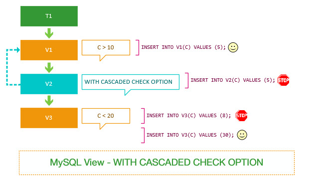
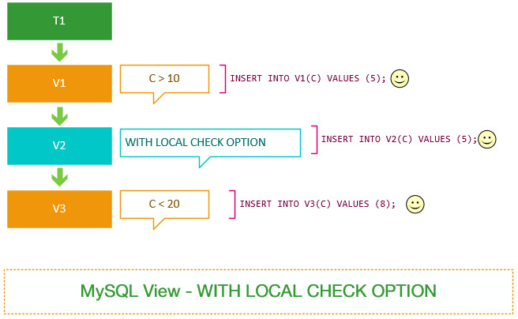

# MySQL 视图

数据库视图是一个虚拟表或逻辑表，它被定义为带有 INNER 的 SQL SELECT 查询。其本质是根据 SQL 语句获取动态的数据集，并为其命名，是用户使用时只需要使用视图名即可获取数据集，并可以将其当作表来使用。

因为数据库视图类似于由行和列组成的数据库表，所以可以针对它查询数据。大多数数据库管理系统（包括 MySQL）允许通过数据库视图更新基础表中的数据，并具有一些先决条件。


数据库视图是动态的，因为它与物理模式无关。数据库系统将视图存储为带有连接的 SQL SELECT 语句。当表的数据发生变化时，视图也会反映出这些变化。

使用视图查询数据时，数据库会从原来的表中取出对应的数据。因此，视图中的数据依赖于原来的表中的数据，一旦表中的数据改变，显示在视图中的数据也会发生改变。

**数据库视图的优点：**

- **允许简化复杂查询**：数据库视图由与许多基础表关联的 SQL 语句定义。可以使用数据库视图向最终用户和外部应用程序隐藏基础表的复杂性。通过数据库视图，只需使用简单的 SQL 语句而不是具有许多连接的复杂语句。
- **有助于限制对特定用户的数据访问**：可能不希望所有用户都可以查询敏感数据的子集。可以使用数据库视图仅将非敏感数据公开给特定用户组。
- **提供额外的安全层**：安全性是任何关系数据库管理系统的重要组成部分。数据库视图为数据库管理系统提供了额外的保护。数据库视图允许您创建只读视图以向特定用户公开只读数据。用户只能以只读视图检索数据，但无法更新数据。
- **启用计算列**：数据库表不应有计算列，但数据库视图应。假设 orderDetails 表中有 quantityOrder（订购产品的数量）和 priceEach（每个产品的价格）列。但是，orderDetails  表没有用于存储订单的每个行项目的总销售额的计算列。如果有，数据库模式将不是一个好的设计。在这种情况下，就可以创建一个名为的计算列 total ，它是 quantityOrder 和 priceEach 计算结果的乘积。从数据库视图查询数据时，将动态计算计算列的数据。
- **可实现向后兼容性**：假设有一个中央数据库，许多应用程序正在使用它。有一天，决定重新设计数据库以适应新的业务需求。删除了一些表并创建新表，并且不希望更改影响其他应用程序。在此方案中，可以使用与要删除的旧表相同的模式创建数据库视图。

**数据库视图的缺点：**

- **性能**：从数据库视图查询数据可能会很慢，尤其是在基于其他视图创建视图时。
- **表依赖项**：您基于数据库的基础表创建视图。每当您更改与其关联的视图的这些表的结构时，您也必须更改视图。

## 视图介绍

从版本 5+ 开始，MySQL 支持数据库视图。在 MySQL 中，几乎所有视图功能都符合 SQL：2003 标准。MySQL 以两种方式处理对视图的查询：

第一种方式，MySQL 基于视图定义语句创建临时表，并在此临时表上执行传入查询。
在第二种方式中，MySQL 将传入查询与定义视图的查询组合成一个查询并执行组合查询。
MySQL 支持视图的版本控制系统。每次更改或替换视图时，  视图的副本都将备份 arc 到驻留在特定数据库文件夹中的（存档）目录中。备份文件的名称是 view_name.frm-00001。如果再次更改视图，MySQL 将创建一个名为的新备份文件 view_name.frm-00002。

MySQL 允许您基于其他视图创建视图。换句话说，您可以在 SELECT 定义视图的语句中引用其他视图。

**MySQL 视图的限制：**

您无法在视图上创建索引。当您根据使用合并算法的视图查询数据时，MySQL 使用基础表的索引。对于使用 temptable 算法的视图，当您根据视图查询数据时，不会使用索引。

您不能 在 MySQL 5.7.7 之前定义视图的 SELECT 语句的 FROM 子句中使用子查询

如果删除 或重命名视图引用的表，MySQL 不会发出任何错误。但是，MySQL 确实使视图无效。您可以使用 `CHECK TABLE` 语句来检查视图是否有效。

一个简单的视图可以更新。基于 SELECT 具有连接，子查询等的复杂语句创建的视图不可更新。

MySQL 不像其他数据库系统（如 Oracle，PostgreSQL）那样支持物化视图。

**数据准备：**

视图是基于一个或多个表的 `SELECT` 语句定义的，因此需要先创建这些表并填充数据。

```sql
CREATE DATABASE IF NOT EXISTS view_db;
USE view_db;
```

```sql
CREATE TABLE dept(
    deptno INT PRIMARY KEY,
    dname VARCHAR(20),
    loc VARCHAR(20)
);

INSERT INTO dept VALUES(10, '教研部','北京'),
(20, '学工部','上海'),
(30, '销售部','广州'),
(40, '财务部','武汉');
```

```sql
CREATE TABLE emp(
    empno INT PRIMARY KEY AUTO_INCREMENT,
    ename VARCHAR(20),
    job VARCHAR(20),
    mgr INT,
    hiredate DATE,
    sal NUMERIC(8,2),
    comm NUMERIC(8, 2),
    deptno INT,
    FOREIGN KEY (deptno) REFERENCES dept(deptno) ON DELETE SET NULL ON UPDATE CASCADE
);

INSERT INTO emp VALUES
(1001, '甘宁', '文员', 1013, '2000-12-17', 8000.00, NULL, 20),
(1002, '黛绮丝', '销售员', 1006, '2001-02-20', 16000.00, 3000.00, 30),
(1003, '殷天正', '销售员', 1006, '2001-02-22', 12500.00, 5000.00, 30),
(1004, '刘备', '经理', 1009, '2001-4-02', 29750.00, NULL, 20),
(1005, '谢逊', '销售员', 1006, '2001-9-28', 12500.00, 14000.00, 30),
(1006, '关羽', '经理', 1009, '2001-05-01', 28500.00, NULL, 30),
(1007, '张飞', '经理', 1009, '2001-09-01', 24500.00, NULL, 10),
(1008, '诸葛亮', '分析师', 1004, '2007-04-19', 30000.00, NULL, 20),
(1009, '曾阿牛', '董事长', NULL, '2001-11-17', 50000.00, NULL, 10),
(1010, '韦一笑', '销售员', 1006, '2001-09-08', 15000.00, 0.00, 30),
(1011, '周泰', '文员', 1008, '2007-05-23', 11000.00, NULL, 20),
(1012, '程普', '文员', 1006, '2001-12-03', 9500.00, NULL, 30),
(1013, '庞统', '分析师', 1004, '2001-12-03', 30000.00, NULL, 20),
(1014, '黄盖', '文员', 1007, '2002-01-23', 13000.00, NULL, 10);
```

```sql
CREATE TABLE salgrade(
    grade INT,
    losal DECIMAL,
    hisal DECIMAL
);

INSERT INTO salgrade VALUES
(1,0,6999),
(2,7000,13999),
(3,14000,19999),
(4,20000,29999),
(5,30000,99999);
```

## 创建视图

MySQL 中创建新视图，使用 `CREATE VIEW` 语句。在 MySQL 中创建视图的语法如下：

```sql
CREATE [ OR REPLACE ]
   [ALGORITHM = {MERGE  | TEMPTABLE | UNDEFINED}]
VIEW view_name [(column_list)]
AS
select-statement
[ WITH [CASCADED | LOCAL] CHECK OPTION ];
```

|参数|含义|
|-|-|
|`OR REPLACE`|如果指定了此选项，则在创建新视图之前，如果已经存在具有相同名称的视图，则会替换现有视图。|
|`ALGORITHM`|此选项用于指定用于处理视图的算法。|
|`view_name`|指定新视图的名称。|
|`(column_list)`|可选。指定视图中列的名称。如果未指定，则使用 SELECT 语句中列的名称。|
|`select-statement`|表示一个完整的 SELECT 语句，将查询记录导入视图中。|

**视图的处理算法：**

算法属性允许控制 MySQL 在创建视图时使用的机制。MySQL 提供三种算法：

**MERGE**：将引用视图的语句与视图定义合并，使得视图定义的某一部分取代语句的对应部分。这种算法通常更有效，因为它避免了创建临时表。

- 使用 MERGE 算法，MySQL 首先将输入查询与 `SELECT` 定义视图的语句组合成单个查询。然后 MySQL 执行组合查询以返回结果集。 如果 `SELECT` 语句包含聚合函数（例如 `MIN`、`MAX`、`SUM`、`COUNT`、`AVG`）或 `DISTINCT`、`GROUP BY`、`HAVING`、`LIMIT`、`UNION`、`UNION ALL` 以及子查询，则不允许使用 MERGE 算法。如果 `SELECT` 语句引用无表，则也不允许 MERGE 算法。如果不允许 MERGE 算法，MySQL 将算法更改为 UNDEFINED。请注意，将视图定义中的输入查询和查询组合到一个查询中称为视图分辨率。

**TEMPTABLE**：将视图的结果放置在临时表中，然后使用临时表执行语句。这种算法可能会比 MERGE 算法慢，因为它需要创建临时表。但是，在某些情况下，使用临时表可能会更快，因为它可以更快地释放基表上的锁定。

- 使用 TEMPTABLE 算法，MySQL 首先根据定义视图的 `SELECT` 语句创建临时表，然后对临时表执行输入查询。因为 MySQL 必须创建一个临时表来存储结果集并将数据从基表移动到临时表，所以 TEMPTABLE  算法的效率低于 MERGE 算法。此外，使用 TEMPTABLE  算法的视图不可更新。

**UNDEFINED**：MySQL 将选择要使用的算法。如果可能，它倾向于使用 MERGE 而不是 TEMPTABLE。

- 在未指定显式算法的情况下创建视图时，这是默认 UNDEFINED 算法。UNDEFINED 算法允许 MySQL 选择使用  MERGE 或 TEMPTABLE  算法。MySQL 更喜欢 MERGE  算法在 TEMPTABLE 算法中，因为  MERGE 算法效率更高。

### 创建普通视图

创建简单视图，视图包含员工名字和岗位。

```sql
CREATE VIEW view_emp
AS
SELECT ename,job FROM emp;
```

如果使用 `SHOW TABLE` 命令查看 数据库中的所有表，还会看到 `view_emp` 视图显示在列表中。

```sql
show tables;
```

```sql
+-------------------+
| Tables_in_view_db |
+-------------------+
| dept              |
| emp               |
| salgrade          |
| view_emp          |
+-------------------+
```

视图和表共享相同的命名空间。要知道哪个对象是视图或表，可以使用 `SHOW FULL TABLES` 命令：

```sql
SHOW FULL TABLES;
```

```sql
+-------------------+------------+
| Tables_in_view_db | Table_type |
+-------------------+------------+
| dept              | BASE TABLE |
| emp               | BASE TABLE |
| salgrade          | BASE TABLE |
| view_emp          | VIEW       |
+-------------------+------------+  
```

`Table_type` 结果集中的列指定哪个对象是视图（ VIEW ），哪个对象是表（基表）。

如果想查询员工的名字和岗位，只需要 `SELECT` 对 `view_emp` 视图执行一个简单的声明：

```sql
SELECT
    * 
FROM
    view_emp;
```

```sql
+-----------+-----------+
| ename     | job       |
+-----------+-----------+
| 甘宁      | 文员      |
| 黛绮丝    | 销售员    |
| 殷天正    | 销售员    |
| 刘备      | 经理      |
| 谢逊      | 销售员    |
……
+-----------+-----------+
```

### 基于另一个视图创建视图

MySQL 允许基于另一个视图创建视图。例如，可以根据表创建高工资的视图，以显示工资大于 20000 的员工信息：

```sql
CREATE VIEW HighSalary
AS
SELECT * FROM emp WHERE sal > 20000;
```

现在就可以从 HighSalary 视图中查询数据，如下所示：

```sql
+-------+-----------+-----------+------+------------+----------+------+--------+
| empno | ename     | job       | mgr  | hiredate   | sal      | comm | deptno |
+-------+-----------+-----------+------+------------+----------+------+--------+
|  1004 | 刘备      | 经理      | 1009 | 2001-04-02 | 29750.00 | NULL |     20 |
|  1006 | 关羽      | 经理      | 1009 | 2001-05-01 | 28500.00 | NULL |     30 |
|  1007 | 张飞      | 经理      | 1009 | 2001-09-01 | 24500.00 | NULL |     10 |
|  1008 | 诸葛亮    | 分析师    | 1004 | 2007-04-19 | 30000.00 | NULL |     20 |
|  1009 | 曾阿牛    | 董事长    | NULL | 2001-11-17 | 50000.00 | NULL |     10 |
|  1013 | 庞统      | 分析师    | 1004 | 2001-12-03 | 30000.00 | NULL |     20 |
+-------+-----------+-----------+------+------------+----------+------+--------+
```

**使用 JOIN 创建视图：**

使用 `JOIN` 创建视图，视图包含了视图表 `HighSalary` 中员工的**部门**、工号、姓名和岗位。

```sql
CREATE VIEW despemp AS SELECT
    b.dname,
    empno,
    ename,
    job 
    FROM
        HighSalary AS a
        INNER JOIN dept AS b 
    WHERE
        a.deptno = b.deptno;
```

就可以直接查看 `despemp` 表。

```sql
SELECT * FROM despemp;
```

```sql
+-----------+-------+-----------+-----------+
| dname     | empno | ename     | job       |
+-----------+-------+-----------+-----------+
| 学工部    |  1004 | 刘备      | 经理      |
| 销售部    |  1006 | 关羽      | 经理      |
| 教研部    |  1007 | 张飞      | 经理      |
| 学工部    |  1008 | 诸葛亮    | 分析师    |
| 教研部    |  1009 | 曾阿牛    | 董事长    |
| 学工部    |  1013 | 庞统      | 分析师    |
+-----------+-------+-----------+-----------+
```

**使用子查询创建视图：**

使用子查询创建视图，查询工资大于 `HighSalary` 表中平均工资员工的工号、姓名以及岗位。

```sql
CREATE VIEW AVG_HighSalary AS SELECT
    empno,
    ename,
    job,
    sal 
FROM
    emp 
WHERE
    sal > ( SELECT AVG( sal ) FROM HighSalary ) 
ORDER BY
    sal;
```

```sql
SELECT * FROM AVG_HighSalary;
```

```sql
+-------+-----------+-----------+----------+
| empno | ename     | job       | sal      |
+-------+-----------+-----------+----------+
|  1009 | 曾阿牛    | 董事长    | 50000.00 |
+-------+-----------+-----------+----------+
```

## 修改视图定义

在 MySQL 中，视图的定义是基于其查询语句而创建的，并且与基本表的定义是分离的。当基本表的结构发生变化时，需要手动更新视图的定义以反映这些更改。

要修改视图的定义，可以使用 `CREATE OR REPLACE VIEW` 语句或 `ALTER VIEW` 语句。

**`CREATE OR REPLACE VIEW`：**

`CREATE OR REPLACE VIEW` 语句用于创建或替换视图的定义。如果视图已存在，则会替换其定义。例如：

```sql
CREATE OR REPLACE VIEW HighSalary
AS
SELECT * FROM emp WHERE sal > 30000;
-- 查询视图表
SELECT * FROM HighSalary;
```

```sql
+-------+-----------+-----------+------+------------+----------+------+--------+
| empno | ename     | job       | mgr  | hiredate   | sal      | comm | deptno |
+-------+-----------+-----------+------+------------+----------+------+--------+
|  1009 | 曾阿牛    | 董事长    | NULL | 2001-11-17 | 50000.00 | NULL |     10 |
+-------+-----------+-----------+------+------------+----------+------+--------+
```

这里将视图 `HighSalary` 中原本工资大于 20000 的查询修改为大于 30000。

如果这时再查询 `despemp` 视图表，视图数据也会随之改变：

```sql
SELECT * FROM despemp;
```

```sql
+-----------+-------+-----------+-----------+
| dname     | empno | ename     | job       |
+-----------+-------+-----------+-----------+
| 教研部    |  1009 | 曾阿牛    | 董事长    |
+-----------+-------+-----------+-----------+
```

**`ALTER VIEW`：**

`ALTER VIEW` 语句用于修改现有视图的定义。可以使用该语句添加、删除或更改视图的列、筛选条件等。例如：

```sql
ALTER VIEW HighSalary
AS
SELECT ename,job,sal FROM emp WHERE sal > 20000;
-- 查询视图表
SELECT * FROM HighSalary;
```

```sql
+-----------+-----------+----------+
| ename     | job       | sal      |
+-----------+-----------+----------+
| 刘备      | 经理      | 29750.00 |
| 关羽      | 经理      | 28500.00 |
| 张飞      | 经理      | 24500.00 |
| 诸葛亮    | 分析师    | 30000.00 |
| 曾阿牛    | 董事长    | 50000.00 |
| 庞统      | 分析师    | 30000.00 |
+-----------+-----------+----------+
```

---

需要注意的是，以上两个语句仅修改视图的定义，而不会直接修改基本表的结构。如果基本表的字段发生变化，需要手动更新视图的定义以反映这些变化。

总结起来，MySQL 中无法直接修改已存在的视图来保持和基本表的一致。需要使用 `CREATE OR REPLACE VIEW` 或 `ALTER VIEW` 语句手动更新视图的定义以反映基本表的变化。

## 更新视图

在 MySQL 中，视图不仅可查询，还可以更新。这意味着可以使用 `INSERT` 或 `UPDATE` 语句通过可更新视图插入或更新基表的行。此外，还可以使用 `DELETE` 语句通过视图删除基础表的行。

但是，要创建可更新视图，定义视图的 SELECT 语句不得包含以下任何元素：

- 聚合函数（例如 `MIN()`，`MAX()`，`SUM()`，`AVG()` 和 `COUNT()`）。
- `DISTINCT`。
- `GROUP BY` 子句。
- `HAVING` 子句。
- `UNION` 或 `UNION ALL` 子句。
- 左连接或外连接。
- 子查询中的 `SELECT` 子句或在引用表 `WHERE` 语句出现在 `FROM` 子句中。
- 引用 `FROM` 子句中的不可更新视图
- 仅引用文字值
- 对基表的任何列的多次引用

如果使用 `TEMPTABLE` 算法创建视图，则无法更新视图。

视图虽然可以更新数据，但是有很多限制。一般情况下，最好将视图作为查询数据的虚拟表，而不要通过视图更新数据。因为，使用视图更新数据时，如果没有全面考虑在视图中更新数据的限制，就可能会造成数据更新失败。

**可更新视图：**

创建一个 `empinfo` 视图，基于数据库中 `emp` 表。视图引用 `emp` 的三列：`ename`、`job` 和 `sal`。

```sql
CREATE VIEW empinfo AS
SELECT ename,job,sal FROM emp;
```

```sql
SELECT * FROM empinfo;
```

```sql
+-----------+-----------+----------+
| ename     | job       | sal      |
+-----------+-----------+----------+
| 甘宁      | 文员      |  8000.00 |
| 黛绮丝    | 销售员    | 16000.00 |
| 殷天正    | 销售员    | 12500.00 |
| 刘备      | 经理      | 29750.00 |
| 谢逊      | 销售员    | 12500.00 |
| 关羽      | 经理      | 28500.00 |
| 张飞      | 经理      | 24500.00 |
| 诸葛亮    | 分析师    | 30000.00 |
| 曾阿牛    | 董事长    | 50000.00 |
| 韦一笑    | 销售员    | 15000.00 |
| 周泰      | 文员      | 11000.00 |
| 程普      | 文员      |  9500.00 |
| 庞统      | 分析师    | 30000.00 |
| 黄盖      | 文员      | 13000.00 |
+-----------+-----------+----------+
```

然后，可以使用以下 UPDATE 语句通过 `empinfo` 视图更改数据。

```sql
UPDATE empinfo SET ename = '陆逊' WHERE ename = '谢逊';
```

最后，为了验证更改，查看基表中的数据是否也被修改。

```sql
SELECT * FROM emp WHERE ename = '陆逊';
```

```sql
+-------+--------+-----------+------+------------+----------+----------+--------+
| empno | ename  | job       | mgr  | hiredate   | sal      | comm     | deptno |
+-------+--------+-----------+------+------------+----------+----------+--------+
|  1005 | 陆逊   | 销售员    | 1006 | 2001-09-28 | 12500.00 | 14000.00 |     30 |
+-------+--------+-----------+------+------------+----------+----------+--------+
```

可以看到基表中的数据被修改的。

**视图插入数据：**

视图上插入数据时，列的数量和名称会依赖于创建视图时的列选择。需要注意，视图列和基表列之间的对应关系，提供必要的默认值，并保持列的顺序一致。

例如，这里向 `empinfo` 视图中插入一条数据。

```sql
INSERT INTO empinfo (ename, job, sal) VALUES ('赵云', '文员', 8000);
```

```sql
ERROR 1423 (HY000): Field of view 'view_db.empinfo' underlying table doesn't have a default value
```

然而报错：`underlying table doesn't have a default value`。

这是因为在创建视图时，没有为某些基表列定义默认值，当插入视图时这些列值为空，从而导致错误。

对于 `empinfo` 视图，它的基表 `emp` 中存在一些未选中的列，如 `mgr`、`hiredate` 等，这些列在插入数据时，如果不提供值，就需要有默认值约束。

所以，正确创建视图和表结构很重要，要预先考虑默认值、允许为空等约束，以便在视图操作时正常工作。

**删除视图数据：**

可以直接使用 `DELETE` 语句删除指定的行。

```sql
DELETE FROM empinfo WHERE ename = '黄盖'; 
```

最后，为了验证删除，查看基表中的数据是否也被删除。

```sql
SELECT * FROM empinfo WHERE ename = '黄盖';
```

可以看到数据在基表中也无法找到，这充分说明了删除视图行可以映射到唯一的基表行并执行删除。

**不可更新视图：**

创建一个 empinfo1 视图，基于数据库中 `emp` 表。视图引用 `emp` 的 `job` 列，并且使用 `DISTINCT` 去重。

```sql
CREATE VIEW empinfo1 AS
SELECT DISTINCT job FROM emp;
```

```sql
SELECT * FROM empinfo1;
```

```sql
+-----------+
| job       |
+-----------+
| 文员      |
| 销售员    |
| 经理      |
| 分析师    |
| 董事长    |
+-----------+
```

如果这时候在更新视图的话，则会报错。

```sql
UPDATE empinfo1 SET job = '文员' WHERE ename = '技术员';
```

```sql
ERROR 1288 (HY000): The target table empinfo1 of the UPDATE is not updatable
```

这个问题就是由于视图 empinfo1 不可更新造成的。

**检查可更新的视图信息：**

可以通过查询数据库中的 `views` 表中的 `is_updatable` 列来检查数据库中的视图是否可更新 `information_schema`。

下面查询从 `view_db` 数据库获取所有视图，并显示哪些视图可更新。

```sql
SELECT 
    table_name, 
    is_updatable
FROM
    information_schema.views
WHERE
    table_schema = 'view_db'; 
```

```sql
+----------------+--------------+
| AVG_HighSalary | NO           |
| HighSalary     | YES          |
| despemp        | YES          |
| empinfo        | YES          |
| empinfo1       | NO           |
| view_emp       | YES          |
+----------------+--------------+
```

YES 表示可更新，NO 表示不可更新。这个字段可以帮助我们快速判断视图的可修改性。

## 其他操作

**重命名视图：**

MySQL 支持重命名已存在的视图。语法如下：

```sql
RENAME TABLE view_name TO new_view_name;
```

需要注意的是，重命名视图并不会重命名依赖于该视图的存储过程或触发器等对象。这些对象在视图重命名后需要修改源代码来引用新的视图名。另外，不能重命名为已经存在的视图名，这会报语法错误。

重命名视图不会影响视图内部的查询逻辑，仅改变视图对象的名称。可以用来更好地表示视图的含义或遵循规范。

**删除视图：**

在 MySQL 中删除视图的语法如下：

```sql
DROP VIEW [IF EXISTS] view_name;
```

- `IF EXISTS` 是可选的，用于避免当视图不存在时产生错误。

删除视图只会删除视图对象，不会影响基表的数据和结构。但是依赖于该视图的存储过程、函数等会失效。注意不能通过删除基表来间接删除视图。删除基表不会影响视图的存在，但视图的数据会变为空。

另外，视图关联的触发器在删除视图后也不会被自动删除，需要手动删除触发器。

## WITH CHECK OPTION 子句

`WITH CHECK OPTION` 子句用于限制对视图的插入和更新操作。当使用 `WITH CHECK OPTION` 创建视图时，只有满足视图定义中的条件的数据才能被插入到视图中，或者更新视图中的数据。这对于限制视图的数据访问权限非常有用，可以确保只有符合特定条件的数据才能被插入或更新到视图中，从而保护数据库中的数据完整性。

`WITH CHECK OPTION` 子句是 `CREATE VIEW` 声明的可选部分。`WITH CHECK OPTION` 子句阻止了更新或插入通过视图不可见的行。换句话说，每当通过视图更新或插入基表的一行时，MySQL 都会确保插入或更新操作符合视图的定义。

`WITH CHECK OPTION` 子句的语法：

```sql
CREATE OR REPLACE VIEW view_name 
AS
  select_statement
  WITH CHECK OPTION; 
```

请注意，将分号 `;` 放在 `WITH CHECK OPTION` 子句的末尾，而不是在定义视图的 `SELECT` 语句的末尾。

**`WITH CHECK OPTION` 子句示例：**

首先，创建一个 `vps` 基于 `emp` 表命名的视图，以揭示其职称为 VP 的员工，例如，经理、总裁、董事长。

```sql
CREATE VIEW vps AS
SELECT * FROM emp WHERE job IN ('经理','总裁','董事长');
```

接下来，就可以在 `vps` 视图中查询数据：

```bash
SELECT * FROM vps;
```

```bash
+-------+-----------+-----------+------+------------+----------+------+--------+
| empno | ename     | job       | mgr  | hiredate   | sal      | comm | deptno |
+-------+-----------+-----------+------+------------+----------+------+--------+
|  1004 | 刘备      | 经理      | 1009 | 2001-04-02 | 29750.00 | NULL |     20 |
|  1006 | 关羽      | 经理      | 1009 | 2001-05-01 | 28500.00 | NULL |     30 |
|  1007 | 张飞      | 经理      | 1009 | 2001-09-01 | 24500.00 | NULL |     10 |
|  1009 | 曾阿牛    | 董事长    | NULL | 2001-11-17 | 50000.00 | NULL |     10 |
+-------+-----------+-----------+------+------------+----------+------+--------+
```

因为 `vps` 是一个简单的视图因此它是可更新的。可以插入一行数据到 `emp` 通过 `vps` 视图。

```bash
INSERT INTO vps(empno,ename,job,mgr,hiredate,sal,comm,deptno)
values(1015,'曹植','文员','1009','2001-12-21','12332',NULL,20); 
```

然而，新创建的员工在 `vps` 视图中是不可见，因为他的职位是 `文员`，而不是 VP。这会导致数据不一致，因为插入或更新视图中的数据不符合视图定义中的条件。

为了确保视图的一致性，以便用户只能显示或更新通过视图可见的数据，可以使用 `WITH CHECK OPTION` 子句限制插入或更新。

重新修改视图定义以包含 `WITH CHECK OPTION` 子句。

```sql
CREATE OR REPLACE VIEW vps AS
SELECT * FROM emp WHERE job IN ('经理','总裁','董事长')
WITH CHECK OPTION;
```

然后在通过视图 `vps` 在 `emp` 基表中插入一行数据：

```sql
INSERT INTO vps(empno,ename,job,mgr,hiredate,sal,comm,deptno)
values(1016,'董允','文员','1009','2002-04-21','15032',NULL,20); 
```

这次，MySQL 拒绝了插入并发出以下错误消息：

```sql
ERROR 1369 (HY000): CHECK OPTION failed 'view_db.vps'
```

最后，通过 `vps` 视图插入一个职位名称为总裁的的员工，看看 MySQL 是否允许这样做。

```sql
INSERT INTO vps(empno,ename,job,mgr,hiredate,sal,comm,deptno)
values(1016,'曹操','总裁','1009','2000-01-11','32322',NULL,20);
```

```sql
SELECT * FROM vps;
```

```sql
+-------+-----------+-----------+------+------------+----------+------+--------+
| empno | ename     | job       | mgr  | hiredate   | sal      | comm | deptno |
+-------+-----------+-----------+------+------------+----------+------+--------+
|  1004 | 刘备      | 经理      | 1009 | 2001-04-02 | 29750.00 | NULL |     20 |
|  1006 | 关羽      | 经理      | 1009 | 2001-05-01 | 28500.00 | NULL |     30 |
|  1007 | 张飞      | 经理      | 1009 | 2001-09-01 | 24500.00 | NULL |     10 |
|  1009 | 曾阿牛    | 董事长    | NULL | 2001-11-17 | 50000.00 | NULL |     10 |
|  1016 | 曹操      | 总裁      | 1009 | 2000-01-11 | 32322.00 | NULL |     20 |
+-------+-----------+-----------+------+------------+----------+------+--------+
```

可以看到正常插入数据。

### LOCAL 和 CASCADED

当使用 `WITH CHECK OPTION` 子句创建视图时，MySQL 会检查通过视图更改的每一行，例如插入，更新，删除，以使其符合视图的定义。由于 MySQL 允许基于另一个视图创建视图，因此它还会检查从属视图中的规则以确保一致性。

为了确定检查范围，MySQL 提供了两个选项：`LOCAL` 和 `CASCADED`。如果未在 `WITH CHECK OPTION` 子句中明确指定关键字，则默认使用 `CASCADED`。

**CASCADED：**

为了理解其效果 `WITH CASCADED CHECK OPTION`，将举例说明。

首先，创建一个名为 `t1` 的表，其中只有一个名为 `c` 的列，其数据类型为 `int`。

```sql
CREATE TABLE t1 (c INT);
```

接下来，我们基于 `t1` 表创建一个名为 `v1` 的视图，以选择值大于 `10` 的行。

```sql
CREATE OR REPLACE VIEW v1 AS
SELECT c FROM t1 WHERE c > 10;
```

因为我们没有指定 `WITH CASCADED CHECK OPTION`，所以即使不符合 `v1` 视图的定义，下面的语句仍然有效，只是无法在 `v1` 视图中看到。

```sql
INSERT INTO v1 (c) VALUES (5);
```

然后，我们基于 `v1` 视图创建 `v2` 视图。在这次，我们添加了一个 `WITH CASCADED CHECK OPTION` 子句。

```sql
CREATE OR REPLACE VIEW v2 AS
SELECT c FROM v1 WITH CASCADED CHECK OPTION;
```

现在，我们通过 `v2` 视图在 `t1` 表中插入一个值为 5 的行。

```sql
INSERT INTO v2 (c) VALUES (5);
```

MySQL 发出以下错误消息：

```sql
ERROR 1369 (HY000): CHECK OPTION failed 'view_db.v2'
```

插入失败了，因为它创建了一个不符合 `v2` 视图定义的新行。由于 `v2` 视图基于 `v1` 视图，而 `v1` 视图定义中有一个条件 `c > 10`，所以只有满足这个条件的数据才能被插入到 `v2` 视图中。

之后，我们基于 `v2` 创建一个名为 `v3` 的新视图。

```sql
CREATE OR REPLACE VIEW v3 AS
SELECT c FROM v2 WHERE c < 20;
```

我们通过 `v3` 视图在 `t1` 表中插入一个值为 8 的新行。

```sql
INSERT INTO v3 (c) VALUES (8);
```

MySQL 发出以下错误消息：

```sql
ERROR 1369 (HY000): CHECK OPTION failed 'view_db.v3'
```

上面插入语句看起来符合 `v3` 视图的定义，但是仍然执行失败。因为 `v3` 视图取决于 `v2` 视图，而 `v2` 视图具有 `WITH CASCADED CHECK OPTION`。由于 `v2` 视图基于 `v1` 视图，而 `v1` 视图定义中有一个条件 `c > 10`，所以只有满足这个条件的数据才能被插入到 `v3` 视图中。

但是，以下插入语句能正常工作。

```sql
INSERT INTO v3 (c) VALUES (30);
```

因为 `v3` 视图没有使用 `WITH CHECK OPTION` 定义，并且该语句符合 `v2` 视图的定义。

当视图使用 `WITH CASCADED CHECK OPTION` 时，MySQL 会以递归方式检查视图的规则以及基础视图的规则。



**LOCAL：**

让我们使用上面的相同示例 `WITH LOCAL CHECK OPTION` 来查看差异。

首先，我们更改 v2 视图以使用 `WITH LOCAL CHECK OPTION` 替代。

```sql
ALTER VIEW v2 AS
    SELECT 
        c
    FROM
        v1 
WITH LOCAL CHECK OPTION; 
```

其次，插入与上面示例相同的行。

```sql
INSERT INTO v2(c) VALUES (5); 
```

然而这次插入操作成功了。这是因为 `v2` 视图没有任何规则，而且 `v2` 视图取决于 `v1` 视图。但是，由于 `v1` 视图没有指定检查选项，因此 MySQL 跳过检查 `v1` 视图中的规则。

最后，通过 `v3` 视图将同一行插入到 `t1` 表中。

```sql
INSERT INTO v3(c) VALUES (8); 
```

这次插入操作也是成功的，这是因为 `v3` 视图没有任何规则，而且 `v3` 视图取决于 `v2` 视图。但是，由于 `v2` 视图使用了 `WITH LOCAL CHECK OPTION`，因此 MySQL 只检查了 `v2` 视图中的规则，而不会继续向下递归检查 `v1` 视图中的规则。

当使用 `WITH LOCAL CHECK OPTION` 创建视图时，MySQL 只会检查当前视图中的规则，以及具有 `WITH LOCAL CHECK OPTION` 或 `WITH CASCADED CHECK OPTION` 的直接依赖视图中的规则。它不会检查间接依赖视图中的规则。

*在上面的例子中，`v3` 视图直接依赖于 `v2` 视图，而 `v1` 视图是 `v3` 视图的间接依赖。*



---

WITH CHECK OPTION 子句中 LOCAL 和 CASCADED 两种检查选项的区别：

|区别|`LOCAL`|`CASCADED`|
|-|-|-|
|检查范围不同|只对当前视图执行检查，不递归到底层依赖视图。|会对当前视图以及所有底层依赖视图递归执行检查。|
|INSERT/UPDATE 结果不同| 更宽松，只要满足当前视图条件即可。|更严格，必须满足所有级联视图条件。|
|使用场景不同|适合对当前视图插入数据。|适合构建多层视图系统，层层过滤控制。|
|默认值不同|如果需要 `LOCAL` 检查必须显式指定。|不指定时默认是 `CASCADED`。|

总之，`LOCAL` 与 `CASCADED` 在检查范围、插入结果、默认值等方面有区别。明确指定 `LOCAL` 或 `CASCADED` 可以实现针对性的视图访问控制。
