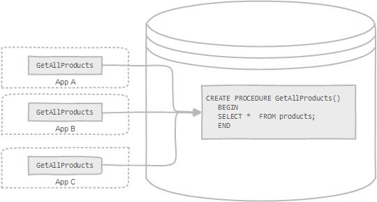

# MySQL 存储过程

MySQL 存储过程是一组为了完成特定功能的 SQL 语句集合。它是数据库中存储复杂程序，以便外部程序调用的一种数据库对象。存储过程思想上很简单，就是**数据库 SQL 语言层面的代码封装与重用**。

存储过程是存储在数据库目录中的一段声明性 SQL 语句。存储过程可以由触发器，其他存储过程以及 Java，  Python，PHP 等应用程序调用。



**MySQL 存储过程的优点：**

- 通常存储过程有助于提高应用程序的性能。一旦创建，存储过程就会被编译并存储在数据库中。但是，MySQL 实现的存储过程略有不同。MySQL 存储过程是按需编译的。编译存储过程后，MySQL 将其放入缓存并为每个连接维护自己的存储过程缓存。如果应用程序在单个连接中多次使用存储过程，则使用编译版本，否则，存储过程的工作方式类似于查询。
- 存储过程有助于减少应用程序和数据库服务器之间的流量，因为应用程序必须只发送存储过程的名称和参数，而不是发送多个冗长的 SQL 语句。
- 存储过程对任何应用程序都是可重用且透明的。存储过程将数据库接口公开给所有应用程序，以便开发人员不必开发存储过程中已经支持的功能。
- 存储过程是安全的。数据库管理员可以为访问数据库中的存储过程的应用程序授予适当的权限，而无需为基础数据库表提供任何权限。

**MySQL 存储过程的缺点：**

- 如果使用许多存储过程，则使用这些存储过程的每个连接的内存使用量将显着增加。此外，如果在存储过程中过度使用大量逻辑操作，CPU 使用率将会增加，因为数据库服务器没有针对逻辑操作进行良好设计。
- 存储过程的构造不是为开发复杂和灵活的业务逻辑而设计的。
- 调试存储过程很困难。只有少数数据库管理系统允许调试存储过程。不幸的是，MySQL 没有提供调试存储过程的工具。
- 开发和维护存储过程并不容易。开发和维护存储过程通常需要一种并非所有应用程序开发人员都具备的专业技能。这可能会导致应用程序开发和维护阶段出现问题。

MySQL 存储过程各有优缺点。在开发应用程序时，应根据应用程序的体系结构决定是否使用存储过程。

## 存储过程实例

在 MySQL 中创建存储过程的语法如下：

```bash
DELIMITER [自定义结束符]
CREATE PROCEDURE 存储过程名 ( [in, out, inout]  参数名 数据类型 …… ) 
BEGIN 
    SQL 语句
END [自定义结束符]
DELIMITER ;
```

- 第一个命令是 `DELIMITER [自定义结束符]`，与存储过程语法无关。`DELIMITER` 语句将标准分隔符（分号 `;`）更改为另一个符号）。在这种情况下，分隔符从分号 `;` 更改为自定义符号（例如 `//`，`$$`，`&&` 等等）。
为什么我们要更改分隔符？因为我们希望将存储过程作为一个整体传递给服务器，而不是让 MySQL 工具一次解释每个语句。在 `END` 关键字之后，使用 [自定义结束符]  来指示存储过程的结束。最后一个命令 `DELIMITER;` 将分隔符恢复为分号 `;`。
- 然后使用 `CREATE PROCEDURE` 语句来创建一个新的存储过程。在 `CREATE PROCEDURE` 语句后指定存储过程的名称。
- `BEGIN` 和之间的部分 `END` 称为存储过程的主体。将声明性 SQL 语句放在正文中以处理业务逻辑。

**先准备数据：**

```sql
CREATE DATABASE IF NOT EXISTS store;
USE store;
```

```sql
CREATE TABLE dept(
    deptno INT PRIMARY KEY,
    dname VARCHAR(20),
    loc VARCHAR(20)
);

INSERT INTO dept VALUES(10, '教研部','北京'),
(20, '学工部','上海'),
(30, '销售部','广州'),
(40, '财务部','武汉');
```

```sql
CREATE TABLE emp(
    empon INT PRIMARY KEY AUTO_INCREMENT,
    ename VARCHAR(20),
    job VARCHAR(20),
    mgr INT,
    hiredate DATE,
    sal NUMERIC(8,2),
    comm NUMERIC(8, 2),
    deptno INT,
    FOREIGN KEY (deptno) REFERENCES dept(deptno) ON DELETE SET NULL ON UPDATE CASCADE
);

INSERT INTO emp VALUES
(1001, '甘宁', '文员', 1013, '2000-12-17', 8000.00, NULL, 20),
(1002, '黛绮丝', '销售员', 1006, '2001-02-20', 16000.00, 3000.00, 30),
(1003, '殷天正', '销售员', 1006, '2001-02-22', 12500.00, 5000.00, 30),
(1004, '刘备', '经理', 1009, '2001-4-02', 29750.00, NULL, 20),
(1005, '谢逊', '销售员', 1006, '2001-9-28', 12500.00, 14000.00, 30),
(1006, '关羽', '经理', 1009, '2001-05-01', 28500.00, NULL, 30),
(1007, '张飞', '经理', 1009, '2001-09-01', 24500.00, NULL, 10),
(1008, '诸葛亮', '分析师', 1004, '2007-04-19', 30000.00, NULL, 20),
(1009, '曾阿牛', '董事长', NULL, '2001-11-17', 50000.00, NULL, 10),
(1010, '韦一笑', '销售员', 1006, '2001-09-08', 15000.00, 0.00, 30),
(1011, '周泰', '文员', 1008, '2007-05-23', 11000.00, NULL, 20),
(1012, '程普', '文员', 1006, '2001-12-03', 9500.00, NULL, 30),
(1013, '庞统', '分析师', 1004, '2001-12-03', 30000.00, NULL, 20),
(1014, '黄盖', '文员', 1007, '2002-01-23', 13000.00, NULL, 10);
```

```sql
CREATE TABLE salgrade(
    grade INT,
    losal DECIMAL,
    hisal DECIMAL
);

INSERT INTO salgrade VALUES
(1,0,6999),
(2,7000,13999),
(3,14000,19999),
(4,20000,29999),
(5,30000,99999);
```

**编写一个 MySQL 存储过程：**

```sql
DELIMITER //
CREATE PROCEDURE myproc01()
BEGIN
    SELECT
        empon,
        ename,
        job 
    FROM
        emp;
END // 
DELIMITER;
```

在这个存储过程中，使用一个简单的 `SELECT` 语句来查询 emp 表中的数据。

**查看存储过程：**

在 MySQL 8.0 版本中，系统数据库 mysql 的 proc 表已经被移除，不再记录存储过程和函数的元数据信息。取而代之的是：`INFORMATION_SCHEMA` 库下的 `ROUTINES` 表。

```sql
SELECT
    routine_name,
    routine_type 
FROM
    INFORMATION_SCHEMA.ROUTINES 
WHERE
    routine_schema = 'store';
```

```sql
+--------------+--------------+
| ROUTINE_NAME | ROUTINE_TYPE |
+--------------+--------------+
| showemp      | PROCEDURE    |
+--------------+--------------+
```

- `ROUTINE_NAME`: 存储过程或函数的名称
- `ROUTINE_TYPE:` 存储过程或函数的类型，取值为 `PROCEDURE` 或 `FUNCTION`

**调用存储过程：**

既然创建了存储过程，那么使用的时候需要调用。在 MySQL 中调用存储过程的语法如下：

```sql
CALL 存储过程名 ([参数 1[, 参数 2,...]]);
```

例如：

```sql
CALL myproc01();
```

```sql
+-------+-----------+-----------+
| empno | ename     | job       |
+-------+-----------+-----------+
|  1001 | 甘宁      | 文员      |
|  1002 | 黛绮丝    | 销售员    |
|  1003 | 殷天正    | 销售员    |
|  1004 | 刘备      | 经理      |
|  1005 | 谢逊      | 销售员    |
|  1006 | 关羽      | 经理      |
|  1007 | 张飞      | 经理      |
|  1008 | 诸葛亮    | 分析师    |
|  1009 | 曾阿牛    | 董事长    |
|  1010 | 韦一笑    | 销售员    |
|  1011 | 周泰      | 文员      |
|  1012 | 程普      | 文员      |
|  1013 | 庞统      | 分析师    |
|  1014 | 黄盖      | 文员      |
+-------+-----------+-----------+
```

## 存储过程变量

变量是一个命名数据对象，其值可以在存储过程执行期间更改。通常使用存储过程中的变量来保存即时结果。这些变量是存储过程的本地变量，必须在使用之前声明变量。

**变量的范围：**

在 MySQL 中，有几种不同类型的变量，它们具有不同的范围和生命周期。主要有以下几种类型的变量：

- **局部变量**：局部变量是在存储过程、函数或触发器中定义的变量。它只能在定义它的 `BEGIN` 和 `END` 语句块中使用，且必须在语句块的开头定义。当执行到该语句块的 `END` 语句时，局部变量将超出范围并被销毁。
- **用户定义变量**：用户定义变量是以 `@` 符号开头的变量，它可以在整个会话期间访问。可以使用 `SET` 或 `SELECT ... INTO` 语句来为用户定义变量赋值，并在整个会话期间使用它。
- **系统变量**：系统变量是 MySQL 服务器维护的变量，它包含了服务器的配置信息和运行状态。可以使用 `SHOW VARIABLES` 语句来查看所有系统变量的值，并使用 `SET` 语句来更改某些系统变量的值。

### 局部变量

局部变量是在 MySQL 存储过程中定义和使用的变量。它只能在定义它的存储过程内部使用，并且在存储过程执行结束后会被自动销毁。局部变量可以用来存储临时数据，以便在存储过程中进行计算和处理。

局部变量只能在定义它的存储过程或 `BEGIN ... END` 块内部使用。，且必须在语句块的开头定义。

**声明局部变量：**

局部变量的定义使用 `DECLARE` 语句，可以指定变量的类型和默认值。语法如下：

```sql
DECLARE variable_name datatype(size) [ DEFAULT default_value]; 
```

- 在 `DECLARE` 关键字后面指定变量名称。变量名必须遵循 MySQL 表列名的命名规则。
- 指定变量的数据类型及其大小。变量可以具有任何 MySQL 数据类型如 `INT`，`VARCHAR`，和 `DATETIME`。
- 当声明一个变量时，它的初始值是 NULL。可以使用 `DEFAULT` 关键字为变量分配默认值。

例如，我们可以声明一个 `total_sale` 用数据类型 INT 和默认值命名的变量 0：

```sql
DECLARE total_sale INT DEFAULT 0; 
```

MySQL 允许使用单个 `DECLARE` 语句声明两个或多个共享相同数据类型的变量：

```sql
DECLARE x, y INT DEFAULT 0; 
```

在这个例子中，定义了两个整型变量 x 和 y，并设置其默认值为零。

**变量赋值：**

声明变量后，即可开始使用它。要为变量赋一个值，请使用 `SET` 语句，例如：

```sql
DECLARE total_count INT DEFAULT 0;
SET total_count = 10; 
```

`total_count` 变量的值 10 在赋值之后。

除了 `SET` 语句之外，还可以使用 `SELECT INTO` 语句将查询结果（返回标量值）分配给变量：

```sql
DECLARE total_emp INT DEFAULT 0;

SELECT COUNT(*) INTO total_emp
FROM emp;

SELECT total_emp;
```

**创建局部变量：**

```sql
DELIMITER //
CREATE PROCEDURE myproc02()
BEGIN
    DECLARE var_name01 VARCHAR(20) DEFAULT '匿名';
    SET var_name01 = '张三'
    SELECT var_name01;
END//
DELIMITER ;
```

在存储过程的主体中，使用 `DECLARE` 语句定义了一个名为 `var_name01` 的局部变量，并将其数据类型指定为 `VARCHAR(20)`，默认值设置为 `匿名`。然后，我们使用 `SET` 语句将 `var_name01` 的值设置为 `张三`，最后使用 `SELECT` 语句输出 `var_name01` 的值。

```sql
CALL myproc02;
```

```sql
+------------+
| var_name01 |
+------------+
| 张三       |
+------------+
```

**使用 `SELECT ... INTO` 语句给变量赋值：**

```sql
DELIMITER //
CREATE PROCEDURE myproc03()
BEGIN
    DECLARE total_emp INT DEFAULT 0;

    SELECT COUNT(*) INTO total_emp
    FROM emp;

    SELECT total_emp;
END//
DELIMITER ;
```

在存储过程的主体中，使用 `DECLARE` 语句定义了一个名为 `total_emp` 的局部变量，并将其默认值设置为 0。然后，使用 `SELECT ... INTO` 语句从 `emp` 表中查询员工的总数，并将结果存储在 `total_emp` 变量中。最后，使用 `SELECT` 语句输出 `total_emp` 变量的值。

```sql
+-----------+
| total_emp |
+-----------+
|        14 |
+-----------+
```

注意，局部变量只能在定义它的存储过程或 `BEGIN ... END` 块内部使用。例如，直接调用 `var_name01` 变量，则会报错：

```sql
SELECT var_name01;
```

```sql
ERROR 1054 (42S22): Unknown column 'var_name01' in 'field list'
```

### 用户自定义变量

用户自定义变量是 MySQL 中一种特殊类型的变量，它允许在一个语句中存储一个值，并在另一个语句中引用它。这样，就可以在不同的语句之间传递值。用户自定义变量的名称以 `@` 符号开头，后面跟着变量名。变量名可以包含字母数字字符、`.`、`_` 和 `$`。

用户自定义变量是会话特定的，这意味着一个客户端定义的变量不能被其他客户端看到或使用。当客户端退出时，该客户端会话的所有变量都会自动释放。用户自定义变量名称不区分大小写，名称最长可以为 64 个字符。

与局部变量不同，用户自定义变量不需要声明。您可以直接使用 SET 语句为用户自定义变量赋值。例如：

```sql
SET @total_emp = 0;
```

您也可以在 `SELECT` 语句中使用 `INTO` 子句将查询结果存储在用户自定义变量中。例如：

```sql
SELECT COUNT(*) INTO @total_emp FROM emp;
```

**创建用户自定义变量：**

```sql
DELIMITER //
CREATE PROCEDURE myproc04()
BEGIN
    SET @var_name01 = '李四';
    SELECT var_name02;
END//
DELIMITER ;
```

```sql
+-------------+
| @var_name02 |
+-------------+
| 李四        |
+-------------+
```

由于用户自定义变量可以在整个会话期间访问，因此可以在存储过程或 `BEGIN ... END` 块之外使用它，例如：

```sql
SELECT @var_name02;
```

```sql
+-------------+
| @var_name02 |
+-------------+
| 李四        |
+-------------+
```

### 系统变量

MySQL 系统变量是 MySQL 自带的变量参数，用于对 MySQL 服务器的配置，其对所有客户端生效。系统变量根据其作用范围可分为全局级 (Global) 和会话级 (Session)。顾名思义，前者是对整个 MySQL 服务器生效，后者只对当前连接的客户端会话生效。有些系统变量会同时拥有全局级和会话级。

全局变量和会话变量的确有所不同。全局变量在 MySQL 启动时由服务器自动初始化为默认值，这些默认值可以通过更改 `my.ini` 文件来更改。会话变量在每次建立新连接时由 MySQL 初始化，MySQL 会将当前所有全局变量的值复制一份作为会话变量。也就是说，如果建立会话后没有手动更改过会话变量与全局变量的值，那么所有这些变量的值都是一样的。

全局变量与会话变量的区别在于，对全局变量的修改会影响整个服务器，但对会话变量的修改只会影响当前会话（也就是当前数据库连接）。有些系统变量的值可以利用语句动态更改，但有些系统变量的值却是只读的。对于可以更改的系统变量，我们可以使用 SET 语句进行更改。

**全局变量：**

全局变量是 MySQL 中的一种变量类型，它对整个 MySQL 服务器生效。

`SHOW GLOBAL VARIABLES` 是一个 MySQL 命令，它用于显示 MySQL 服务器中所有全局变量的名称和值。这些全局变量包含了 MySQL 服务器的配置信息和运行状态。可以使用这个命令来查看 MySQL 服务器的当前配置，并根据需要进行调整。例如，要查看全局变量 max_connections 的值，可以使用以下语句：

```sql
SHOW GLOBAL VARIABLES LIKE 'max_connections';
```

```sql
+-----------------+-------+
| Variable_name   | Value |
+-----------------+-------+
| max_connections | 151   |
+-----------------+-------+
```

`@@global.variable_name` 是一种引用全局变量的语法。可以使用这种语法来查看或更改全局变量的值。例如，要查看全局变量 `max_connections` 的值，可以使用以下语句：

```sql
SELECT @@GLOBAL.max_connections;
```

```sql
+--------------------------+
| @@GLOBAL.max_connections |
+--------------------------+
|                      151 |
+--------------------------+
```

也可以使用 SET 语句来更改全局变量的值。例如，要将全局变量 `max_connections` 的值更改为 200，可以使用以下语句：

```sql
SET @@GLOBAL.max_connections = 200;
```

或者：

```sql
SET GLOBAL max_connections = 200;
```

```sql
mysql> SELECT @@GLOBAL.max_connections;
+--------------------------+
| @@GLOBAL.max_connections |
+--------------------------+
|                      200 |
+--------------------------+
```

*`max_connections` 是 MySQL 中的一个系统变量，它用来控制 MySQL 服务器允许的最大并发连接数。*

**会话变量：**

会话变量是 MySQL 中的一种变量类型，它只在当前客户端会话期间有效。

`SHOW SESSION VARIABLES` 是一个 MySQL 命令，它用于显示当前会话中所有会话变量的名称和值。这些会话变量包含了当前客户端会话的配置信息和运行状态。可以使用这个命令来查看当前会话的配置，并根据需要进行调整。例如，您可以使用以下语句来查看 `wait_timeout` 这个会话变量的值：

```sql
SHOW SESSION VARIABLES LIKE 'wait_timeout';
```

```sql
+---------------+-------+
| Variable_name | Value |
+---------------+-------+
| wait_timeout  | 28800 |
+---------------+-------+
```

会话变量可以使用 `@@session.variable_name`来引用。例如，要查看会话变量 `wait_timeout` 的值，可以使用以下语句：

```sql
SELECT @@SESSION.wait_timeout;
```

```sql
+------------------------+
| @@SESSION.wait_timeout |
+------------------------+
|                  28800 |
+------------------------+
```

同样也可以使用 `SET` 语句来更改会话变量的值。例如，要将会话变量 `wait_timeout` 的值更改为 14400，可以使用以下语句：

```sql
SET @@session.wait_timeout = 14400;
```

或者：

```sql
SET SESSION wait_timeout = 14400;
```

```sql
mysql> SELECT @@SESSION.wait_timeout;
+------------------------+
| @@SESSION.wait_timeout |
+------------------------+
|                  14400 |
+------------------------+
```

---

`@@variable_name` 是一种引用会话变量和全局变量的语法。当您使用 `@@variable_name` 时，MySQL 会根据上下文来确定您是在引用会话变量还是全局变量。

例如，如果您在 SELECT 语句中使用 @@variable_name，则 MySQL 会将其解释为会话变量。例如：

SELECT @@max_connections;
复制
上面的语句会返回当前会话的 max_connections 变量的值。

如果您在 SET 语句中使用 @@variable_name，则 MySQL 会根据您是否指定了 GLOBAL 或 SESSION 关键字来确定您是在设置全局变量还是会话变量。例如：

SET @@max_connections = 200;
复制
上面的语句会将当前会话的 max_connections 变量的值设置为 200。

总之，@@variable_name 是一种灵活的语法，它可以用来引用会话变量和全局变量。具体引用哪种类型的变量取决于上下文。

---

## 参数传递

开发的存储过程几乎都需要参数。这些参数使存储过程更加灵活和有用。在 MySQL 中，参数具有以下三种模式：

- `IN`：是默认模式。`IN` 在存储过程中定义参数时，调用程序必须将参数传递给存储过程。此外，`IN` 参数的值受到保护。这意味着即使 `IN` 参数的值在存储过程内部发生更改，其原始值也会在存储过程结束后保留​​。换句话说，存储过程仅适用于 `IN` 参数的副本。
- `OUT`：`OUT` 可以在存储过程内更改参数的值，并将其新值传递回调用程序。请注意，存储过程 `OUT` 在启动时无法访问参数的初始值。
- `INOUT``：INOUT`  参数是 `IN` 和 `OUT` 参数的组合。这意味着调用程序可以传递参数，并且存储过程可以修改 `INOUT` 参数，并将新值传递回调用程序。

在存储过程中定义参数的语法如下：

```sql
MODE param_name param_type(param_size) 
```

- `MODE` 可能是 `IN`，`OUT` 或 `INOUT`，根据在存储过程中的参数的目的。
- `param_name` 是参数的名称。参数的名称必须遵循 MySQL 中列名的命名规则。
- 遵循参数名称是其数据类型和大小。与变量一样，参数的数据类型可以是任何有效的  MySQL 数据类型。

### IN 模式

`IN` 它用于**向存储过程传递值**，在存储过程内部，`IN` 参数的值是只读的，不能被修改。

**封装有参数的存储过程，传入员工编号，查找员工信息：**

```sql
DELIMITER //
CREATE PROCEDURE myproc05(
    IN param_empno int)
BEGIN
    SELECT
        *
    FROM
        emp
    WHERE empno = param_empno;
END //
DELIMITER ;
```

```sql
CALL myproc05(1001);
```

```sql
+-------+--------+--------+------+------------+---------+------+--------+
| empno | ename  | job    | mgr  | hiredate   | sal     | comm | deptno |
+-------+--------+--------+------+------------+---------+------+--------+
|  1001 | 甘宁   | 文员   | 1013 | 2000-12-17 | 8000.00 | NULL |     20 |
+-------+--------+--------+------+------------+---------+------+--------+
```

存储过程接受一个输入参数：`param_empno`，表示员工编号。在存储过程的主体部分，有一个 `SELECT` 语句，它从 `emp` 表中查询数据。查询结果中包含所有满足以下条件的记录：员工编号等于 `param_empno`。调用存储过程的命令 `CALL myproc05(1001)`。这将执行存储过程，并返回满足条件的记录。

**通过参数传递传入部门和薪资，查询指定部门，并且薪资大于指定值的员工信息：**

```sql
DELIMITER //
CREATE PROCEDURE myproc06(
   IN param_dname VARCHAR ( 50 ),
   IN param_sal NUMERIC ( 8, 2 ))
BEGIN
   SELECT
        * 
   FROM
        dept a,
        emp b 
   WHERE
        a.deptno = b.deptno 
        AND a.dname = param_dname 
        AND b.sal > param_sal;
   
END //
DELIMITER ;
```

```sql
CALL myproc06('学工部',20000);
```

```sql
+--------+-----------+--------+-------+-----------+-----------+------+------------+----------+------+--------+
| deptno | dname     | loc    | empno | ename     | job       | mgr  | hiredate   | sal      | comm | deptno |
+--------+-----------+--------+-------+-----------+-----------+------+------------+----------+------+--------+
|     20 | 学工部    | 上海   |  1004 | 刘备      | 经理      | 1009 | 2001-04-02 | 29750.00 | NULL |     20 |
|     20 | 学工部    | 上海   |  1008 | 诸葛亮    | 分析师    | 1004 | 2007-04-19 | 30000.00 | NULL |     20 |
|     20 | 学工部    | 上海   |  1013 | 庞统      | 分析师    | 1004 | 2001-12-03 | 30000.00 | NULL |     20 |
+--------+-----------+--------+-------+-----------+-----------+------+------------+----------+------+--------+
```

这个存储过程接受两个输入参数：`param_dname` 和 `param_sal`，分别表示部门名称和薪水。在存储过程的主体部分，使用 `SELECT` 语句，它从 `dept` 和 `emp` 两个表中查询数据。这两个表通过 `a.deptno = b.deptno` 这个条件进行连接。查询结果中包含所有满足以下条件的记录：部门名称等于 `param_dname`，且薪水大于 p`aram_sal`。调用存储过程的命令 `CALL myproc06('学工部',20000)` 将会执行存储过程，并返回满足条件的记录。共有 3 条记录满足条件。这些记录分别是来自学工部，且薪水大于 20000 的员工。

### OUT 模式

`OUT`，它用于**从存储过程中返回值**（与 `IN` 相反）。在存储过程内部，`OUT` 参数的初始值为 `NULL`，并且可以在存储过程中修改它的值。当存储过程结束时，`OUT` 参数的值将传递回调用程序。

**封装有参数的存储过程，传入员工编号，返回员工名字：**

```sql
DELIMITER //
CREATE PROCEDURE myproc07(
    IN in_empon INT,
    OUT out_ename VARCHAR(20)
)
BEGIN
    SELECT ename INTO out_ename FROM emp WHERE empno = in_empon;
END //
DELIMITER ;

CALL myproc07('1001',@out_name);
SELECT @out_name;
```

```sql
+-----------+
| @out_name |
+-----------+
| 甘宁      |
+-----------+
```

这个存储过程接受两个参数：一个 `IN` 参数 `in_empon` 和一个 `OUT` 参数 `out_dname`。在存储过程的主体部分，使用 `SELECT` 语句，它从 `emp` 表中查询数据。查询结果中包含所有满足以下条件的记录：员工编号等于 `in_empon`。查询结果将赋值给 `OUT` 参数 `out_ename`。在调用存储过程中，需要通过一个变量 `@out_name` 来存储储过程的返回值，当存储过程执行完毕后，可以使用 `SELECT` 语句来获取存储过程返回的值。

**封装有参数的存储过程，传入员工编号，返回员工名字和薪资：**

```sql
DELIMITER //
CREATE PROCEDURE myproc08(
    IN in_empon INT,
    OUT out_ename VARCHAR(20),
    OUT out_sal decimal(8,2)
)
BEGIN
    SELECT ename,sal INTO out_ename,out_sal FROM emp WHERE empno = in_empon;
END //
DELIMITER ;

CALL myproc08('1001',@out_name,@out_sal);
SELECT @out_name,@out_sal;
```

```sql
+-----------+----------+
| @out_name | @out_sal |
+-----------+----------+
| 甘宁      |  8000.00 |
+-----------+----------+
```

这个存储过程接受三个参数：一个 `IN` 参数 `in_empon`，一个 `OUT` 参数 `out_ename` 和一个 `OUT` 参数 `out_sal`。在存储过程的主体部分，使用 `SELECT` 语句，它从 `emp` 表中查询数据。查询结果中包含所有满足以下条件的记录：员工编号等于 `in_empon`。查询结果将赋值给 `OUT` 参数 `out_ename` 和 `out_sal`。在调用存储过程后，`OUT` 参数的值将传递回调用程序。

### INOUT 模式

`INOUT` 它既可以用于向存储过程传递值，也可以用于从存储过程中返回值。在存储过程内部，`INOUT` 参数的初始值为调用程序传递给它的值，并且**可以在存储过程中修改它的值**。

`INOUT` 参数类型的存储过程需要一个**变量**作为参数，因为它既可以接收输入值，也可以输出结果。当调用存储过程时，如果存储过程修改了 `INOUT` 参数的值，那么传入的变量的值也会被更改。

**传入一个数，返回这个数的十倍：**

```sql
DELIMITER //
CREATE PROCEDURE myproc09 ( INOUT num INT ) 
BEGIN
    SET num = num * 10;
END // 
DELIMITER;

SET @inout_num = 2;
CALL myproc09(@inout_num);
SELECT @inout_num;
```

```sql
+------------+
| @inout_num |
+------------+
|        20 |
+------------+
```

这个存储过程接受一个 `INOUT` 参数 `num`。在存储过程的主体部分，有一个 `SET` 语句，它将 `num` 的值乘以 10，并将结果赋值给 `num`。在调用存储过程的命令中，首先定义了一个用户变量 `@inout_num` 并将其值设置为 2。然后调用 `myproc09` 存储过程，并传递一个参数 `@inout_num`。最后，使用 `SELECT @inout_num;` 语句来获取存储过程返回的值，那么就等于 `num = 2 * 10`。

**传入员工名，返回员工年薪：**

```sql
DELIMITER //
CREATE PROCEDURE myproc10 ( INOUT inout_name varchar(20), INOUT inout_sal decimal(8,2) ) 
BEGIN
    SELECT concat_ws('：',ename,job) INTO inout_name FROM emp WHERE ename = inout_name;
    SET inout_sal = inout_sal * 12;
END //
DELIMITER;

SET @inout_name = '刘备';
SET @inout_sal = 8000;
CALL myproc10(@inout_name, @inout_sal);

SELECT @inout_name,@inout_sal;
```

如果直接传入一个常量，如 `CALL myproc10('刘备', 8000);`，那么当存储过程试图修改 `INOUT` 参数的值时，就会出现问题，因为常量的值是不能被更改的。所以不能直接使用常量来调用存储过程 myproc10，需要使用变量来传递参数。在调用存储过程后，这些变量的值会被**更改**。需要先定义变量，然后使用 `CALL myproc10(@inout_name, @inout_sal);` 来调用存储过程。

```sql
+-----------------+------------+
| @inout_name     | @inout_sal |
+-----------------+------------+
| 刘备：经理      |   96000.00 |
+-----------------+------------+
```

## 分支语句

在 MySQL 存储过程中，支持流程控制语句用于实现逻辑控制。分支语句有两种：`if-then-else` 和 `case1`。这两种语句都可以根据指定的条件影响程序的走向。

### IF

IF 语句允许根据表达式的特定条件或值执行一组 SQL 语句。要在 MySQL 中形成表达式，可以组合文字，变量，运算符甚至函数。表达式可以返回 `TRUE`、`FALSE`，或 `NULL`。IF 语句的语法：

```sql
IF expression THEN
   statements;
ELSEIF elseif-expression THEN
   elseif-statements;
...
ELSE
   else-statements;
END IF; 
```

其中，`ELSEIF` 和 `ELSE` 子句是可选的。如果表达式 `expression` 求值为 `TRUE`，则 IF 分支中的语句 `statements` 将执行；如果表达式求值为 `FALSE`，则如果 `elseif_expression` 的计算结果为 `TRUE`，MySQL 将执行 `elseif-expression`，否则执行 `ELSE` 分支中的 `else-statements` 语句。

**输入学生成绩，判断成绩级别：**

```sql
DELIMITER //
CREATE PROCEDURE myproc11 ( IN score INT ) BEGIN
    IF score > 0 AND score < 60 THEN
        SELECT '不及格' ;
    ELSEIF score >= 60 AND score < 80 THEN
        SELECT '良好' ;
    ELSEIF  score >= 80 AND score < 100 THEN
        SELECT '优秀' ;
    ELSE
        SELECT '非法输入' ;
    END IF;
END // 
DELIMITER;

CALL myproc11(100);
CALL myproc11(60);
```

```sql
+--------+
| 优秀   |
+--------+
| 优秀   |
+--------+

+--------+
| 良好   |
+--------+
| 良好   |
+--------+
```

**输入员工名字，判断薪资等级：**

```sql
DELIMITER //
CREATE PROCEDURE myproc12 ( IN in_name VARCHAR(20) ) BEGIN
    DECLARE var_sal decimal(7,2);
    DECLARE result VARCHAR(20);
    SELECT sal INTO var_sal FROM emp WHERE ename = in_name;
    IF var_sal >= 0 AND var_sal < 10000 THEN SET result = '试用工资' ;
    ELSEIF var_sal >= 10000 AND var_sal < 20000 THEN SET result = '正式工资' ;
    ELSEIF  var_sal >= 20000 AND var_sal < 30000 THEN SET result = '管理工资' ;
    ELSE SET result = '董事工资' ;
    END IF;
    SELECT result ;
END // 
DELIMITER;

CALL myproc12('曹操');
```

```sql
+--------------+
| result       |
+--------------+
| 董事工资     |
+--------------+
```

这个存储过程它接受一个输入参数 `in_name`，类型为 `VARCHAR(20)`。在存储过程的主体中，首先声明了两个变量：`var_sal` 和 `result`。`var_sal` 用于存储从 `emp` 表中查询到的薪水值，而 `result` 用于存储最终的结果。然后，使用 `SELECT ... INTO ... FROM ... WHERE ...` 语句从 `emp` 表中查询出名字为 `in_name` 的员工的薪水，并将其值赋给变量 `var_sal`。接下来是一个 `IF-ELSEIF-ELSE` 结构，根据 `var_sal` 的值将不同的字符串赋给变量 `result`。

这个结构的含义是：如果薪水在 0 到 10000 之间，则结果为 '试用工资'；如果薪水在 10000 到 20000 之间，则结果为 '正式工资'；如果薪水在 20000 到 30000 之间，则结果为 '管理工资'；否则，结果为 '董事工资'。

这里的 `SET result = '试用工资';` 语句是将字符串 '试用工资' 赋值给变量 `result`。同样，其他的 `SET result = ...;` 语句也是将不同的字符串赋值给 `result`。最后，使用 `SELECT result;` 语句返回 `result` 的值。

### CASE

除了 `IF` 语句之外，MySQL 还提供了一个名为 `CASE` 语句的替代条件语句。`CASE` 语句使代码更具可读性和效率。 `CASE` 声明有两种形式：简单和搜索 `CASE` 语句。

**简单 CASE 语句：**

```sql
CASE case_expression
    WHEN when_expression_1 THEN commands
    [ WHEN when_expression_2 THEN commands ] ……
    ……
    [ ELSE commands ]
END CASE;
```

如果 `case_expression` 等于 `when_expression_1`，则执行第一个 `commands`；如果等于 `when_expression_2`，则执行第二个 `commands`；以此类推。如果没有任何匹配项，则执行 `ELSE` 子句中的 `commands`。

**搜索 CASE 语句：**

```sql
CASE
    WHEN condition_1 THEN result_1
    [ WHEN condition_2 THEN result_2 ] ……
    ……
    [ ELSE result ]
END;

如果 `condition_1` 为真，则返回 `result_1`；如果 `condition_2` 为真，则返回 `result_2`；以此类推。如果没有任何条件为真，则返回 `ELSE`` 子句中的 `result`。
```

简单 `CASE` 语句和搜索 `CASE` 语句的主要区别在于它们的条件判断方式：

- 简单 `CASE` 语句：它会将 `case_expression` 与每个 `when_expression` 进行比较，如果相等，则执行相应的 `THEN` 子句。这就像一个多路分支，根据表达式的值选择一个分支执行。
- 搜索 `CASE` 语句：它会评估每个 `condition`，如果为真，则返回相应的结果。这就像一个多路分支，根据条件的真假选择一个分支执行。

所以，简单来说，简单 `CASE` 语句是基于**等值比较**，而搜索 `CASE` 语句是基于**条件判断**。

**使用简单 CASE 根据输入的支付类型返回相应的支付方式：**

```sql
DELIMITER //
CREATE PROCEDURE myproc13 ( IN pay_type INT ) BEGIN
    DECLARE payment_method VARCHAR(20);
    CASE pay_type
        WHEN 1 THEN SET payment_method = "微信支付";
        WHEN 2 THEN SET payment_method = "支付宝支付";
        WHEN 3 THEN SET payment_method = "银行卡";
        WHEN 4 THEN SET payment_method = "信用卡";
        ELSE SET payment_method = "支付错误";
    END CASE;
    SELECT payment_method;
END // 
DELIMITER;

CALL myproc13(1);
CALL myproc13(4);
CALL myproc13(5);
```

```sql
+----------------+
| payment_method |
+----------------+
| 微信支付       |
+----------------+

+----------------+
| payment_method |
+----------------+
| 信用卡         |
+----------------+

+----------------+
| payment_method |
+----------------+
| 支付错误       |
+----------------+
```

存储过程接受一个整数输入 `pay_type`，然后使用 CASE 语句根据 `pay_type` 的值将不同的字符串赋给变量 `payment_method`。最后，存储过程使用 `SELECT payment_method;` 语句返回 `payment_method` 的值。这样，当调用这个存储过程并传入一个支付类型时，它就会返回相应的支付方式。

**使用搜索 CASE 判断成绩级别：**

```sql
DELIMITER //
CREATE PROCEDURE myproc14 ( IN score INT ) BEGIN
    DECLARE level VARCHAR(20);
    CASE 
        WHEN score > 0 AND score < 60 THEN SET level = "及格";
        WHEN score >= 60 AND score < 80 THEN SET level = "良好";
        WHEN score >= 80 AND score < 100 THEN SET level = "优秀";
        ELSE SET level = "非法输入";
    END CASE;
    SELECT level;
END // 
DELIMITER;

CALL myproc14('92');
CALL myproc14('192');
CALL myproc14('-92');
```

```sql
+--------+
| level  |
+--------+
| 优秀   |
+--------+

+--------------+
| level        |
+--------------+
| 非法输入     |
+--------------+

+--------------+
| level        |
+--------------+
| 非法输入     |
+--------------+
```

存储过程接受一个整数输入 `score`，然后使用 `CASE` 语句根据 `score` 的值将不同的字符串赋给变量 `level`。最后，存储过程使用 `SELECT level;` 语句返回 `level` 的值。这样，当调用这个存储过程并传入一个分数时，它就会返回相应的等级。

例如，如果执行 `CALL myproc14(92);`, 它将返回 '优秀'。如果执行 `CALL myproc14(192);`, 或者 `CALL myproc14(-92);`, 它将返回 '非法输入'，因为这些分数不在定义的范围内。

### IF 与 CASE 的选择

MySQL 提供既 `IF` 和 `CASE` 语句使你可以执行基于某些条件的代码块，这被称为流控制。那么什么时候应使用什么声明？对于大多数开发人员，之间进行选择 `IF` 和 `CASE` 仅仅是一个个人喜好的问题。但是，当决定使用 `IF` 或时 `CASE`，应考虑以下几点：

- 一个简单的 `CASE` 是比 `IF` 更可读，当对一个范围内唯一值的比较单一的表达。此外，简单 `CASE` 语句比 `IF` 语句更有效。
- 当基于多个值检查复杂表达式时，`IF` 语句更容易理解。
- 如果选择使用 `CASE` 语句，则必须确保至少有一个 `CASE` 条件匹配。否则，需要定义错误处理程序以捕获错误。不必使用 `IF` 语句执行此操作。
- 在大多数组织（公司）中，总是有一些所谓的开发指导文件，为开发人员提供了编程风格的命名约定和指导，那么应参考本文档并遵循开发实践。
- 在某些情况下，`IF` 和 `CASE` 之间的混合会让存储过程更具可读性和效率。

## 循环语句

MySQL 提供了循环语句，允许根据条件重复执行一段 SQL 代码。有三种循环语句在 MySQL： `WHILE`，`REPEAT` 和 `LOOP`。

同样，MySQL 中有一些语句可以用来控制循环的执行。这些语句包括 `LEAVE` 和 `ITERATE`：

- `LEAVE` 语句：当满足某个条件时，可以使用 `LEAVE` 语句退出循环。
- `ITERATE` 语句：当满足某个条件时，可以使用 `ITERATE` 语句跳过当前循环迭代，直接开始下一次迭代。

### WHILE

`WHILE` 循环是一种基于条件的循环，它会在每次迭代开始时检查表达式。如果表达式为真，MySQL 将执行 `WHILE` 和 `END WHILE` 之间的语句，直到表达式为假。语法如下：

```SQL
[ 标签：] WHILE expression DO
   statements
END WHILE [ 标签 ] ;
```

`WHILE` 循环检查 `expression` 在每次迭代的开始。如果 `expression` 评估为 `TRUE`，MySQL 将 在评估 `statements` 之间执行 `WHILE`，`END WHILE` 直到 `expression` 评估为止 `FALSE`。`WHILE` 循环称为预测试循环，因为它在 `statements` 执行之前检查表达式。

`WHILE` 循环可以有一个可选的标签。这个标签可以放在 `WHILE` 关键字前和 `END WHILE` 关键字后。这个标签可以用于 `LEAVE` 语句和 `ITERATE` 语句，以便在循环内部控制流程。


**创建一个测试表，向这个表中循环插入数据：**

```sql
CREATE TABLE user(
    uid INT PRIMARY KEY,
    username VARCHAR(50),
    password VARCHAR(50)
);
```

向表中添加指定条数的数据。

```sql
DELIMITER //
CREATE PROCEDURE myproc15 ( IN InsertCount INT )
BEGIN
    DECLARE i INT DEFAULT 1;
    WHILE i <= InsertCount DO
        INSERT INTO user(uid,username,password) VALUES (i,CONCAT('user-',i),'123456');
        set i = i + 1;
    END WHILE;
END //
DELIMITER;

CALL myproc15(10);
```

存储过程接受一个整数 `InsertCount` 作为输入，然后将 `InsertCount` 数量的用户插入到 `user` 表中。每个用户都有一个唯一的 `uid`，一个是 `user-` 与他们的 uid 连接的 `username`，和一个密码 `123456`。

定义过程后，可以使用参数 10 调用它，也就是在 user 表中插入 10 个用户。查看测试表格。

```sql
SELECT * FROM user;
```

```sql
+-----+----------+----------+
| uid | username | password |
+-----+----------+----------+
|   1 | user-1   | 123456   |
|   2 | user-2   | 123456   |
|   3 | user-3   | 123456   |
|   4 | user-4   | 123456   |
|   5 | user-5   | 123456   |
|   6 | user-6   | 123456   |
|   7 | user-7   | 123456   |
|   8 | user-8   | 123456   |
|   9 | user-9   | 123456   |
|  10 | user-10  | 123456   |
+-----+----------+----------+
```

**使用 `LEAVE` 语句跳出循环：**

清空 `user` 表。

```sql
TRUNCATE TABLE user;
```

如果插入数据大于 6 则退出循环。

```sql
DELIMITER //
CREATE PROCEDURE myproc16 ( IN InsertCount INT )
BEGIN
    DECLARE i INT DEFAULT 1;
    lable:WHILE i <= InsertCount DO
        INSERT INTO user(uid,username,password) VALUES (i,CONCAT('user-',i),'123456');
        SET i = i + 1;
        IF i > 5 THEN 
            LEAVE lable;
        END IF;
    END WHILE lable;
END //
DELIMITER;

CALL myproc16(10);
```

在 MySQL 中，`LEAVE` 语句用于立即退出一个循环。`LEAVE` 后面跟的是一个标签名，这个标签名应该与想要退出的循环的标签名相同。如果没有提供一个标签，MySQL 将不知道要退出哪个循环，特别是在嵌套循环的情况下。

在 `WHILE` 循环前加了一个标签 `lable:`，并在 `LEAVE` 后面使用了这个标签 `lable`。这样，当 `i > 5` 时，程序将会立即跳出标签为 `lable` 的循环。至于标签的名称，是可以自由选择。只要在 `LEAVE` 语句中使用的标签与想要退出的循环的标签相同就可以了。

```sql
SELECT * FROM user;
```

```sql
+-----+----------+----------+
| uid | username | password |
+-----+----------+----------+
|   1 | user-1   | 123456   |
|   2 | user-2   | 123456   |
|   3 | user-3   | 123456   |
|   4 | user-4   | 123456   |
|   5 | user-5   | 123456   |
+-----+----------+----------+
```

**使用 `ITERATE` 语句跳过循环：**

清空 `user` 表。

```sql
TRUNCATE TABLE user;
```

如果插入数据等于 3 则跳过本次循环。

```sql
DELIMITER //
CREATE PROCEDURE myproc17 ( IN InsertCount INT )
BEGIN
    DECLARE i INT DEFAULT 1;
    lable:WHILE i <= InsertCount DO
        IF i = 3 THEN
            SET i = i + 1;
            ITERATE lable;
        END IF;
        INSERT INTO user(uid,username,password) VALUES (i,CONCAT('user-',i),'123456');
        SET i = i + 1;
    END WHILE lable;
END //
DELIMITER;

CALL myproc17(5);
```

注意，先判断 `IF i = 3 THEN` 时，要执行 `SET i = i + 1;`，否则当 `i = 3` 时，使用了 `ITERATE lable;` 语句来跳过当前的循环迭代。然而，这并**不会改变** `i` 的值，所以在下一次迭代时，`i` 仍然等于 `3`，导致程序再次跳过循环迭代。这就形成了一个无限循环，程序将一直运行，直到手动停止。

所以在 `ITERATE lable;` 之前添加一个额外的 `SET i = i + 1;` 语句。这样，当 `i = 3` 时，即使跳过了当前的循环迭代，`i` 的值也会增加。

```sql
SELECT * FROM user;
```

```sql
+-----+----------+----------+
| uid | username | password |
+-----+----------+----------+
|   1 | user-1   | 123456   |
|   2 | user-2   | 123456   |
|   4 | user-4   | 123456   |
|   5 | user-5   | 123456   |
+-----+----------+----------+
```

### REPEAT

`REPEAT` 循环是一种特殊类型的循环，它首先执行语句，然后评估表达式。如果表达式为假，则 MySQL 将重复执行该语句，直到该表达式为真。因此，REPEAT 循环至少会执行一次。语法如下：

```SQL
[ 标签：] REPEAT
    statements;
    UNTIL expression
END REPEAT [ 标签 ];
```

首先，MySQL 执行 `statements`，然后评估 `expression`。如果 `expression` 评估为 `FALSE`，则 MySQL `statements` 重复执行直到 `expression` 评估为止 `TRUE`。 因为 `REPEAT` 循环语句 `expression` 在执行后检查 `statements`，所以 `REPEAT` 循环语句也称为测试后循环。


**创建一个测试表，向这个表中循环插入数据：**

```sql
CREATE TABLE orders (
    id INT PRIMARY KEY,
    customer_id INT,
    order_date DATE
);
```

```sql
DELIMITER //
CREATE PROCEDURE myproc18 ( IN InsertCount INT )
BEGIN
    DECLARE i INT DEFAULT 1;
    REPEAT
        INSERT INTO orders(id,customer_id,order_date) VALUES (i,i,CURDATE());
        SET i = i + 1;
        UNTIL i > InsertCount 
    END REPEAT;
END //
DELIMITER ;

CALL myproc18(5);
```

存储过程将插入指定数量的订单到 `orders` 表中。每个订单都有一个唯一的 `id`，一个客户 `id`（与订单 `id` 相同），以及一个订单日期（当前日期）。这个循环将一直执行，直到 `i > InsertCount`。

注意，与 `WHILE` 循环不同，`REPEAT` 循环是一个后测试循环，它在每次迭代的结束时检查条件。因此，即使初始条件不满足，`REPEAT` 循环也至少会执行一次。

```sql
SELECT * FROM orders;
```

```sql
+----+-------------+------------+
| id | customer_id | order_date |
+----+-------------+------------+
|  1 |           1 | 2023-09-17 |
|  2 |           2 | 2023-09-17 |
|  3 |           3 | 2023-09-17 |
|  4 |           4 | 2023-09-17 |
|  5 |           5 | 2023-09-17 |
+----+-------------+------------+
```

**使用 `LEAVE` 语句跳出循环：**

清空 `orders` 表。

```sql
TRUNCATE TABLE orders;
```

如果插入数据大于 3 则退出循环。

```sql
DELIMITER //
CREATE PROCEDURE myproc19 ( IN InsertCount INT )
BEGIN
    DECLARE i INT DEFAULT 1;
    lable: REPEAT
        INSERT INTO orders(id,customer_id,order_date) VALUES (i,i,CURDATE());
        SET i = i + 1;
        IF i > 3 THEN 
            LEAVE lable;
        END IF;
        UNTIL i > InsertCount 
    END REPEAT lable;
END //
DELIMITER ;

CALL myproc19(5);
```

```sql
SELECT * FROM orders;
```

```sql
+----+-------------+------------+
| id | customer_id | order_date |
+----+-------------+------------+
|  1 |           1 | 2023-09-17 |
|  2 |           2 | 2023-09-17 |
|  3 |           3 | 2023-09-17 |
+----+-------------+------------+
```

**使用 `ITERATE` 语句跳过循环：**

清空 `user` 表。

```sql
TRUNCATE TABLE user;
```

如果插入数据等于 3 则跳过本次循环。

```sql
DELIMITER //
CREATE PROCEDURE myproc20 ( IN InsertCount INT )
BEGIN
    DECLARE i INT DEFAULT 1;
    lable: REPEAT
            IF i = 3 THEN
            SET i = i + 1;
            ITERATE lable;
        END IF;
        INSERT INTO orders(id,customer_id,order_date) VALUES (i,i,CURDATE());
        SET i = i + 1;
        UNTIL i > InsertCount
    END REPEAT lable;
END //
DELIMITER;

CALL myproc20(5);
```

```sql
SELECT * FROM orders;
```

```sql
+----+-------------+------------+
| id | customer_id | order_date |
+----+-------------+------------+
|  1 |           1 | 2023-09-17 |
|  2 |           2 | 2023-09-17 |
|  4 |           4 | 2023-09-17 |
|  5 |           5 | 2023-09-17 |
+----+-------------+------------+
```

### LOOP

`LOOP` 循环是一种基本的循环结构，它会反复执行一个代码块，直到满足某个条件才退出循环。这个条件通常是在循环体中使用 `IF` 语句、`LEAVE`和 `ITERATE` 语句来定义的。

```SQL
[ 标签：] LOOP
    statements
    IF expression THEN
        LEAVE [ 标签 ];
    END IF
END LOOP ;
```

MySQL 首先执行 `statements`，然后评估 `expression`。如果 `expression` 评估为 `TRUE`，则执行 `LEAVE [标签]` 语句，从而结束循环。因为 `LOOP` 语句在每次执行完 `statements` 后都会检查是否需要结束循环，所以 `LOOP` 语句也被称为测试后循环。

MySQL 还为提供了 LOOP 一个重复执行代码块的语句，并具有使用循环标签的额外灵活性。 以下是使用 LOOP 循环语句的示例：

```sql
DELIMITER //
CREATE PROCEDURE myproc21 ( IN InsertCount INT ) 
BEGIN
    DECLARE x INT DEFAULT 1;
    DECLARE str VARCHAR ( 255 );
    SET str = '';

    loop_label :LOOP
        IF x > InsertCount THEN
            LEAVE loop_label;
        END IF;

        SET x = x + 1;

        IF ( x MOD 2 ) THEN
            ITERATE loop_label;
        ELSE 
            SET str = CONCAT( str, x, ',' );
        END IF;
    END LOOP;

    SELECT str;
END //
DELIMITER ; 
```

```sql
CALL myproc21(10);
```

```sql
+-------------+
| str         |
+-------------+
| 2,4,6,8,10, |
+-------------+
```

存储过程仅构造具有偶数的字符串，例如，2,4 和 6。

- 首先 `loop_label`  在 LOOP 声明之前放置了一个循环标签。
- 如果值 `x` 大于输入的 `InsertCount`，则由于 `LEAVE` 语句而终止循环。
- 如果 `x` 是奇数，则 ITERATE 语句忽略其下的所有内容并开始新的迭代。
- 如果 `x` 是偶数，则 ELSE 语句中的块将构建具有偶数的字符串。

## 存储过程游标

如果要处理存储过程中的结果集，请使用游标。在 MySQL 中，游标是一个存储在数据库查询中的结果集，它不是一条 `SELECT` 语句，而是被这条语句检索出来的结果集。游标允许迭代查询返回的一组行，并相应地处理每一行。MySQL 游标是只读的，不可滚动且不敏感的。

- **只读**：无法通过游标更新基础表中的数据。
- **不可滚动**：只能按 `SELECT` 语句确定的顺序获取行。无法以相反的顺序获取行。此外，也不能跳过行或跳转到结果集中的特定行。
- **未定型**：有两种光标：未定型游标和不敏感游标。敏感光标指向实际数据，而不敏感光标使用数据的临时副本。敏感性游标比不敏感游标执行得更快，因为它不必创建临时数据副本。但是，对来自其他连接的数据所做的任何更改都将影响敏感光标正在使用的数据，因此，如果不更新敏感光标正在使用的数据，则更安全。MySQL 游标是敏感的。

可以在存储过程，存储函数和触发器中使用 MySQL 游标。

### 使用游标

**首先，必须使用以下 `DECLARE` 语句声明游标：**

```sql
DECLARE cursor_name CURSOR FOR select_statement; 
```

- `DECLARE` 是一个关键字，用于声明一个新的游标。
- `cursor_name` 是为游标选择的名称。
- `CURSOR FOR` 是关键字，用于指定游标将遍历哪个查询的结果集。
- `select_statement` 是一个 SELECT 查询，它定义了游标将遍历的结果集。

**接下来，使用 `OPEN` 语句打开游标：**

```sql
OPEN cursor_name; 
```

`OPEN` 语句初始化游标的结果集，因此，必须在从结果集中获取行之前调用 `OPEN` 语句。

**然后，使用 `FETCH` 语句检索光标指向的下一行，并将光标移动到结果集中的下一行：**

```sql
FETCH cursor_name INTO variables list; 
```

- `variables list`：这是要存储获取的数据的变量列表。变量的数量和顺序应与 `SELECT` 语句中选择的列相匹配。

之后，可以在获取之前检查是否有可用的行。

**最后，调用 `CLOSE` 语句以停用游标并释放与其关联的内存：**

```sql
CLOSE cursor_name; 
```

当光标不再使用时，应关闭它。使用 MySQL 游标时，还必须声明 `NOT FOUND` 处理程序以在光标找不到任何行时处理情况。因为每次调用 `FETCH` 语句时，游标都会尝试读取结果集中的下一行。当光标到达结果集的末尾时，它将无法获取数据，并且会引发一个条件处理程序用于处理此情况。 要声明 `NOT FOUND` 处理程序，请使用以下语法：

```sql
DECLARE CONTINUE HANDLER FOR NOT FOUND SET finished = 1; 
```

- `DECLARE`：这是一个关键字，用于声明一个处理程序。
- `CONTINUE HANDLER`：这是一个关键字，表示当触发了指定的条件时，处理程序会执行指定的操作，然后继续执行后续的语句。
- `FOR NOT FOUND`：这是触发处理程序的条件。在这个上下文中，当所有的行都被 `FETCH` 命令获取后，再次尝试 `FETCH` 将会引发一个没有数据的情况，SQLSTATE 值为 `02000`。这时就会触发这个 `NOT FOUND` 条件。
- `SET finished = 1;`：这是处理程序执行的操作。在这个上下文中，当触发了 `NOT FOUND` 条件时，处理程序会将 `finished` 变量的值设置为 1。

所以，`DECLARE CONTINUE HANDLER FOR NOT FOUND SET finished = 1;` 这个声明的意思是，当所有的行都被获取后，再次尝试获取行将会引发一个没有数据的情况。当这种情况发生时，处理程序会将 `finished` 变量的值设置为 1。然后可以在代码中检查 `finished` 变量的值，以确定是否已经获取了所有的行。


**输入一个部门，查询该部门的员工编号、姓名、薪资，将查询结果集添加游标：**

```sql
DELIMITER //
CREATE PROCEDURE myproc22 ( IN InsertCount varchar(20) ) 
BEGIN
    -- 定于局部变量
    DECLARE var_empon int;
    DECLARE var_ename varchar(20);
    DECLARE var_job decimal(8,2);
    -- 声明游标
    DECLARE cursor1 CURSOR FOR
        SELECT empno,ename,sal FROM dept a,emp b WHERE a.deptno = b.deptno AND dname = InsertCount;
    
    -- 打开游标
    OPEN cursor1;

    /* 通过游标获取值
    FETCH cursor1 INTO var_empon, var_ename, var_job;
    SELECT var_empon, var_ename, var_job;
    但这样只能获取单个游标
    */
    -- 使用 loop 循环通过游标获取值
    get_emp: LOOP
        FETCH cursor1 INTO var_empon, var_ename, var_job;
        SELECT var_empon, var_ename, var_job;
    END LOOP get_emp;

    -- 关闭游标
    CLOSE cursor1;

END //
DELIMITER ;

CALL myproc22('销售部');
```

```sql
+-----------+-----------+----------+
| var_empon | var_ename | var_job  |
+-----------+-----------+----------+
|      1002 | 黛绮丝    | 16000.00 |
+-----------+-----------+----------+
1 row in set (0.00 sec)

……

+-----------+-----------+---------+
| var_empon | var_ename | var_job |
+-----------+-----------+---------+
|      1012 | 程普      | 9500.00 |
+-----------+-----------+---------+
1 row in set (0.00 sec)

ERROR 1329 (02000): No data - zero rows fetched, selected, or processed
```

这样虽然能够成功获取游标的值，但是在存储过程中，当试图从游标中获取数据，但游标中没有更多的行时，就会出现 `No data - zero rows fetched, selected, or processed` 的错误。为了处理这种情况，可以声明一个 `NOT FOUND` 的处理程序。

```sql
DELIMITER //
CREATE PROCEDURE myproc23 ( IN InsertCount VARCHAR(20) ) 
BEGIN
    -- 定于局部变量
    DECLARE var_empon INT;
    DECLARE var_ename VARCHAR(20);
    DECLARE var_job DECIMAL(8,2);
    DECLARE finished INTEGER DEFAULT 0;

    -- 声明游标
    DECLARE cursor1 CURSOR FOR
        SELECT empno,ename,sal FROM dept a,emp b WHERE a.deptno = b.deptno AND dname = InsertCount;
    
    -- 声明 NOT FOUND 处理程序
    DECLARE CONTINUE HANDLER FOR NOT FOUND SET finished = 1; 

    -- 打开游标
    OPEN cursor1;

    -- 使用 loop 循环通过游标获取值
    get_emp: LOOP
        FETCH cursor1 INTO var_empon, var_ename, var_job;
        IF finished = 1 THEN
            LEAVE get_emp;
        END IF;
        SELECT var_empon, var_ename, var_job;
    END LOOP get_emp;

    -- 关闭游标
    CLOSE cursor1;

END //
DELIMITER ;

CALL myproc23('销售部');
```

注意，游标的声明必须在处理程序的声明之前，需要先声明游标，然后再声明处理程序。

在这个存储过程中，添加了一个名为 `finished` 的变量，并将其默认值设置为 0。然后，声明了一个 `CONTINUE HANDLER FOR NOT FOUND`，当没有更多的行可以从游标中获取时，它会将 `finished` 设置为 1。

在 LOOP 循环中，检查 `finished` 是否为 1，如果是，则使用 `LEAVE` 语句退出循环。这样，当所有的行都被获取后，循环就会结束，不会再出现 `No data - zero rows fetched, selected, or processed` 的错误了。

**获取指定部门员工的姓名列表：**

```sql
DELIMITER //
CREATE PROCEDURE myproc24 ( IN InsertCount VARCHAR(20) ) 
BEGIN
    -- 定于局部变量
    DECLARE var_dname VARCHAR(20) DEFAULT "";
    DECLARE dname_list VARCHAR(255) DEFAULT "";
    DECLARE finished INTEGER DEFAULT 0;

    -- 声明游标
    DECLARE cursor1 CURSOR FOR
        SELECT ename FROM dept a,emp b WHERE a.deptno = b.deptno AND dname = InsertCount;
    
    -- 声明 NOT FOUND 处理程序
    DECLARE CONTINUE HANDLER FOR NOT FOUND SET finished = 1; 

    -- 打开游标
    OPEN cursor1;

    -- 使用 loop 循环通过游标获取值
    get_emp: LOOP
        FETCH cursor1 INTO var_dname;
        IF finished = 1 THEN
            LEAVE get_emp;
        END IF;
        SET dname_list = CONCAT(var_dname,"；",dname_list);
    END LOOP get_emp;
    SELECT dname_list;

    -- 关闭游标
    CLOSE cursor1;

END //
DELIMITER ;

CALL myproc24('销售部');
```

```sql
+-----------------------------------------------------------------+
| dname_list                                                      |
+-----------------------------------------------------------------+
| 程普；韦一笑；关羽；谢逊；殷天正；黛绮丝；                      |
+-----------------------------------------------------------------+
```

## 异常处理

在 MySQL 中，异常处理是一种机制，用于处理存储过程中遇到的异常或错误。当存储过程内发生错误时，必须正确处理它，例如继续或退出当前代码块的执行，以及发出有意义的错误消息。MySQL 提供了一种简单的方法来定义处理程序，这些处理程序可以处理一般条件，例如特定条件的警告或异常，例如特定的错误代码。

可以声明一个处理程序来捕获并处理这些异常，可以使用 `DECLARE …… HANDLER` 语句来声明一个处理程序，当 SQL 异常发生时，这个处理程序就会被触发：

```sql
DECLARE action HANDLER
    FOR condition_value [condition_value ] …
    statement; 

---

action: {
    CONTINUE |
    EXIT |
    UNDO
}

condition_value: {
    mysql_error_code |
    condition_name |
    SQLWARNING |
    NOT FOUND |
    SQLEXCEPTION
}

---
```

如果条件的值与之匹配  `condition_value`，MySQL 将执行 `statement` 并继续或退出当前代码块 `action`。 `action` 接受下列值之一：

- `CONTINUE`：继续执行封闭代码块（`BEGIN... END`），表示即使发生了异常，也会继续执行后续的语句
- `EXIT` ：声明处理程序的封闭代码块的执行终止，表示一旦发生异常，就会立即退出当前的程序或块。
- `UNDO`：是一个处理程序类型，但是它在 MySQL 中并未实现。也就是说，虽然 `UNDO` 是 SQL 标准中定义的一种处理程序类型，但 MySQL 并没有提供对它的支持。

在 `condition_value` 指定特定条件或类的激活处理程序的条件。所述 `condition_value` 接受下列值之一：

- `mysql_error_code`：这是一个 MySQL 错误代码，例如 1062 代表重复键错误。当发生与此错误代码匹配的错误时，处理程序就会被触发。
- `condition_name`：这是一个用户定义的条件名称。可以使用 `DECLARE CONDITION` 语句来声明一个条件，并给它指定一个名称和一个 MySQL 错误代码或 `SQLSTATE` 值。然后，就可以在 `DECLARE HANDLER` 语句中使用这个条件名称。
- `SQLWARNING`：这是一个特殊的条件，表示发生了一个 SQL 警告。当执行的 SQL 语句产生警告时，处理程序就会被触发。
- `NOT FOUND`：这也是一个特殊的条件，表示没有找到任何行。例如，在游标或 `SELECT INTO` 语句中，如果没有找到任何行，处理程序就会被触发。
- `SQLEXCEPTION`：这是另一个特殊的条件，表示发生了一个 SQL 异常。当执行的 SQL 语句产生异常时，处理程序就会被触发。

**MySQL 错误处理实例 1：**

例如，在使用游标的时候遇到报错，就可以通过异常处理：

```sql
DELIMITER //
CREATE PROCEDURE myproc24 ( IN InsertCount VARCHAR(20) ) 
BEGIN
    -- 定于局部变量
    DECLARE var_dname VARCHAR(20) DEFAULT "";
    DECLARE dname_list VARCHAR(255) DEFAULT "";
    DECLARE finished INTEGER DEFAULT 0;

    -- 声明游标
    DECLARE cursor1 CURSOR FOR
        SELECT ename FROM dept a,emp b WHERE a.deptno = b.deptno AND dname = InsertCount;
    
    -- 声明 NOT FOUND 处理程序
    DECLARE CONTINUE HANDLER FOR NOT FOUND SET finished = 1; 

    -- 打开游标
    OPEN cursor1;

    -- 使用 loop 循环通过游标获取值
    get_emp: LOOP
        FETCH cursor1 INTO var_dname;
        IF finished = 1 THEN
            LEAVE get_emp;
        END IF;
        SET dname_list = CONCAT(var_dname,"；",dname_list);
    END LOOP get_emp;
    SELECT dname_list;

    -- 关闭游标
    CLOSE cursor1;

END //
DELIMITER ;

CALL myproc24('销售部');
```

```sql
+-----------------------------------------------------------------+
| dname_list                                                      |
+-----------------------------------------------------------------+
| 程普；韦一笑；关羽；谢逊；殷天正；黛绮丝；                      |
+-----------------------------------------------------------------+
```

**在存储过程中处理指定错误代码 ID：**

如果发生重复键错误，也就是则发出 MySQL 错误 1062，则它会显示一条错误消息并继续执行。

```sql
DELIMITER //
CREATE PROCEDURE myproc25(IN In_id INT, IN In_name VARCHAR(20))
BEGIN
  DECLARE CONTINUE HANDLER FOR 1062
  SELECT 'Error, duplicate key occurred';

  INSERT INTO emp(empno, ename) VALUES (In_id, In_name);
END //
DELIMITER ;

CALL myproc25(1001,'张飞');
```

```sql
+-------------------------------+
| Error, duplicate key occurred |
+-------------------------------+
| Error, duplicate key occurred |
+-------------------------------+
```

在这个例子中，创建了一个名为 `myproc25` 的存储过程，它接受两个输入参数：`In_id` 和 `In_name`。

在存储过程的主体中，声明了一个处理程序，当发生重复键错误（MySQL 错误代码为 1062）时，它会显示一条错误消息并继续执行。这是通过 `DECLARE CONTINUE HANDLER FOR 1062 SELECT 'Error, duplicate key occurred';` 这行代码实现的。

然后，尝试将新的员工信息插入到 emp 表中。如果插入的 empno 已经存在于表中（即发生了重复键错误），那么处理程序就会被触发，显示错误消息，并防止程序中断。

最后，通过 `CALL myproc25(1001,'张飞');` 调用这个存储过程。尝试插入的员工编号（即 1001）已经存在于 `emp` 表中，那么就会显示 `Error, duplicate key occurred`。

### 处理程序优先级

在 MySQL 中，处理程序（handler）是用于处理 SQL 语句执行过程中出现的特定错误或异常的程序。当有多个处理程序可以处理同一错误时，MySQL 会根据处理程序的**具体性**来选择哪一个处理程序来处理这个错误。

具体性是由错误的类型决定的。在 MySQL 中，错误可以有三种类型：MySQL 错误代码、`SQLSTATE` 值和 `SQLEXCEPTION`。其中，MySQL 错误代码是最具体的，因为每一个错误代码都对应一个特定的错误；`SQLSTATE` 值则较为一般，因为一个 `SQLSTATE` 值可以对应多个 MySQL 错误代码；而 `SQLEXCEPTION` 是最为一般的，因为它可以对应一类 `SQLSTATE` 值。

因此，当有多个处理程序可以处理同一错误时，MySQL 会优先选择 **MySQL 错误代码**处理程序，然后是 `SQLSTATE` 处理程序，最后是 `SQLEXCEPTION` 处理程序。

假设我们在 `myproc25` 存储过程中声明了三个处理程序，如下所示：

```sql
DELIMITER //
CREATE PROCEDURE myproc25(IN In_id INT, IN In_name VARCHAR(20))
BEGIN
  -- 处理重复键错误
  DECLARE CONTINUE HANDLER FOR 1062
  SELECT 'Error, duplicate key occurred';

  -- 处理 SQLSTATE 值
  DECLARE CONTINUE HANDLER FOR SQLSTATE '23000'
  SELECT 'Error, a constraint violation occurred';

  -- 处理 SQLEXCEPTION
  DECLARE CONTINUE HANDLER FOR SQLEXCEPTION
  SELECT 'Error, an SQL exception occurred';

  INSERT INTO emp(empno, ename) VALUES (In_id, In_name);
END
```

尝试 `myproc25` 通过调用存储过程将重复键插入表中：

```sql
CALL myproc25(1001,'张飞');
```

调用了 MySQL 错误代码处理程序：

```sql
+-------------------------------+
| Error, duplicate key occurred |
+-------------------------------+
| Error, duplicate key occurred |
+-------------------------------+
```

### SIGNAL 语句

在 MySQL 中，`SIGNAL` 语句是一种特殊的语句，它可以从存储的程序（例如存储过程，存储函数，触发器或事件）向调用者返回错误或警告条件。这意味着你可以使用 `SIGNAL` 语句来控制错误的特性（错误号，`SQLSTATE` 值，消息）。

`SIGNAL` 语句的基本语法如下：

```sql
SIGNAL SQLSTATE | condition_name;
[ SET condition_information_item_name_1 = value_1,
condition_information_item_name_1 = value_2, 
…… ; ] 
```

- `SQLSTATE` 或 `condition_name` 表示要返回的错误值。`condition_name` 是通过 `DECLARE CONDITION` 语句声明的。
- `SET` 子句是可选的，用于提供给调用者的信息。如果想返回多个条件信息项名称及其值，需要用逗号分隔每个名称/值对。
- `condition_information_item_name` 可以是以下之一：`CLASS_ORIGIN`, `SUBCLASS_ORIGIN`, `MESSAGE_TEXT`, `MYSQL_ERRNO`, `CONSTRAINT_CATALOG`, `CONSTRAINT_SCHEMA`, `CONSTRAINT_NAME`, `CATALOG_NAME`, `SCHEMA_NAME`, `TABLE_NAME`, `COLUMN_NAME`, `CURSOR_NAME`。

例如，如果想在存储过程中引发一个错误，可以使用以下语法：

```sql
SIGNAL SQLSTATE '45000' SET MESSAGE_TEXT = 'An error occurred';
```

在这个例子中，`SIGNAL` 语句将返回一个 `SQLSTATE` 值为 `45000` 的错误，并设置错误消息为 `An error occurred`。

需要注意的是，`SIGNAL` 语句的 `SQLSTATE` 值不应以 `00` 开头，因为这样的值表示成功，并且不适合用于表示错误。如果要发出通用的 `SQLSTATE` 值，可以使用 `45000`，这表示 `未处理的用户定义异常`。此外，`SIGNAL` 语句还可以包含一个可选的 `SET` 子句，该子句包含多个信号项。每个信号项都是一个条件信息项名称和一个简单值规范的赋值。

**使用 SIGNAL 语句返回一个错误：**：

```sql
DELIMITER //
CREATE PROCEDURE myproc26(IN In_id INT)
BEGIN
    DECLARE C INT;
    SELECT COUNT(empno) INTO C FROM emp WHERE empno = In_id;
    IF(C != 1) THEN
        SIGNAL SQLSTATE '45000'
        SET MESSAGE_TEXT = 'Order No not found in orders table';
    END IF;
END //
DELIMITER ; 

CALL myproc26(10000);
```

```sql
ERROR 1644 (45000): Order No not found in orders table
```

在这个例子中，存储过程首先声明了一个名为 `C` 的变量，然后执行了一个 `SELECT` 语句，将表中 `empno` 等于输入参数 `In_id` 的记录数赋值给变量 `C`。

然后，有一个 `IF` 语句来检查变量 `C` 是否不等于 1。如果不等于 1，那么就意味着在表中没有找到对应的 `empno`。在这种情况下，存储过程会使用 `SIGNAL` 语句返回一个错误，S`QLSTATE` 值为 `45000`，错误消息为 `ID not found in the table`。

### RESIGNAL 语句

除了 `SIGNAL` 语句之外，MySQL 还提供了 `RESIGNAL` 用于引发警告或错误情况的语句。`RESIGNAL` 语句的语法和 `SIGNAL` 语句的语法非常相似。两者都可以指定一个 `SQLSTATE` 值或一个条件名称，以及一个可选的 `SET` 子句来设置或修改条件信息项的值。

`RESIGNAL` 语句与 `SIGNAL` 功能和语法方面的语句类似，然而，它们不同之处在于：

- `RESIGNAL` 语句必须在错误或警告处理程序中使用。如果在处理程序未处于活动状态时使用 `RESIGNAL`，将会收到一条错误消息。
- `RESIGNAL` 语句可以传递现有的条件信息，可能在传递之前修改它。这使得在处理错误的同时返回错误信息成为可能。否则，通过在处理程序中执行 SQL 语句，导致处理程序激活的信息将被销毁。
- `RESIGNAL` 还可以使一些过程更短，如果一个给定的处理程序可以处理部分情况，然后将条件**传递给**另一个处理程序。

**使用 RESIGNAL 语句返回一个错误：**：

```sql
BEGIN
    DECLARE division_by_zero CONDITION FOR SQLSTATE '22012';
    DECLARE CONTINUE HANDLER FOR division_by_zero
    RESIGNAL SET MESSAGE_TEXT = 'Division by zero / Denominator cannot be zero';
    IF denominator = 0 THEN
        SIGNAL division_by_zero;
    ELSE
        SET result := numerator / denominator;
    END IF;
END //
DELIMITER ;  

CALL myproc27(10,0,@result);
```

在这个例子中，存储过程接受两个输入参数（numerator 和 denominator）和一个输出参数（result）。

在存储过程的主体中，首先声明了一个名为 `division_by_zero` 的条件，该条件对应于 `SQLSTATE` 值 `22012`，这是一个表示除数为零的错误条件。

然后，声明了一个继续处理程序，用于处理 `division_by_zero` 条件。如果遇到这个条件，处理程序将使用 `RESIGNAL` 语句重新发出错误，并设置错误消息为 `Division by zero / Denominator cannot be zero`。

接下来，有一个 `IF` 语句来检查输入参数 `denominator` 是否等于 0。如果等于 0，那么就使用 `SIGNAL` 语句引发 `division_by_zero` 条件。否则，就计算除法结果（即，`numerator / denominator`），并将结果存储在输出参数 `result` 中。

## 存储函数

在 MySQL 中，存储函数是一种特殊类型的存储程序，它返回一个单一的值。通常，会使用存储函数来封装可在 SQL 语句或存储程序中重用的常见公式或业务规则。

与存储过程不同，存储函数可以在任何表达式可以使用的地方在 SQL 语句中使用存储函数。这有助于提高程序代码的可读性和可维护性

要创建存储函数，可以使用 `CREATE FUNCTION` 语句。以下是创建新存储函数的基本语法：

```sql
CREATE FUNCTION function_name(param1,param2,…)
    RETURNS datatype
    [NOT] DETERMINISTIC
BEGIN
  -- statements
END
```

1. 首先，指定存储函数 `CREATE FUNCTION` 子句的名称。
2. 其次，列出括号内存储函数的所有参数。默认情况下，所有参数都是 `IN` 参数。不能指定 `IN`，`OUT` 或 `INOUT` 修饰符。
3. 第三，必须在 `RETURNS` 语句中指定返回值的数据类型。它可以是任何有效的 MySQL 数据类型。
4. 第四，使用 `DETERMINISTIC` 关键字指定函数是否是确定性的。确定性函数对于相同的输入参数总是返回相同的结果，而非确定性函数对于相同的输入参数返回不同的结果。如果你不使用 `DETERMINISTIC` 或 `NOT DETERMINISTIC`，MySQL 默认使用 `NOT DETERMINISTIC` 选项。
5. 最后，在 `BEGIN END` 块中编写代码。需要至少指定一个 `RETURN` 语句。当达到 `RETURN` 语句时，存储函数的执行立即终止，并返回一个值给调用程序。

在创建存储函数时，可能会出现报错：

```bash
> 1418 - This function has none of DETERMINISTIC, NO SQL, or READS SQL DATA in its declaration and binary logging is enabled (you *might* want to use the less safe log_bin_trust_function_creators variable)
```

这个错误是因为在创建存储函数时，MySQL 需要知道这个函数是否是确定性的，以及它是否读取或修改 SQL 数据 。可以通过在函数定义中添加 `DETERMINISTIC`、`NO SQL` 或 `READS SQL DATA` 关键字之一来解决这个问题，例如：

```sql
CREATE FUNCTION myfunc01() RETURNS INT DETERMINISTIC READS SQL DATA
BEGIN
  -- statements
END
```

在这个例子中，在函数定义中添加了 `DETERMINISTIC READS SQL DATA`。这告诉MySQL，这个函数是确定性的（即，对于相同的输入参数总是产生相同的结果），并且它只读取SQL数据（即，它不修改任何表或其他数据库对象）。

除此之外，还可以在 MySQL 中设置全局变量：

```sql
SET GLOBAL log_bin_trust_function_creators = 1;
```

这个全局变量用于控制是否允许不具有 `SUPER` 权限的用户创建或修改存储函数。当二进制日志（binary logging）启用时，如果 `log_bin_trust_function_creators` 设置为0（默认值），用户不得创建或修改存储函数，除非他们具有 `SUPER` 权限。如果将此变量设置为 1，MySQL不会对创建存储函数实施这些限制。

请注意，这种动态设置的方式会在服务器重启后失效。如果想要永久地改变这个设置，可以在 MySQL 的配置文件（如 `my.ini` 或 `my.cnf`）中添加或修改这个设置。

**创建没有参数的函数存储：**

统计指定

```sql title="统计指定部门人数"
DELIMITER //
CREATE FUNCTION myfunc01() RETURNS INT DETERMINISTIC READS SQL DATA
BEGIN
    DECLARE cnt INT;
    SELECT COUNT(*) INTO cnt FROM emp, dept WHERE dept.dname = '销售部' AND emp.deptno = dept.deptno;
    RETURN cnt;
END//
DELIMITER ; 
```

创建好存储函数后就可以调用该函数：

```sql
SELECT myfunc01();
```

```sql
+------------+
| myfunc01() |
+------------+
|          6 |
+------------+
```

**创建有参数的函数存储：**

```sql title="输入员工ID，返回员工姓名"
DELIMITER //
CREATE FUNCTION myfunc02(In_id INT) RETURNS VARCHAR(20) DETERMINISTIC READS SQL DATA
BEGIN
    DECLARE out_name VARCHAR(20);
    SELECT ename INTO out_name FROM emp WHERE empno = In_id;
    RETURN out_name;
END//
DELIMITER ; 
```

```sql
mysql> SELECT myfunc02(1003);
```

```sql
+----------------+
| myfunc02(1003) |
+----------------+
| 殷天正         |
+----------------+
```